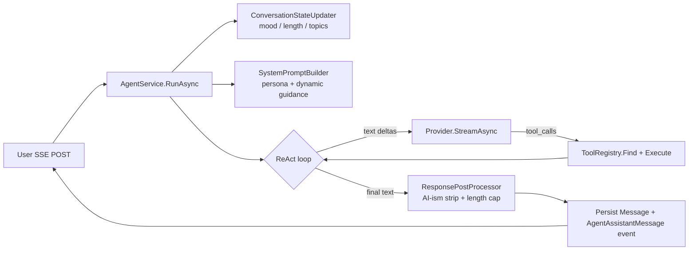

# Gabriel.Engine

The agent runtime. Everything LLM-, tool-, and personality-related lives here. `Gabriel.Core` holds the domain (entities, exceptions, identity contracts); `Gabriel.Infrastructure` holds the transport adapters (HTTP, EF Core, Identity stores); `Gabriel.Engine` is the **brains** between the two.

## What's in this project

| Folder | Purpose |
| --- | --- |
| `Providers/` | `IChatProvider` streaming abstraction + the transport-neutral DTOs the agent loop consumes. |
| `Tools/` | `ITool` contract, `IToolRegistry` for DI-driven tool discovery, the starter `GetCurrentTimeTool`. |
| `Services/` | `IAgentService` / `AgentService` (the ReAct loop), `AgentEvent` wire DTOs, `AgentOptions`, token-estimator. |
| `Personality/` | Conversation-state updater, system prompt builder, response post-processor, `PersonalityOptions`. |
| `Sequence/` | Gabriel Sequence - 64-frame avatar engine: palette templates, pattern primitives, generator, service. |
| `DependencyInjection.cs` | One-call `AddEngineServices(IConfiguration)` that wires every interface above. |

## Mental model in one diagram



Six things to know that aren't obvious from the diagram:

1. **One agent service, two entry points.** `RunAsync(convId, userInput)` is a fresh turn. `RegenerateAsync(convId, assistantMessageId)` re-uses the prior user turn's state and stamps the new reply with the original message's `VariantGroupId` so the picker UI can navigate between alternatives. Both delegate to the same private streaming iterator. See [agent-loop.md](agent-loop.md) and [variants-and-history.md](variants-and-history.md).

2. **System prompt is built per turn, not per conversation.** A static persona block (named character + behavioral rules + few-shot examples) gets concatenated with dynamic state-derived guidance (current mood, message-length budget, task-mode flag, user-style flags). See [personality-stack.md](personality-stack.md).

3. **History sent to the model is filtered.** Inactive variants and orphaned tool messages (whose parent assistant got deactivated by a regen) are skipped before the provider sees the conversation. The DB keeps everything; the wire format only sees the active turn.

4. **Streaming raw, cleaning on save.** The SSE controller forwards model deltas with a human-typing pacing simulation. After the stream finishes, the accumulated text is post-processed (AI-ism strip + length cap) and the cleaned version is what gets persisted. The live client view sees the raw text; reloads show the cleaned version. Trade-off accepted to avoid mid-stream rewrites.

5. **Rolling summary, not history truncation.** When estimated history tokens cross $\theta \cdot W$ (default $\theta = 0.8$, $W$ = provider context window), the agent generates a summary of the earliest portion and from then on prepends it as a system message instead of the raw messages it covers. The user still sees the full transcript; the model sees `summary + recent`.

6. **Two reasoning channels coexist per turn.** The loop captures both the provider's *native* chain-of-thought (Grok 4 `reasoning_content`, DeepSeek-R1, OpenAI o-series - streamed as `ReasoningDeltaEvent`, persisted on `Message.ReasoningContent`) **and** the model's *external* ReAct reasoning (regular text content emitted alongside a tool-call iteration, persisted on `Message.Content`). The first gives transparency when the provider supports it; the second works for any tool-capable model and gets re-fed to the next iteration as part of the visible history. See [agent-loop.md#reasoning-channels-native-cot--external-react](agent-loop.md#reasoning-channels--native-cot--external-react).

## Key types at a glance

| Type | Lifetime | Role |
| --- | --- | --- |
| `IChatProvider` | singleton | Streams `ChatProviderEvent`s. Implemented by `GrokChatProvider` / `MockChatProvider` in Infrastructure. |
| `IToolRegistry` | scoped | Discovers `ITool` implementations via `IEnumerable<ITool>` constructor injection. |
| `IConversationStateUpdater` | singleton | Stateless heuristic - mood, length EMA, topic extraction, emoji/lowercase flags. |
| `ISystemPromptBuilder` | singleton | Stateless. Assembles persona + dynamic guidance per turn. |
| `IResponsePostProcessor` | singleton | Stateless. AI-ism opener/closer strip + token-budget length cap. |
| `ITokenEstimator` | singleton | Naive `⌈chars / 4⌉` approximation; behind an interface so a real BPE tokenizer can slot in later. |
| `IGabrielSequenceGenerator` | singleton | Stateless. Picks palette + pattern from seed, renders 64 frames, applies Live State modulation. |
| `IGabrielSequenceService` | scoped | Loads conversation user-scoped, hands `(AvatarSeed, ConversationState)` to the generator. |
| `IAgentService` | scoped | Owns the ReAct loop. Reads everything above, writes to `IConversationRepository`. |

## Config sections consumed

```json
{
  "Agent": {
    "MaxIterations": 8,
    "CompactThreshold": 0.8,
    "CompactKeepLast": 6
  },
  "Personality": {
    "Name": "Gabriel",
    "MaxResponseMultiplier": 2.5,
    "MaxResponseTokenCap": 300,
    "DetailResponseTokenCap": 2000,
    "MinThinkingDelayMs": 400,
    "MaxThinkingDelayMs": 1100,
    "MinCharsPerSecond": 55,
    "MaxCharsPerSecond": 85
  }
}
```

`Providers:Grok:*` and `Jwt:*` are consumed by Infrastructure, not Engine.

## Reading order

1. [architecture.md](architecture.md) - where Engine sits in the onion, and the dependency graph between projects.
2. [agent-loop.md](agent-loop.md) - the ReAct iteration, streaming events, rolling compact, and the regenerate path. Math for token estimation and compact triggering.
3. [personality-stack.md](personality-stack.md) - the emotion-system pipeline: ConversationState → SystemPromptBuilder → ResponsePostProcessor. Mood detection rules, length-cap math, task-mode handling.
4. [gabriel-sequence.md](gabriel-sequence.md) - the 64-frame avatar engine. Frame layers (DNA / Traits / Context / Live), palette templates, pattern primitives (plasma / waves / spiral / pulse / shimmer) with formulas, Live State modulation by mood, client renderer.
5. [tools.md](tools.md) - `ITool` / `IToolRegistry`, the five shipped tools (`get_current_time`, `web_search`, `web_fetch`, `docs_list`, `docs_read`), SSRF defense for fetch, the "authoritative source" framing for docs.
6. [variants-and-history.md](variants-and-history.md) - how regenerate / delete / variant-picker work at the data and history-filter level.
