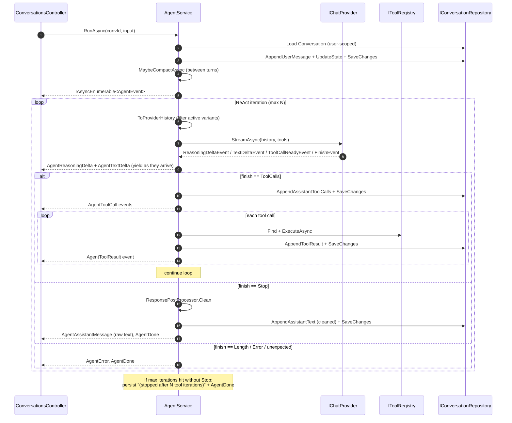
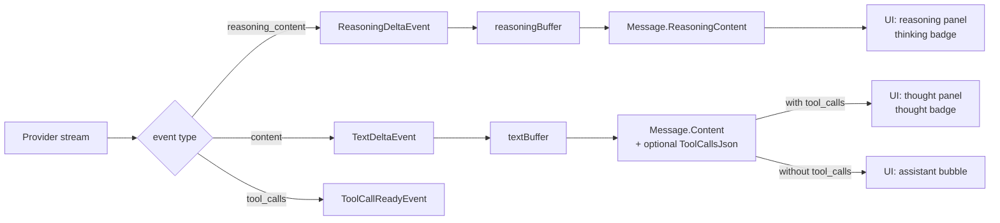
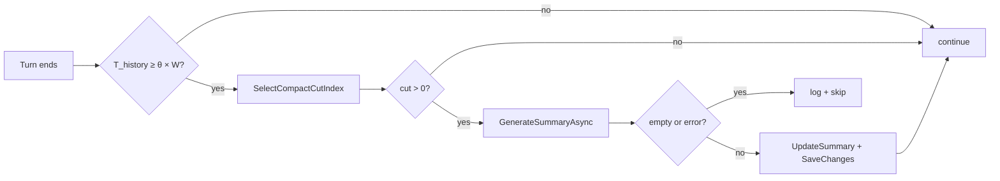

# Agent loop

The ReAct loop is the heart of `Gabriel.Engine`. Every chat turn flows through it. This document covers the iteration mechanics, streaming, rolling compact, and the regenerate path.

## Entry points

`IAgentService` exposes two:

```csharp
Task<IAsyncEnumerable<AgentEvent>> RunAsync(
    Guid conversationId, string userInput, CancellationToken ct);

Task<IAsyncEnumerable<AgentEvent>> RegenerateAsync(
    Guid conversationId, Guid assistantMessageId, CancellationToken ct);
```

Both return an async stream of `AgentEvent`s. The SSE controller serializes them as `data: ...\n\n` frames, so the wire format and the C# type system see the same shape.

| Path | Persists user msg? | Updates state? | Variant grouping |
| --- | --- | --- | --- |
| `RunAsync` | Yes | Yes | New `VariantGroupId` = new message id |
| `RegenerateAsync` | No (turn already exists) | No (replay against same state) | Re-uses the original variant's `VariantGroupId` |

Pre-flight validation throws **synchronously** so the API layer can respond with `4xx` / `ProblemDetails` *before* SSE headers are written:

- Empty user input → `DomainException` → `400`
- Missing user → `UnauthorizedAccessException` → `401`
- Conversation not found → `NotFoundException` → `404`
- (`RegenerateAsync` only) target is not an assistant message or is already inactive → `DomainException` → `400`

In-stream failures, by contrast, can't change HTTP status - they appear as a final `AgentError` event on the SSE stream.

## The iteration loop



The agent loop is bounded by `AgentOptions.MaxIterations` (default 8). Past that, the loop bails with a placeholder message so a runaway tool-call sequence can't drain credits or hang the SSE stream forever.

## Streaming events

The provider emits `ChatProviderEvent`s - the transport-level shape:

| Type | Meaning |
| --- | --- |
| `TextDeltaEvent(string Delta)` | Partial assistant text. Buffer + yield to client. |
| `ReasoningDeltaEvent(string Delta)` | Partial **reasoning** token - the model's private chain-of-thought stream (Grok 4 `reasoning_content`, DeepSeek-R1, OpenAI o-series, Anthropic extended-thinking). Providers without a reasoning channel simply never emit these. |
| `ToolCallReadyEvent(Id, Name, ArgsJson)` | A complete tool call. The provider buffers partial JSON internally; agent only sees fully-assembled calls. |
| `FinishEvent(FinishReason)` | `Stop` / `ToolCalls` / `Length` / `Error`. Terminates the current provider call. |

The agent transforms these into `AgentEvent`s for the SSE wire:

| Type | When |
| --- | --- |
| `AgentTextDelta(Delta)` | Every text delta forwarded as-is. |
| `AgentReasoningDelta(Delta)` | Every reasoning delta forwarded as-is. Surfaces in the UI as a collapsible "thinking" panel. |
| `AgentToolCall(MessageId, ToolCallId, Name, ArgsJson)` | After persisting the assistant's tool-call message. |
| `AgentToolResult(MessageId, ToolCallId, Content)` | After tool execution + persistence. |
| `AgentAssistantMessage(MessageId, Content, ReasoningContent?)` | Final assistant text - carries raw model output (see Save-vs-stream below) plus the accumulated reasoning so reloads stay consistent with the live view. |
| `AgentError(Message)` | In-stream failure. |
| `AgentDone()` | Terminal - loop exited. |

Polymorphic JSON: every `AgentEvent` serializes with a `type` discriminator (`"textDelta"`, `"reasoningDelta"`, `"toolCall"`, etc.) via `[JsonPolymorphic]`. The webapp's `streamChat.ts` switches on that string.

## Reasoning channels - native CoT + external ReAct

Gabriel deliberately runs **two independent reasoning channels** per iteration; both can fire on a single turn:

1. **Provider-native chain-of-thought** - `reasoning_content` from reasoning-capable models. Streamed as `ReasoningDeltaEvent`, accumulated in a `reasoningBuffer`, emitted to the client as `AgentReasoningDelta`, and persisted on `Message.ReasoningContent` (a column distinct from `Message.Content`). The model's own private CoT - useful for transparency and a UI "thinking" indicator, but **not the answer**.

2. **External ReAct reasoning** - the model's regular text content emitted **alongside** a tool-call iteration. OpenAI / xAI permit an assistant message to carry both `content` and `tool_calls`; that leading text is the "Thought" in Thought → Action → Observation. It's persisted on `Message.Content` of an assistant-with-tool-calls message and rendered as a separate `thought` ChatEntry in the webapp.



### Why both

Native CoT gives us free transparency when the provider supports it - no prompt engineering required. But:

- Not every model exposes a reasoning channel.
- Native CoT is generally **ephemeral**: the model doesn't re-read its own prior `reasoning_content` on subsequent turns; only the visible `content` flows back into the next iteration's history.

External ReAct reasoning (the model writing "I should call `web_search` because the user is asking about a current event…" before the actual tool call) is in `Message.Content`, which **is** re-fed to the provider on the next iteration. That gives the loop a stable trail of decisions to refer back to, regardless of whether native CoT is available.

Combining the two: when both fire, you get a private, fine-grained CoT *and* a publicly-visible decision trail. When only ReAct fires (non-reasoning model), you still get the decision trail. When only CoT fires (rare - usually a one-shot answer with no tool calls), the user still sees the thinking panel.

### Implications for new providers

When implementing a new `IChatProvider`:

- Parse the reasoning-channel field if the API exposes one (`reasoning_content`, `thinking_blocks`, etc.) and emit `ReasoningDeltaEvent` for each chunk.
- The regular text-content channel emits `TextDeltaEvent` as always. The ReAct side is automatically handled by the loop - no provider-level work needed.
- Never collapse the two into a single channel. The data model and the UI treat them as separate entities by design.

## Provider-agnostic tool calling

Native tool calling (the OpenAI/xAI `tool_calls` protocol Gabriel was built around) is one of two transports the loop supports. The other is **emulation** via `GabrielToolBridge` — for models with no native function-calling, this decorator at the `IChatProvider` boundary injects tool documentation into the system prompt, parses `<tool_call>{...}</tool_call>` markers out of the text stream, and synthesises the same `ToolCallReadyEvent` / `FinishEvent(ToolCalls)` shape the agent loop expects. The bridge handles wire-protocol translation only — actual tool execution still happens server-side in `AgentService.ExecuteToolSafelyAsync` via `ITool.ExecuteAsync`.

Routing is per-model via the `ToolMode` enum on `LLMModel`:

| Mode | Behavior |
| ---- | -------- |
| `Native` (default) | Raw provider; tool descriptors ride in the sibling `tools` field of the chat request. |
| `Emulated` | Raw provider wrapped in `GabrielToolBridge`; tools injected into the system prompt; `<tool_call>` blocks parsed out of the text stream. |
| `None` | Raw provider, no tools advertised at all. The Tools bucket in the metrics breakdown reads 0. |

`AgentService.RunStreamAsync` checks `selection.ToolMode` after resolving the provider and decides whether to wrap it. The agent loop above doesn't change — the same `switch (evt)` block handles both transports because both emit identical events.

Full design + tradeoffs in [.dev/notes/tool-emulation.md](../../.dev/notes/tool-emulation.md). The headline tradeoff: live token-by-token streaming is preserved on the first attempt of every turn in emulated mode (via a prefix-aware lookahead splitter), but if the parser rejects malformed JSON and a retry runs, the retry's text isn't streamed — only the corrected tool calls land. The retry path is rare in practice.

## Observability

Every turn emits Info-level structured logs via Serilog (configured in `Gabriel.API/appsettings.json`, sinks to Console + rolling daily file under `logs/`). The intent is that an operator can read the file and reconstruct any turn end-to-end without enabling Debug.

`AgentService` logs at these points:

| Event | Level | Fields |
| --- | --- | --- |
| Turn start (`RunAsync`) | Info | conv, project, userId, inputChars, messageCount |
| Regenerate start | Info | conv, project, userId, targetMsg |
| Per-iteration tool-call summary | Info | iter, toolCount, conv, reasoningChars |
| **Tool call START** | Info | conv, tool, callId, args (preview to 240 chars) |
| **Tool call OK** | Info | conv, tool, callId, elapsedMs, resultLen, resultPreview |
| **Tool call SOFT-ERROR** (tool returned `"Error: …"` without throwing) | Warning | conv, tool, callId, elapsedMs, resultLen, result |
| **Tool call THREW** (unhandled exception) | Error | conv, tool, callId, elapsedMs, + exception |
| Unknown-tool rejection | Warning | conv, tool, callId, args |
| Turn complete | Info | conv, iters, rawChars, cleanChars, reasoningChars |
| Provider Stop with empty text | Warning | iter, conv |
| Unexpected finish reason | Warning | iter, finish, conv |
| MaxIterations hit | Warning | max, conv |
| Compact summary failure / empty | Warning | exception (if any) |
| Compact applied | Info | conv, cut count, current tokens, threshold |

Result and arguments are flattened to a single line and truncated to 240 characters (`AgentService.LogPreviewLimit`) so big payloads - a fetched web page, a 12k-char file read - don't bloat the file.

`Microsoft.*` and `System.*` namespaces are pinned to Warning (`Microsoft.Hosting.Lifetime` excepted) in `appsettings.json` so framework noise stays out. `Gabriel.*` runs at Information in production, Debug in `appsettings.Development.json`. `UseSerilogRequestLogging` adds one HTTP line per request: `HTTP {Method} {Path} → {Status} in {Elapsed} ms`.

## Save-vs-stream semantics

A deliberate split:

- **Streaming wire**: the model's raw output flows through `AgentTextDelta` events untouched. The user sees what the model said in real time.
- **Database**: the cleaned version (after `IResponsePostProcessor.Clean`) is persisted to `Messages.Content`. The cleaner only strips residual AI-ism openers and closers - it does not truncate - so a reload of the conversation surfaces effectively the same text the client rendered live.
- **`AgentAssistantMessage.Content`**: carries the raw text (matches the deltas the client already received) so the live bubble doesn't visibly swap at end-of-stream.

Fall-back: if the cleaner strips everything to empty (would-be reject by `Message.Create`), persistence falls back to the raw text.

## Empty-Stop retry

The provider occasionally completes a stream with `finish_reason = "stop"` and no text, no reasoning, and no tool calls - a fully successful HTTP 200 transport carrying nothing. The HTTP resilience pipeline can't catch this case (it only sees a clean 200), so the agent loop retries the same iteration up to `AgentService.EmptyStopMaxRetries` times (default `2`, i.e. three total attempts) with a linear backoff of `EmptyStopRetryDelayMs * attempt` (default 500 ms × N).

Retry only fires when the attempt produced literally nothing the caller can act on. Any text delta or any tool call commits the attempt - retrying past that point would either duplicate streamed content or replay tool calls. The user message is still saved at the very top of the turn; only the assistant response is retried.

## History assembly

`ToProviderHistory` is the bridge between the persisted message log and the provider's wire format. It does four things:

1. **Prepend the per-turn system prompt** built by `ISystemPromptBuilder` (persona + dynamic guidance from `ConversationState`).
2. **Prepend the rolling summary** (if any) as a second system message.
3. **Skip pre-summary messages** when a `SummarizedThroughMessageId` exists.
4. **Filter inactive variants and orphaned tool messages**.

Variant filtering rules:

- Non-tool messages: keep only `IsActiveVariant == true`.
- Tool messages: keep only if their `ToolCallId` appears in the `ToolCallsJson` of an **active** assistant. This catches legacy tool messages from before variant grouping AND orphans created when a regen turn was deactivated.

Without this filter, the model would see contradicting tool results from deactivated branches, leading to confused replies.

## Rolling compact

When estimated history tokens approach the provider's context window, the agent summarizes the earliest portion and continues with `summary + recent messages`.

**Trigger condition** - between turns, compute:

$$
T_{\text{history}} = T_{\text{summary}} + \sum_{m \in \text{post-cut}} \text{est}(m)
$$

where $\text{est}(m)$ is the naive token estimate $\lceil \text{len}(m) / 4 \rceil + 8$ per message (chars/4 plus per-message overhead).

Compact fires when:

$$
T_{\text{history}} \geq \theta \cdot W_{\text{provider}}
$$

with $\theta = $ `AgentOptions.CompactThreshold` (default `0.8`) and $W_{\text{provider}}$ = `IChatProvider.ContextWindowTokens` (256k for grok-4, 8k for mock).

**Cut-point selection** - `SelectCompactCutIndex` walks back from the end keeping at least `CompactKeepLast` messages (default `6`), then keeps walking until it lands on a User-role message. The User-message boundary is critical: cutting between an assistant's `tool_calls` and its tool results would orphan them and break the provider's wire-format invariant.

**Cut-point formula:**

$$
\text{cut} = \max\{i \leq n - K : \text{role}(m_i) = \text{User}\}
$$

where $n$ is the message count, $K$ = `CompactKeepLast`. If no such index exists ($\text{cut} \leq 0$), the compact is skipped.

**Summary generation** uses the provider with an empty tool list and a fixed system prompt asking for a concise factual summary. The result is folded into `Conversation.Summary`, and `Conversation.SummarizedThroughMessageId` records the cut.

**Failure mode**: if the summarization call fails or returns empty, the compact is silently skipped (logged as a warning). The user turn proceeds; the compact is re-attempted on the next turn.



The agent never compacts mid-iteration. Doing so could cut between an assistant's tool_call message and the matching tool result that's about to arrive - those need to travel together.

## Regenerate flow

`RegenerateAsync(convId, assistantMessageId)`:

1. Load conversation, find target assistant message.
2. Validate: must be assistant, must be `IsActiveVariant`.
3. Call `Conversation.DeactivateVariantGroup(target.VariantGroupId)` - every message in that group (assistant + its tool aftermath) flips to `IsActiveVariant = false`.
4. Save. From here on `ToProviderHistory` no longer sees the old turn.
5. `MaybeCompactAsync` (same as a normal turn).
6. Hand to `RunStreamAsync(conversation, variantGroupIdOverride: target.VariantGroupId, ct)`.

The iterator runs the standard ReAct loop. Every assistant + tool message created in the new turn passes the override into `AppendAssistantText` / `AppendAssistantToolCalls` / `AppendToolResult`, so they all carry the original variant's group id. After the stream ends, the variant group has $\geq 2$ active+inactive turn-sequences - exactly the data shape the variant-picker UI needs.

See [variants-and-history.md](variants-and-history.md) for the full variant model.

## Token estimation

`ITokenEstimator` is intentionally trivial - the default `NaiveTokenEstimator` returns:

$$
\text{est}(text) = \lceil \text{len}(text) / 4 \rceil
$$

and for a message:

$$
\text{est}(m) = 8 + \text{est}(m.\text{Content}) + \text{est}(m.\text{ToolCallsJson}) + \text{est}(m.\text{ToolCallId})
$$

The `8` constant accounts for role markers and JSON separators that surround the content on the wire. The chars/4 ratio is a coarse approximation - real BPE tokenization is 30-50% more accurate - but for context-window budgeting at the 80% threshold, the headroom absorbs the error easily. The interface exists so swapping in a real BPE tokenizer later doesn't touch any caller.

## What this loop deliberately does NOT do

- **Parallel tool execution**: tool calls within an iteration run serially. The provider can emit multiple tool calls per iteration, but we execute them one at a time. Parallelism would be straightforward but isn't worth the complexity until the tool list contains slow IO-bound calls.
- **Streaming-aware compact**: compact fires only between turns. Inside an iteration, even if the history grows past the threshold, we don't interrupt - the model will get its full response or hit the iteration cap.
- **Per-turn cost tracking**: no accounting. Each turn calls the provider 1 to `MaxIterations` times; we don't tally tokens or expose usage.
- **Re-feed native CoT on subsequent iterations**: `Message.ReasoningContent` is persisted for transparency but is not added to `ToProviderHistory`. Only `Message.Content` (the visible text channel, which contains any ReAct "Thought" prelude) is re-fed. Mirrors the providers' own behavior - they treat their `reasoning_content` as ephemeral by design.
