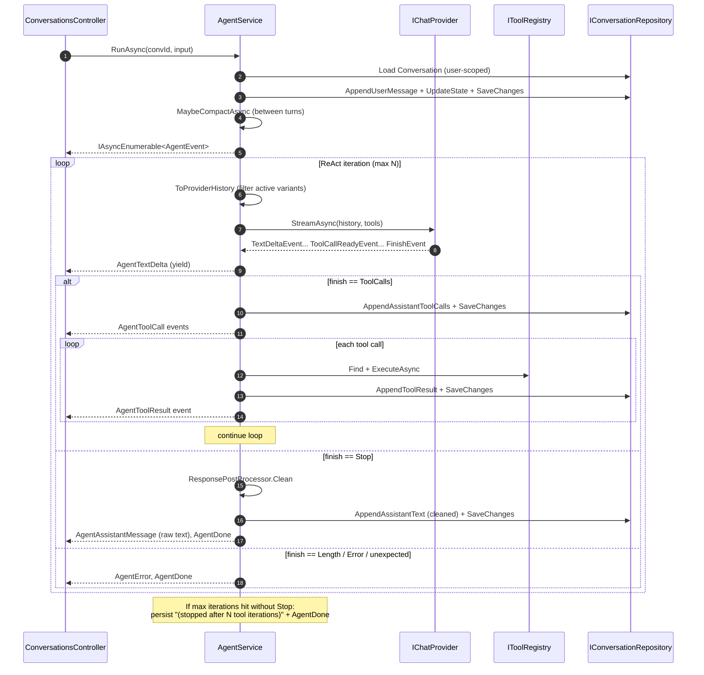
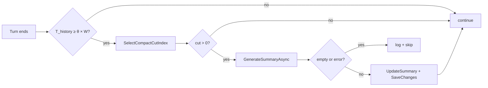

# Agent loop

The ReAct loop is the heart of `Gabriel.Engine`. Every chat turn flows through it. This document covers the iteration mechanics, streaming, rolling compact, and the regenerate path.

## Entry points

`IAgentService` exposes two:

```csharp
Task<IAsyncEnumerable<AgentEvent>> RunAsync(
    Guid conversationId, string userInput, CancellationToken ct);

Task<IAsyncEnumerable<AgentEvent>> RegenerateAsync(
    Guid conversationId, Guid assistantMessageId, CancellationToken ct);
```

Both return an async stream of `AgentEvent`s. The SSE controller serializes them as `data: ...\n\n` frames, so the wire format and the C# type system see the same shape.

| Path | Persists user msg? | Updates state? | Variant grouping |
| --- | --- | --- | --- |
| `RunAsync` | Yes | Yes | New `VariantGroupId` = new message id |
| `RegenerateAsync` | No (turn already exists) | No (replay against same state) | Re-uses the original variant's `VariantGroupId` |

Pre-flight validation throws **synchronously** so the API layer can respond with `4xx` / `ProblemDetails` *before* SSE headers are written:

- Empty user input → `DomainException` → `400`
- Missing user → `UnauthorizedAccessException` → `401`
- Conversation not found → `NotFoundException` → `404`
- (`RegenerateAsync` only) target is not an assistant message or is already inactive → `DomainException` → `400`

In-stream failures, by contrast, can't change HTTP status — they appear as a final `AgentError` event on the SSE stream.

## The iteration loop



The agent loop is bounded by `AgentOptions.MaxIterations` (default 8). Past that, the loop bails with a placeholder message so a runaway tool-call sequence can't drain credits or hang the SSE stream forever.

## Streaming events

The provider emits `ChatProviderEvent`s — the transport-level shape:

| Type | Meaning |
| --- | --- |
| `TextDeltaEvent(string Delta)` | Partial assistant text. Buffer + yield to client. |
| `ToolCallReadyEvent(Id, Name, ArgsJson)` | A complete tool call. The provider buffers partial JSON internally; agent only sees fully-assembled calls. |
| `FinishEvent(FinishReason)` | `Stop` / `ToolCalls` / `Length` / `Error`. Terminates the current provider call. |

The agent transforms these into `AgentEvent`s for the SSE wire:

| Type | When |
| --- | --- |
| `AgentTextDelta(Delta)` | Every text delta forwarded as-is. |
| `AgentToolCall(MessageId, ToolCallId, Name, ArgsJson)` | After persisting the assistant's tool-call message. |
| `AgentToolResult(MessageId, ToolCallId, Content)` | After tool execution + persistence. |
| `AgentAssistantMessage(MessageId, Content)` | Final assistant text — carries raw model output (see Save-vs-stream below). |
| `AgentError(Message)` | In-stream failure. |
| `AgentDone()` | Terminal — loop exited. |

Polymorphic JSON: every `AgentEvent` serializes with a `type` discriminator (`"textDelta"`, `"toolCall"`, etc.) via `[JsonPolymorphic]`. The webapp's `streamChat.ts` switches on that string.

## Save-vs-stream semantics

A deliberate split:

- **Streaming wire**: the model's raw output flows through `AgentTextDelta` events untouched. The user sees what the model said in real time.
- **Database**: only the **cleaned** version (after `IResponsePostProcessor.Clean`) is persisted to `Messages.Content`.
- **`AgentAssistantMessage.Content`**: carries the **raw** text (matches the deltas the client already received) so the live client view doesn't visibly swap content at end-of-stream.

Trade-off: a page reload shows the cleaned version; the live session shows the raw version. Accepted — the alternative ("stream raw, swap to clean at end") would visibly rewrite the bubble after streaming completes, which feels worse.

Fall-back: if the cleaner strips everything to empty (would-be reject by `Message.Create`), persistence falls back to the raw text.

## History assembly

`ToProviderHistory` is the bridge between the persisted message log and the provider's wire format. It does four things:

1. **Prepend the per-turn system prompt** built by `ISystemPromptBuilder` (persona + dynamic guidance from `ConversationState`).
2. **Prepend the rolling summary** (if any) as a second system message.
3. **Skip pre-summary messages** when a `SummarizedThroughMessageId` exists.
4. **Filter inactive variants and orphaned tool messages**.

Variant filtering rules:

- Non-tool messages: keep only `IsActiveVariant == true`.
- Tool messages: keep only if their `ToolCallId` appears in the `ToolCallsJson` of an **active** assistant. This catches legacy tool messages from before variant grouping AND orphans created when a regen turn was deactivated.

Without this filter, the model would see contradicting tool results from deactivated branches, leading to confused replies.

## Rolling compact

When estimated history tokens approach the provider's context window, the agent summarizes the earliest portion and continues with `summary + recent messages`.

**Trigger condition** — between turns, compute:

$$
T_{\text{history}} = T_{\text{summary}} + \sum_{m \in \text{post-cut}} \text{est}(m)
$$

where $\text{est}(m)$ is the naive token estimate $\lceil \text{len}(m) / 4 \rceil + 8$ per message (chars/4 plus per-message overhead).

Compact fires when:

$$
T_{\text{history}} \geq \theta \cdot W_{\text{provider}}
$$

with $\theta = $ `AgentOptions.CompactThreshold` (default `0.8`) and $W_{\text{provider}}$ = `IChatProvider.ContextWindowTokens` (256k for grok-4, 8k for mock).

**Cut-point selection** — `SelectCompactCutIndex` walks back from the end keeping at least `CompactKeepLast` messages (default `6`), then keeps walking until it lands on a User-role message. The User-message boundary is critical: cutting between an assistant's `tool_calls` and its tool results would orphan them and break the provider's wire-format invariant.

**Cut-point formula:**

$$
\text{cut} = \max\{i \leq n - K : \text{role}(m_i) = \text{User}\}
$$

where $n$ is the message count, $K$ = `CompactKeepLast`. If no such index exists ($\text{cut} \leq 0$), the compact is skipped.

**Summary generation** uses the provider with an empty tool list and a fixed system prompt asking for a concise factual summary. The result is folded into `Conversation.Summary`, and `Conversation.SummarizedThroughMessageId` records the cut.

**Failure mode**: if the summarization call fails or returns empty, the compact is silently skipped (logged as a warning). The user turn proceeds; the compact is re-attempted on the next turn.



The agent never compacts mid-iteration. Doing so could cut between an assistant's tool_call message and the matching tool result that's about to arrive — those need to travel together.

## Regenerate flow

`RegenerateAsync(convId, assistantMessageId)`:

1. Load conversation, find target assistant message.
2. Validate: must be assistant, must be `IsActiveVariant`.
3. Call `Conversation.DeactivateVariantGroup(target.VariantGroupId)` — every message in that group (assistant + its tool aftermath) flips to `IsActiveVariant = false`.
4. Save. From here on `ToProviderHistory` no longer sees the old turn.
5. `MaybeCompactAsync` (same as a normal turn).
6. Hand to `RunStreamAsync(conversation, variantGroupIdOverride: target.VariantGroupId, ct)`.

The iterator runs the standard ReAct loop. Every assistant + tool message created in the new turn passes the override into `AppendAssistantText` / `AppendAssistantToolCalls` / `AppendToolResult`, so they all carry the original variant's group id. After the stream ends, the variant group has $\geq 2$ active+inactive turn-sequences — exactly the data shape the variant-picker UI needs.

See [variants-and-history.md](variants-and-history.md) for the full variant model.

## Token estimation

`ITokenEstimator` is intentionally trivial — the default `NaiveTokenEstimator` returns:

$$
\text{est}(text) = \lceil \text{len}(text) / 4 \rceil
$$

and for a message:

$$
\text{est}(m) = 8 + \text{est}(m.\text{Content}) + \text{est}(m.\text{ToolCallsJson}) + \text{est}(m.\text{ToolCallId})
$$

The `8` constant accounts for role markers and JSON separators that surround the content on the wire. The chars/4 ratio is a coarse approximation — real BPE tokenization is 30-50% more accurate — but for context-window budgeting at the 80% threshold, the headroom absorbs the error easily. The interface exists so swapping in a real BPE tokenizer later doesn't touch any caller.

## What this loop deliberately does NOT do

- **Stream the provider's reasoning tokens**: only text deltas and tool calls. Models with separate "thinking" streams (some xAI / Anthropic variants) would need additional event types.
- **Parallel tool execution**: tool calls within an iteration run serially. The provider can emit multiple tool calls per iteration, but we execute them one at a time. Parallelism would be straightforward but isn't worth the complexity until the tool list contains slow IO-bound calls.
- **Streaming-aware compact**: compact fires only between turns. Inside an iteration, even if the history grows past the threshold, we don't interrupt — the model will get its full response or hit the iteration cap.
- **Per-turn cost tracking**: no accounting. Each turn calls the provider 1 to `MaxIterations` times; we don't tally tokens or expose usage.
