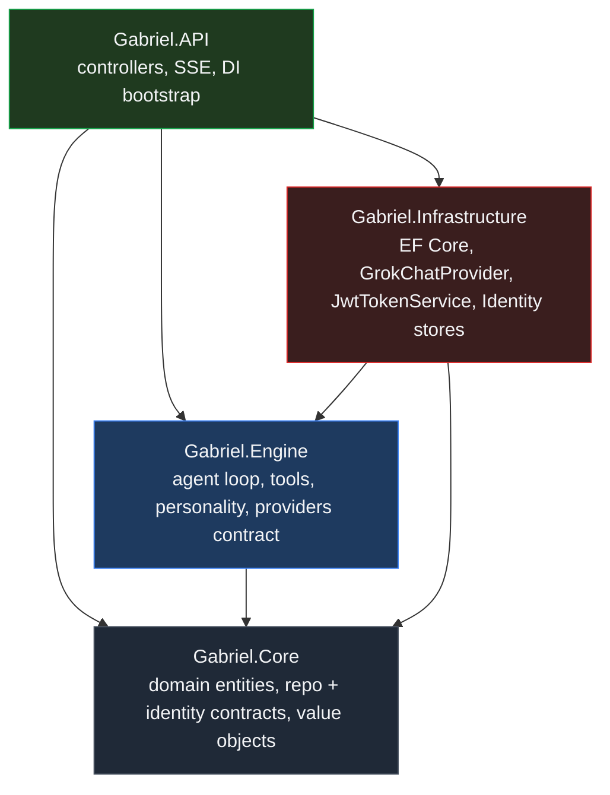
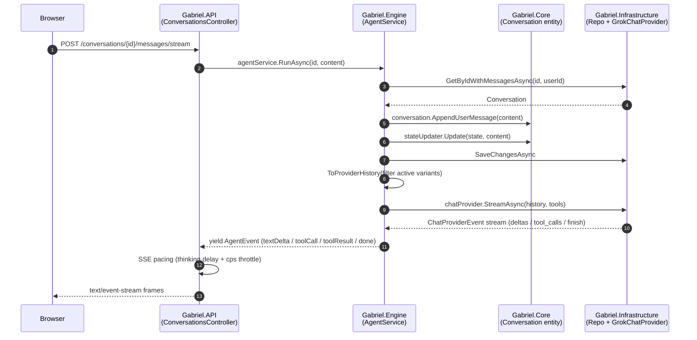

# Architecture

Gabriel uses an **onion layering**: a pure-domain core, an application/agent layer in the middle, an infrastructure layer on the outside, and the API as the entry point. `Gabriel.Engine` is the application layer.

## Project graph



The arrow rule is **dependencies point inward**. Core has zero project references. Engine depends on Core. Infrastructure depends on Engine + Core. API ties the whole thing together at composition time.

## Why this split

| Concern                          | Layer        | Why there                                                                 |
| -------------------------------- | ------------ | ------------------------------------------------------------------------- |
| `Conversation`, `Message` entities, `ConversationState`, `Mood` value objects | **Core**    | Pure domain language; no framework deps. Engine + Infra both consume.     |
| `IConversationRepository`, `IUnitOfWork`, `ICurrentUser`, `IJwtTokenService` | **Core**    | Contracts the application can call without knowing the storage tech.      |
| `IChatService` / `ChatService`   | **Core**    | CRUD over conversations. Not LLM-flavored, so it lives with the domain it manipulates. |
| `IChatProvider`, `ITool`, `IToolRegistry`, `IAgentService`, `ITokenEstimator`, `Personality/*` | **Engine** | Agent / LLM orchestration. The application logic that turns "user said X" into "model said Y, after a few tool calls". |
| `GrokChatProvider`, `MockChatProvider`, `AppDbContext`, EF configurations, `JwtTokenService`, Identity stores | **Infrastructure** | Concrete implementations: HTTP calls, EF Core, ASP.NET Core Identity, JWT minting. Swappable without touching Engine or Core. |
| Controllers, middleware, `Program.cs`, OpenAPI gen, exception handling, Serilog host + sinks | **API** | HTTP boundary. Wires everything via DI and serves the SSE / REST surface. Serilog config (Console + rolling daily file, `Microsoft.*`/`System.*` pinned to Warning) lives in `appsettings.json`; the host registers it via `AddSerilog` + `UseSerilogRequestLogging`. |

## What the rule rejects

- Engine **cannot reference Infrastructure**. The provider abstraction is `IChatProvider` (defined in Engine, implemented in Infrastructure). If Engine wanted to call `HttpClient` directly, that'd be a layering violation - the provider interface exists exactly to dodge that.
- Core **cannot reference Engine**. This is why `ConversationState` + `Mood` live in `Core/Personality/` even though everything *operating* on them is in `Engine/Personality/`. `Conversation` has `GetState()` / `SetState(ConversationState)` methods, so the type must be visible from Core.
- Migrations + EF configs live in **Infrastructure**. Domain doesn't know about column types, table names, or indexes.

## Engine internal folder map

```text
Gabriel.Engine/
├── Gabriel.Engine.csproj
├── DependencyInjection.cs       - AddEngineServices() - single registration entry point
│
├── Providers/                   - LLM transport contract
│   ├── IChatProvider.cs                    streaming abstraction
│   ├── ChatProviderEvent.cs                TextDeltaEvent / ReasoningDeltaEvent / ToolCallReadyEvent / FinishEvent
│   ├── ChatProviderMessage.cs              wire DTO mirroring OpenAI/xAI message shape
│   ├── ChatProviderToolCall.cs             {id, name, argumentsJson}
│   └── ToolDescriptor.cs                   what the agent advertises to the model
│
├── Tools/                       - agent-callable tools
│   ├── ITool.cs                            name, description, JSON-schema params, ExecuteAsync
│   ├── IToolRegistry.cs                    All / Find / AsDescriptors
│   ├── ToolRegistry.cs                     DI-driven via IEnumerable<ITool>
│   └── GetCurrentTimeTool.cs               starter tool
│
├── Services/                    - agent runtime
│   ├── IAgentService.cs                    RunAsync + RegenerateAsync
│   ├── AgentService.cs                     ReAct loop + rolling compact + history filtering + structured logging
│   ├── AgentEvent.cs                       polymorphic SSE wire events (textDelta / reasoningDelta / toolCall / ...)
│   ├── AgentOptions.cs                     MaxIterations, CompactThreshold, CompactKeepLast
│   ├── ITokenEstimator.cs                  abstraction
│   └── NaiveTokenEstimator.cs              ⌈chars / 4⌉ baseline
│
└── Personality/                 - natural-DM persona stack
    ├── PersonalityOptions.cs               Name, length caps, typing-tempo knobs
    ├── IConversationStateUpdater.cs        Update(state, userMessage) -> newState
    ├── HeuristicConversationStateUpdater.cs  regex + EMA, zero LLM cost
    ├── ISystemPromptBuilder.cs             Build(state) -> string
    ├── GabrielSystemPromptBuilder.cs       static persona + per-turn dynamic guidance + few-shot
    ├── IResponsePostProcessor.cs           Clean(raw, state) -> string
    └── ResponsePostProcessor.cs            AI-ism opener/closer strip + length cap
```

## How a request flows across layers



The Engine never talks HTTP directly. It speaks to `IChatProvider`, which Infrastructure implements as an `HttpClient` call to xAI / a mocked stream.

## What "swap the model provider" looks like

Concretely: implementing `IChatProvider` in another Infrastructure class, then registering it in `Gabriel.Infrastructure/DependencyInjection.AddChatProvider` under a new `Providers:Active` key. **No Engine code changes.**

## Things this layering deliberately does not solve

- **Cross-conversation memory** (Qdrant) - Phase 9. Will land as an `IMemoryStore` interface in Engine + a `QdrantMemoryStore` in Infrastructure.
- **Per-project personality** - Phase 8. Today the persona is global (config-driven `PersonalityOptions.Name`). Per-project will introduce a `Project` aggregate in Core with its own `SystemPrompt` field that overrides the global default.
- **Streaming as a general transport** - Engine's `RunAsync` returns `IAsyncEnumerable<AgentEvent>` regardless of whether the consumer wraps it in SSE, WebSockets, or just awaits the whole sequence. The SSE specifics (the `data: ...\n\n` framing, the typing-tempo pacing) live in `Gabriel.API/Controllers/ConversationsController`, not in Engine.
