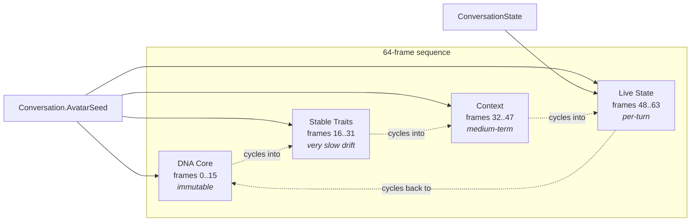
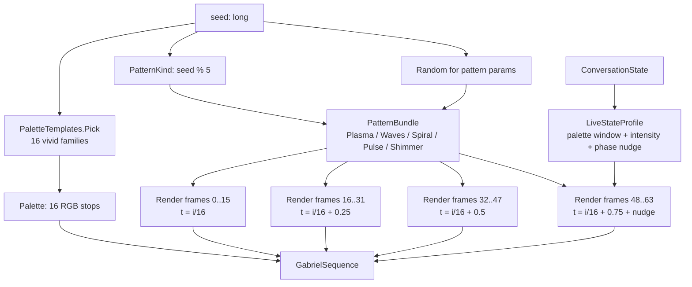

# Gabriel Sequence

The **Gabriel Sequence** is a **64-frame, 16×16 RGB representation** of a personality's visual + emotional identity. Each personality (currently each conversation; eventually each Phase 8 project) owns one. It serves three roles at once:

1. **Visual avatar** - animated in the client, gives the chat a face.
2. **Live emotional readout** - the lower 16 frames react to `ConversationState`, so mood + tempo are visible at a glance.
3. **Portable identity** - the spec (v0.1) defines a binary `.gemo` file format so a Sequence can be exported, shared, and observed by any compatible AI without metadata. (File format not yet implemented; data model is in place.)

The full v0.1 spec lives in [`.dev/notes/emotion-engine.md`](../../.dev/notes/emotion-engine.md). This doc covers the shipped implementation.

## Frame layering



| Layer | Frames | Mutability | What modulates it |
| --- | --- | --- | --- |
| **DNA Core** | 0..15 | Immutable | Seed only |
| **Stable Traits** | 16..31 | Very slow drift (weeks) | Seed (drift unimplemented v1) |
| **Context** | 32..47 | Medium (hours / days) | Seed (drift unimplemented v1) |
| **Live State** | 48..63 | Per turn | Seed + `ConversationState` |

The four layers all derive from the same seed and the same pattern in v1; what differs between layers is the **time window**, **palette range**, and (for Live State) the **mood-driven modulation**. The cycle then animates frame-by-frame from 0 → 63 and loops.

## Data model

```csharp
public sealed record GabrielSequence(
    int Version,
    Palette Palette,
    IReadOnlyList<Frame> Frames,   // exactly 64
    SequenceMetadata Metadata);

public sealed record Palette(IReadOnlyList<RgbColor> Colors);
public readonly record struct RgbColor(byte R, byte G, byte B);

public sealed record Frame(byte[] Pixels);          // 256 palette indices
public sealed record SequenceMetadata(
    long Seed,
    DateTimeOffset GeneratedAt,
    string? StateSummary);
```

Each frame is `16×16 = 256` palette-indexed bytes. With a 16-entry palette (3 bytes each), the raw sequence is `64 × 256 + 16 × 3 = 16,432 bytes` ≈ 16 KB. JSON-serialized (palette indices as integers, RGB as `[r,g,b]`) it's ~50 KB on the wire - acceptable for a once-per-turn fetch.

**Storage strategy: nothing is persisted.** Sequences regenerate on demand from `(Conversation.AvatarSeed, Conversation.GetState())`. Both inputs already exist on the entity; no new tables, no migration. The trade-off is one CPU pass per fetch - generation is sub-millisecond at this size.

## Generator pipeline



Three seed-derived choices drive the visual:

| Decision | Source | Output |
| --- | --- | --- |
| **Palette family** | `seed ^ (seed >> 32) ^ 0x9E3779B1` mod 16 | One of: heat, ice, plasma, matrix, sunset, ocean, aurora, rose, cyber, amber, lime, sakura, mono, void, forge, alive |
| **Pattern kind** | `\|seed ^ (seed >> 32)\|` mod 5 | One of: Plasma, Waves, Spiral, Pulse, Shimmer |
| **Pattern parameters** | `seed ^ (seed >> 32) ^ 0xC2B2AE35` as `Random` seed | Pattern-specific (angle, frequency, arms, etc.) |

Three independent seed mixes (different xor salts) so a 1-bit seed change visibly affects all three axes rather than collapsing to "same palette, same pattern, slightly different params".

## Palette generation

Curated families ported from the webapp's `pulse/palettes.ts` so the Sequence speaks the same visual language as the procedural avatar that was already on screen.

Each template is 2-4 RGB stops. To produce the 16-entry palette, sample the gradient at uniform $t \in [0, 1]$:

$$
\text{palette}[i] = \text{lerp}\bigl(\text{stop}_k, \text{stop}_{k+1}, k'\bigr), \quad i \in [0, 15]
$$

where $t_i = i / 15$, $k = \min(N-2, \lfloor t_i / \frac{1}{N-1} \rfloor)$ for a template with $N$ stops, and $k' = (t_i - k \cdot \frac{1}{N-1}) \cdot (N-1)$.

Result: `palette[0]` = darkest stop (quiescent shadow), `palette[15]` = brightest stop (peak accent). The 16-stop expansion makes palette-window manipulation in the Live State layer fine-grained without re-running the gradient math at render time.

## Pattern primitives

Five primitives ported (with tweaks) from `pulse/patterns.ts`. Each takes a pixel $(x, y)$, a normalized loop time $t \in [0, 1)$, and pattern-specific params; returns a scalar in $[0, 1]$ which the renderer maps to a palette index.

All patterns are designed for **loop continuity**: sampling at $t = 0$ and $t = 1$ produces the same image so the 64-frame cycle closes seamlessly.

### Plasma - superposed sines

$$
v = \frac{1}{4}\left[\sin(A x + s_a \phi) + \sin(B y + s_b \phi) + \sin(C(x+y) + s_c \phi) + \sin(D \cdot d(x, y) + s_d \phi)\right]
$$

where:

- $\phi = 2 \pi t$
- $d(x, y) = \sqrt{(x - c_x)^2 + (y - c_y)^2}$, centered on the grid
- $A, B \in [0.35, 0.70]$, $C \in [0.25, 0.60]$, $D \in [0.40, 0.80]$ - spatial frequencies
- $s_a \in \{1, -1, 2, -2\}$, $s_b \in \{1, -1, 2\}$, $s_c \in \{1, -1\}$, $s_d \in \{1, 2\}$ - phase speeds

Final: $(v + 1) / 2$ to remap to $[0, 1]$. The four-sine superposition makes plasma the most parameter-sensitive primitive - small seed changes produce noticeably different visuals. Looks alive without obvious motion.

### Directional waves

$$
v = \left(\frac{\sin(p \cdot f + s \cdot \phi) + 1}{2}\right)^k
$$

where:

- $p = (x - c_x) \cos\theta + (y - c_y) \sin\theta$ - projection along an axis at angle $\theta$
- $f \in [0.6, 1.4]$ - spatial frequency
- $s \in \{-1, 1\}$ - direction
- $k \in [1.2, 2.4]$ - sharpness (raises the sine to a power → narrower bright bands)

Clean directional flow - perpendicular to $\theta$, the wave appears stationary; parallel, it moves at constant velocity. Reads as "flowing".

### Spiral

$$
v = \left(\frac{\sin(N \theta + r \tau - s \phi) + 1}{2}\right)^k
$$

where:

- $\theta = \text{atan2}(y - c_y, x - c_x)$ - angular coordinate
- $r = \sqrt{(x - c_x)^2 + (y - c_y)^2}$ - radial distance from center
- $N \in \{1, 2, 3\}$ - number of arms
- $\tau \in [0.5, 1.1]$ - tightness (how fast arms unwind with distance)
- $s \in \{-1, 1\}$ - rotation direction
- $k \in [1.4, 2.4]$ - sharpness

A rotating spiral - visually striking, instantly recognizable as a "pattern" rather than noise.

### Pulse - expanding ripples

Multi-ripple model:

$$
v = \max_{r \in [0, R)} \left[\text{trail}(d, r) \cdot \max\left(0, 1 - \frac{|d - w_r|}{W}\right)\right]
$$

where:

- $d$ = distance from `(cx, cy)` to pixel
- $R$ = ripple count (1 or 2)
- $w_r = ((t + r/R) \mod 1) \cdot r_{\max}$ - current radius of the $r$-th ripple
- $W \in [1.8, 3.2]$ - wave width
- $r_{\max} = \sqrt{2} \cdot \text{size}/2 + W$
- $\text{trail}(d, w_r) = 0.7$ inside the wave, $1.0$ outside (gives a comet-tail look)

Concentric rings expanding outward, looping. Clean rhythm.

### Shimmer - per-pixel independent phase

The "vivid shimmer" primitive. Each pixel has its own random phase and speed:

$$
v_{x,y}(t) = f + (1 - f) \cdot \frac{\sin\bigl(2\pi (t \cdot s_{x,y} + \phi_{x,y})\bigr) + 1}{2}
$$

where:

- $\phi_{x,y} \in [0, 1)$ - per-pixel phase offset, drawn once at init
- $s_{x,y} \in [0.7, 2.3]$ - per-pixel speed
- $f = 0.1$ - floor brightness (so no pixel ever goes fully dark)

256 pixels × 256 phase samples = a starfield where each "star" twinkles on its own clock. This is the primitive that produces the actual shimmering feel - every other primitive has correlated motion, this one has none.

## Layer rendering

Each layer samples the chosen primitive at its own time window with its own palette range:

```text
Layer            Frames   Time window           Palette window    Intensity
DNA Core         0..15    t = i/16              [0..15]           1.0
Stable Traits    16..31   t = i/16 + 0.25       [2..15]           0.95
Context          32..47   t = i/16 + 0.5        [1..14]           1.0
Live State       48..63   t = i/16 + 0.75 + ν   [pMin..pMax]      I
```

The `+ 0.25 / 0.5 / 0.75` offsets walk the layers around the loop. Since each pattern is periodic in $t$, the layers cycle through different "phases" of the same animation. Visually: across 64 frames the animation completes one full cycle, but each quarter looks slightly different because the palette window shifts (DNA uses the full gradient, Traits drops the darkest 2 entries, Context drops both ends, Live State window is mood-dependent).

**Frame rendering** for a single layer:

```text
for y in 0..16:
    for x in 0..16:
        v = SamplePattern(bundle, x, y, t)
        v_clamped = clamp(v * intensity, 0, 1)
        idx = paletteMin + round(v_clamped * (paletteMax - paletteMin))
        frame.pixels[y * 16 + x] = idx
```

The intensity multiplier biases values toward the bright end of the assigned window - used by Live State to brighten the avatar when the mood is high-energy.

## Live State modulation

This is where `ConversationState` becomes visible. The `LiveStateProfile` struct precomputes the four parameters:

```csharp
private readonly record struct LiveStateProfile(
    int PaletteMin, int PaletteMax,
    double Intensity, double PhaseNudge, string Summary);
```

### Palette window by mood

| Mood | $(p_{\min}, p_{\max})$ for 16-entry palette | Intensity $I$ | Visual feel |
| --- | --- | --- | --- |
| `Playful` | $(8, 15)$ - bright tail | $1.10$ | Hot, energetic, top of the gradient |
| `Venting` | $(0, 8)$ - dark tail | $0.80$ | Dim, sunk in shadows |
| `Serious` | $(5, 10)$ - narrow midband | $0.90$ | Compressed, focused |
| `Curious` | $(1, 15)$ - wide window | $1.05$ | Full range, alive |
| `LowEnergy` | $(1, 7)$ - dark, narrow | $0.75$ | Sleepy, dim |
| `Neutral` | $(1, 15)$ | $1.0$ | Full range, default intensity |

### Consecutive-shorts pinch

When `state.ConsecutiveShortMessages >= 2`, the palette window compresses further to a third of its width around the midpoint:

$$
\text{mid} = \frac{p_{\min} + p_{\max}}{2}, \quad \delta = \max\left(1, \frac{p_{\max} - p_{\min}}{3}\right)
$$

$$
p_{\min}' = \max(0, \text{mid} - \delta), \quad p_{\max}' = \min(15, \text{mid} + \delta)
$$

Reads as the avatar getting **slightly tense / restricted** - less color variety when the conversation feels stilted. A subtle but legible signal.

### Per-turn phase nudge

$$
\nu = (\text{turnCount} \cdot 0.073 + \text{lastUserTokenCount} \cdot 0.0013) \mod 1
$$

Adds a small shove to the Live State time window per turn. Without this, two consecutive turns at the same mood would produce **identical Live State frames** - the avatar would freeze in place. The nudge guarantees visible motion turn-to-turn even when nothing else changed.

The coefficients are co-prime-ish so the orbit through phase space doesn't repeat for any reasonable conversation length.

### State summary

`SequenceMetadata.StateSummary` carries a short human-readable digest:

```text
pattern=plasma, mood=curious, turn=12, lastTok=47
```

This is what shows up in observation passes / future "emotional passport" tooling. Models loading a `.gemo` file can read it for a quick state snapshot without parsing every frame.

## API surface

Single endpoint:

```http
GET /api/conversations/{convId}/sequence
```

Returns:

```jsonc
{
  "version": 1,
  "palette": [[40,0,10], [80,18,12], ..., [255,255,200]],  // 16 × [r,g,b]
  "frames": [
    [0, 0, 1, 2, ...],   // 64 arrays of 256 palette indices
    ...
  ],
  "metadata": {
    "seed": 3421997825,
    "generatedAt": "2026-05-19T...",
    "stateSummary": "pattern=plasma, mood=curious, turn=12, lastTok=47"
  }
}
```

The endpoint loads the conversation user-scoped (so cross-tenant fetches are 404), grabs `(AvatarSeed, GetState())`, and hands them to the generator. Pure read, no mutation, fast to call.

Recommended refresh cadence on the client: **after `send`** (Live State just changed) and **after `reroll-avatar`** (seed just changed). NOT on rename / delete / new-chat - those don't affect the active conversation's Sequence. See [agent-loop.md](agent-loop.md) and the `sequenceRefresh` signal in `App.tsx`.

## Client rendering

[`GabrielSequenceView`](../../src/webapp/src/components/GabrielSequenceView.tsx) is a 16×16 canvas2D renderer with CSS upscaling:

```tsx
<canvas width={16} height={16} style={{
    width: size, height: size, imageRendering: 'pixelated'
}} />
```

Crisp pixel edges from the CSS scaling; per-frame cost is a single `putImageData(16×16)` call. No WebGL needed at this size.

### Animation timing

$$
T_{\text{frame}} = 280 \text{ms}, \quad T_{\text{cycle}} = 64 \cdot 280 \approx 18 \text{s}
$$

The first iteration used 600ms/frame + smoothstep easing. Smoothstep made each frame "pause" at its boundary which compounded with FBM noise patterns to read as a **muscle spasm**. Linear interpolation at 280ms feels like continuous flow.

### Frame-to-frame interpolation

For interpolation parameter $t \in [0, 1)$ between frame $i$ and frame $i+1$:

$$
\text{rgb}_{\text{out}}(p) = \text{lerp}(\text{palette}[\text{frame}_i[p]], \text{palette}[\text{frame}_{i+1}[p]], t)
$$

per pixel $p$. Linear in RGB space, which means a pixel transitioning from `palette[2]` (dark red) to `palette[14]` (bright yellow) passes through the RGB midpoint (which may not be `palette[8]`). Acceptable trade-off because adjacent frames typically have small palette-index deltas - the wave/plasma/shimmer patterns produce **locally correlated** changes between adjacent frames, so the interpolation midpoints are also valid palette colors most of the time.

### Refetch hooks

```tsx
useEffect(() => {
  const ctrl = new AbortController();
  fetchGabrielSequence(conversationId, ctrl.signal)
    .then(seq => { sequenceRef.current = seq; })
    .catch(...);
  return () => ctrl.abort();
}, [conversationId, refreshKey]);
```

- Refetch on `conversationId` change (component remounts, fresh fetch)
- Refetch on `refreshKey` change (parent's `sequenceRefresh` signal, bumped only on send + reroll)
- Animation loop runs in a separate `useEffect([])` - it reads `sequenceRef.current` so swap-in is seamless (the animation never restarts, just samples newer data)
- Cleanup: `AbortController.abort()` cancels the in-flight fetch on unmount or fresh refetch

## Performance numbers

| Metric | Value | Notes |
| --- | --- | --- |
| Frames per sequence | 64 | Fixed by spec |
| Frame size | 256 bytes | 16×16 palette indices |
| Palette size | 48 bytes | 16 × RGB |
| Raw payload | ~16 KB | Pre-JSON |
| JSON payload | ~50 KB | Per-frame array overhead |
| Server CPU per generation | sub-ms | 64 × 256 pattern evaluations |
| Client render frame budget | 16ms @ 60 Hz | 256 putImageData pixels, easy |
| Full cycle wall time | 17.92s | 64 × 280 ms |

## What's NOT implemented

The v0.1 spec describes more than v1 ships. Held back for follow-ups:

- **`.gemo` binary file format** - header, palette-indexed payload, CRC32. Sequences are JSON-on-the-wire only today.
- **Slow drift for Traits + Context** - both layers are seed-only in v1. The spec describes long-term drift over weeks (Traits) and hours/days (Context) based on conversation patterns.
- **Reserved data-encoding band** - the spec reserves rows for machine-readable signals (personality constants, current state, identity markers) so any compatible AI can extract them without metadata. Not yet wired.
- **Observation pass** - `observe(sequence) → description`. The state summary in metadata is the rudiment of this; a full observation grammar is future work.
- **Per-project ownership** - Phase 8 will move Sequences from per-conversation to per-`Project.Id`. The data model is ready; the migration is part of the Projects feature.
- **Import / export endpoints** - round-tripping a personality between deployments. Trivial once `.gemo` lands.

## Future drift mechanics (design only)

For when Phase 8 lands:

- **Stable Traits drift**: weekly job rolls a slow Random walk on the layer's palette window and pattern parameters. Persisted on `Project.TraitsDrift` so reloads are stable.
- **Context drift**: per-conversation-close update - count topic prevalence, message length distribution, mood histogram over the last N hours. Map to a smaller palette window perturbation than Traits.
- **Live State** stays per-turn as today.

The math is simple; the engineering question is when each layer runs (job queue? on-demand?). Defer until the Projects work surfaces concrete needs.
