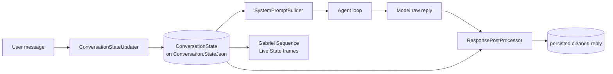

# Personality stack (the emotion system)

The "emotion system" in Gabriel is a three-stage pipeline that runs per turn:

1. **`IConversationStateUpdater`** - reads the new user message + prior state, emits a new `ConversationState` (mood, length stats, user-style flags, task-mode flag).
2. **`ISystemPromptBuilder`** - assembles the per-turn system prompt: static persona block + dynamic guidance derived from the state.
3. **`IResponsePostProcessor`** - cleans the model's raw reply at save time (AI-ism strip + length cap).

The state is also what drives the **Live State** layer of the Gabriel Sequence (frames 48-63). The same mood signal that shapes the system prompt also shifts the avatar's palette window - see [gabriel-sequence.md](gabriel-sequence.md).



## ConversationState

Lives in `Gabriel.Core.Personality` (it's a domain value object owned by `Conversation`). Persisted as JSON on `Conversation.StateJson`.

```csharp
public sealed record ConversationState
{
    public int TurnCount { get; init; }
    public Mood Mood { get; init; } = Mood.Neutral;

    public float AvgUserTokenCount { get; init; }    // EMA across user messages
    public int LastUserTokenCount { get; init; }

    public IReadOnlyList<string> RecentTopics { get; init; }
    public DateTimeOffset LastMessageAt { get; init; }
    public int ConsecutiveShortMessages { get; init; }

    public bool UserUsesEmoji { get; init; }
    public bool UserUsesLowercase { get; init; }

    public bool UserAskedForDetail { get; init; }    // "task mode" flag
}
```

`Mood` is a discrete enum: `Neutral | Playful | Venting | Serious | Curious | LowEnergy`.

## HeuristicConversationStateUpdater

Pure-heuristic, zero LLM calls - runs in microseconds. Trade-off: occasional mood mis-classification in exchange for predictability and no marginal cost.

### Token tracking - exponential moving average

For each new user message with token count $c_t$:

$$
\mu_t = \begin{cases}
c_t & \text{if } T_0 = 0 \text{ (first turn)} \\
0.7 \cdot \mu_{t-1} + 0.3 \cdot c_t & \text{otherwise}
\end{cases}
$$

Smoother than a sliding window, no buffer to maintain. Stored as `AvgUserTokenCount`. The weight ratio `0.7 / 0.3` gives ~3-message half-life - enough to track conversational rhythm without latching to outliers.

### Mood classification - regex-driven

Priority-ordered: the first matching cue wins.

| Mood | Trigger |
| --- | --- |
| `Playful` | `\b(lol\|lmao\|haha\|hahaha\|rofl)\b` OR `!{2,}` OR `\bxd\b` |
| `Venting` | Negative lexicon AND first-person - `\b(hate\|sucks\|fuck\|shit\|exhausted\|frustrat\w+\|stressed\|...)\b` plus the message containing `"i "` (case-insensitive) |
| `Serious` | Message starts with `^(honestly\|seriously\|look\|listen\|ok so)\b` |
| `Curious` | Token count > 100 AND message contains `?` |
| `LowEnergy` | Token count < 5 AND no punctuation |
| `Neutral` | Fallback - also decays from prior non-neutral moods when no cue fires (`DecayToward` currently returns the prior, leaves room for a future decay table) |

### Task-mode detection (`UserAskedForDetail`)

The most important flag in the state. Determines whether the model produces a casual chat reply or delivers a substantive artifact (code, doc, explanation).

Two regexes, OR'd:

**`DetailCueRegex`** - task verbs:

```text
explain | tell me about | tell me | how does | how do | what is | why does | why is
walk me through | describe | write | implement | build | code | create | generate
draft | compose | design | produce | refactor | fix | debug
do it | go ahead | send it | just do it | write it | make it
make me | give me | show me | help me with
```

**`PleaseSuffixRegex`** - `\w+\s+(please|pls)\s*\??\s*$` - catches `"bubble sort please"` / `"quicksort pls"` style implicit requests.

When `UserAskedForDetail` flips true, the system prompt builder swaps the length guidance from chat-mode to task-mode (see below) and the post-processor raises the length cap.

### Other signals

| Field | How it's set |
| --- | --- |
| `RecentTopics` | Naive: take tokens of length ≥ 5 not in a stop-word list, sort by length desc, keep top 3, merge with previous 5. Cheap and reasonably stable. |
| `ConsecutiveShortMessages` | Increment when `LastUserTokenCount < 10`; reset to 0 otherwise. Drives the anti-stall heuristic. |
| `UserUsesEmoji` | Sticky-once-true; checks for high-surrogate chars (BMP supplementary plane covers most emoji) or U+2600-U+27BF (misc symbols + dingbats). |
| `UserUsesLowercase` | First letter of the trimmed message is lowercase. |

## GabrielSystemPromptBuilder

Assembles the per-turn system prompt. Static persona block stays constant; dynamic block reflects current state.

### Two modes

The persona is split into two modes, with **TASK MODE leading the prompt** (it's the failure-prone case - if the model defaults to short chat replies when the user asked for code, the experience breaks). Key rules:

**TASK MODE** - fires when `UserAskedForDetail` is true:

- Deliver the full artifact in this reply. Length-matching does NOT apply.
- Open with the artifact itself, no preamble like "alright, here's a basic X".
- If reply would be < 30 words, you've failed - start over.
- Repeated user prompts ("do it", "write it") = stalling; produce output now.

**CHAT MODE** - casual back-and-forth:

- Match the user's general weight (short user → short reply).
- Every reply must bring substance - a take, a callback, a reaction with flavor. Bare acknowledgments ("yeah ok") are a fail.
- 2-3 word replies acceptable only for pure-noise messages (lol / k / fair).

Plus hard prohibitions that apply in both modes: no "great question" / "absolutely" / "I'd be happy to help" / etc., no rephrasing the user, no "feel free to ask" closers, no unsolicited emoji.

### Dynamic block

Appended to the static persona at every turn:

```text
[Conversation metadata]
Turn: {state.TurnCount}
User's last message length: ~{state.LastUserTokenCount} tokens
Conversation mood: {state.Mood, lowercased}
User uses emoji - light mirroring is allowed.            ; if state.UserUsesEmoji
User writes in lowercase - match.                         ; if state.UserUsesLowercase
Recent messages have been very short - don't force engagement.  ; if ConsecutiveShortMessages >= 2
User is in TASK MODE - they want a substantive artifact (code, doc, explanation).  ; if UserAskedForDetail
⚠ STALL WARNING: ...PRODUCE THE FULL ARTIFACT IN THIS REPLY. No more confirmations.  ; if task mode + ConsecutiveShortMessages >= 1

[Guidance]
{LengthGuidance(state)}
{MoodGuidance(state.Mood)}
```

### Length guidance - bucketed on user-message length

The bucketing is intentionally coarse (5 buckets) to avoid hair-trigger swings:

| User tokens $c_t$ | Guidance |
| --- | --- |
| `≤ 5` (truly tiny: "lol", "k") | Mirror in scale if pure-noise; otherwise ONE punchy sentence with a hook |
| `6..20` | 1-3 sentences with substance |
| `21..60` | 3-5 sentences |
| `61..150` | Match depth; short paragraph |
| `> 150` | Substantive; cap at ~250 words |

**Task-mode short-circuits all buckets** - when `UserAskedForDetail` is true, the function returns the "deliver the full artifact, length-matching does NOT apply" guidance regardless of $c_t$. This is the fix for the `"write it"` (2 tokens) failure mode where the previous bucket would have demanded an 8-word reply.

### Mood guidance - bias toward engagement

Each mood gets a one-liner pushing toward genuine engagement rather than passive matching:

| Mood | Guidance shape |
| --- | --- |
| `Playful` | Keep it light, banter, **but still bring an angle**. |
| `Venting` | Listen more than advise; validate; **genuine warmth, not canned**. |
| `Serious` | Direct, thoughtful, substantive. |
| `Curious` | Engage with the idea, add a take, ask one thing if genuinely curious. |
| `LowEnergy` | Brief but make each sentence count. |
| `Neutral` | **Bring an angle, a take, or a curious question** - "match the room" does NOT mean strip personality. |

### Few-shot block

Two chunks: chat-mode examples (`lol → lol`; `what do you think about rust → opinion`; `how's it going → caffeinated regex fight + question`) and task-mode examples (Python string reverse, TS BFS, OAuth explainer). The model anchors strongly on these - the task-mode examples specifically were added because the original prompt's chat-only examples were teaching the model to never deliver code.

## ResponsePostProcessor

Runs at save time on the **full** accumulated raw response. Pure function: `(raw, state) → cleaned`.

### What it strips

**AI-ism openers** (anchored at start, case-insensitive):

- `"that's a (great|really good|fantastic|interesting) question..."`
- `"i think you'll find that..."`
- `"here's what i think..."`
- `"to answer your question..."`
- `"certainly..."`, `"absolutely..."`
- `"i'd be happy to help..."`
- `"let me break this down..."`
- `"here's the thing..."`
- `"i appreciate you sharing..."`

**AI-ism closers** (anchored at end):

- `"let me know if you have any questions..."`
- `"feel free to ask..."`
- `"hope (that|this) helps..."`
- `"does that make sense..."`

What it deliberately does NOT strip: markdown. Discord-style inline emphasis (`**bold**`, `*italic*`, fenced code, blockquotes) is part of the persona's allowed style - the post-processor's only job here is residual AI-speak.

### Length cap

Calculate the cap:

$$
C = \begin{cases}
C_{\text{detail}} & \text{if } state.UserAskedForDetail \\
\min(L \cdot M, C_{\max}) & \text{otherwise}
\end{cases}
$$

where:

- $L$ = `state.LastUserTokenCount`
- $M$ = `PersonalityOptions.MaxResponseMultiplier` (default `2.5`)
- $C_{\max}$ = `PersonalityOptions.MaxResponseTokenCap` (default `300`)
- $C_{\text{detail}}$ = `PersonalityOptions.DetailResponseTokenCap` (default `2000`)

Floor: $C \geq 30$. Even very short user messages allow a minimum reply.

If $T_{\text{response}} > C$, truncate at the last sentence boundary (`. ! ?`) within the last ~80 chars of the budget. If no boundary found, hard-cut and append `…`. The 4-chars-per-token approximation used here matches the rest of the engine.

The cap is a **safety net** - the persona prompt is the primary defense. In practice it's rarely triggered because the model already respects the prompt's guidance most of the time.

## Configuration

All knobs live in `PersonalityOptions` (section `Personality` in config):

```jsonc
{
  "Personality": {
    "Name": "Gabriel",                  // persona name in the prompt + few-shot
    "MaxResponseMultiplier": 2.5,
    "MaxResponseTokenCap": 300,
    "DetailResponseTokenCap": 2000,
    "MinThinkingDelayMs": 400,          // SSE typing-tempo simulation
    "MaxThinkingDelayMs": 1100,
    "MinCharsPerSecond": 55,
    "MaxCharsPerSecond": 85
  }
}
```

The thinking-delay + cps range are consumed by the SSE controller (not Engine) to pace SSE deltas. They live on `PersonalityOptions` because they're a personality knob - different personas could feel slower or snappier - and they're config-bound where Engine reads `PersonalityOptions`.

## Where this hooks the agent loop

`AgentService.RunAsync` calls:

```csharp
var newState = _stateUpdater.Update(conversation.GetState(), userInput);
conversation.SetState(newState);
// ...
var history = ToProviderHistory(conversation);
// inside ToProviderHistory:
result.Add(new ChatProviderMessage(
    MessageRole.System,
    _promptBuilder.Build(conv.GetState())));
// ...
// after stream finishes (Stop):
var cleaned = _postProcessor.Clean(rawText, conversation.GetState());
var toPersist = string.IsNullOrWhiteSpace(cleaned) ? rawText : cleaned;
var assistantMessage = conversation.AppendAssistantText(toPersist, variantGroupIdOverride);
```

The state update happens **once per user turn** - before any provider call. The system prompt is rebuilt **on every iteration** of the ReAct loop (each tool-response cycle gets the same state-derived prompt, which is fine since state doesn't change mid-turn). The post-processor runs **once at the end** on the accumulated text.

`RegenerateAsync` **does not call the state updater** - the existing state already reflects the user's message that the regen is replying to. The system prompt and post-processor use the same state.

## What's NOT in the personality stack (yet)

- **Per-project personality** - Phase 8. Today the persona is global, defined by `PersonalityOptions.Name` + the hardcoded text in `GabrielSystemPromptBuilder`. Phase 8 introduces `Project.SystemPrompt` that overrides at agent-time. The `ISystemPromptBuilder` interface is already general enough to accept that.
- **LLM-backed mood classification** - the heuristic is good enough today. The interface (`IConversationStateUpdater`) is the swap point if a small classifier model becomes worth it.
- **Multi-turn mood decay** - `DecayToward` is currently the identity function; a future smoothing table could decay non-neutral moods toward neutral over silent turns.
- **Topic-aware system prompt** - `RecentTopics` is tracked but not yet injected. The dynamic block could include `"Recent topics: rust, ownership, lifetimes"` to keep the model aware of running threads.
