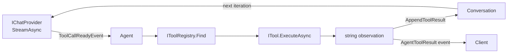
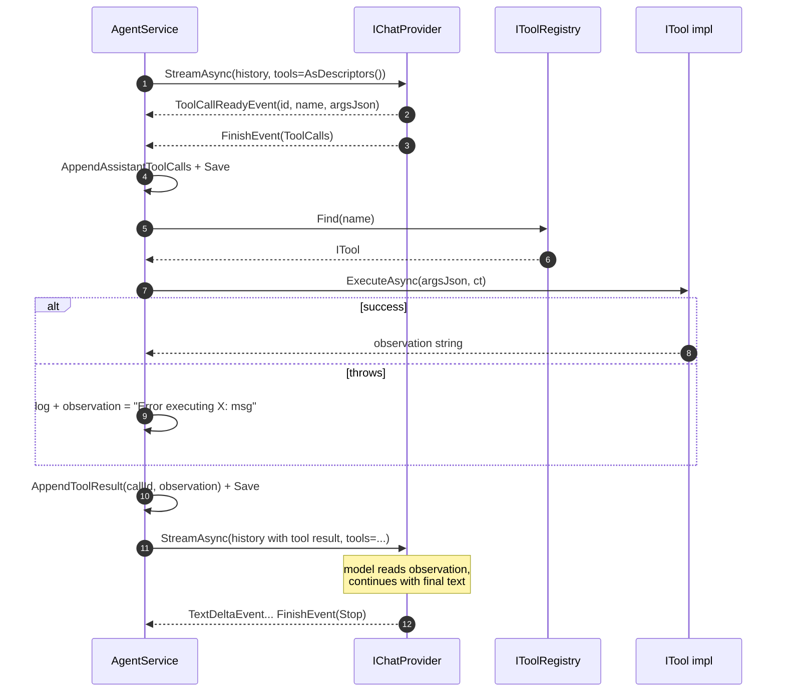

# Tools

The agent loop calls tools when the model emits `tool_calls`. This doc covers the tool abstraction, the currently registered tools, and how to add a new one.

## Tool model



Two interfaces shape everything:

```csharp
public interface ITool
{
    string Name { get; }
    string Description { get; }
    string ParametersJsonSchema { get; }
    Task<string> ExecuteAsync(string argumentsJson, CancellationToken ct);
}

public interface IToolRegistry
{
    IReadOnlyList<ITool> All { get; }
    ITool? Find(string name);
    IReadOnlyList<ToolDescriptor> AsDescriptors();
}
```

`ToolRegistry` is the default implementation. It consumes `IEnumerable<ITool>` from DI, so every `ITool` registered in the service collection is automatically discovered. No central manifest, no plugin loader - just DI scanning.

`AsDescriptors()` projects the registry into the wire format the provider sees:

```csharp
public record ToolDescriptor(string Name, string Description, string ParametersJsonSchema);
```

This is what gets serialized into the `tools` array of the chat-completions request body. The model decides which (if any) to call based on the descriptions.

## How tool calls flow

A complete tool-using turn:



Key invariants:

- **Tool execution errors don't crash the agent**. If `ExecuteAsync` throws, the catch block surfaces the message back to the model as `"Error executing {tool}: {msg}"` - the model can react (try different args, give up, explain to the user).
- **Unknown tool names** also return an error observation rather than crashing - `"Error: tool 'foo' is not registered."`
- **The assistant message + tool messages share a `VariantGroupId`** when generated under a regenerate flow (see [variants-and-history.md](variants-and-history.md)).

## Registered tools

Five tools ship with v1:

| Name | Purpose | Provider dep |
| --- | --- | --- |
| `get_current_time` | Returns ISO 8601 UTC time | None |
| `web_search` | Search the web | `IWebSearch` |
| `web_fetch` | Fetch a URL's content as text | `IUrlFetcher` |
| `docs_list` | List Gabriel's official docs | `IDocsLookup` |
| `docs_read` | Read one official doc by path | `IDocsLookup` |

### `get_current_time`

Trivial starter - proves the loop works end-to-end. Returns `DateTimeOffset.UtcNow.ToString("o")`.

### `web_search`

```jsonc
{ "query": "string", "limit": 5 }
```

Description steers the model: *"USE THIS for: recent events, public docs of external tools/libraries, factual lookups. DO NOT use this for questions about Gabriel itself - use the docs_list / docs_read tools instead."*

#### Provider selection

`Tools:Web:Active` (default `"ddg"`) picks the implementation:

- **`ddg`** → `DuckDuckGoWebSearch`. Free, no API key. POSTs `q=...` to `https://html.duckduckgo.com/html/`, regex-parses result blocks out of the HTML, unwraps the `/l/?uddg=ENCODED` redirect wrapper to recover destination URLs.
- **`brave`** → `BraveWebSearch`. Requires `Tools:Web:Brave:ApiKey`. Cleaner output, 2000 queries/month free tier; needed for production-grade use.

The DDG impl is brittle by nature - if their HTML class names change, the regex returns zero results and logs `"DuckDuckGo returned no parseable results"`. Wrapped in try/don't-crash so a parse drift doesn't kill the agent loop.

### `web_fetch`

```jsonc
{ "url": "https://example.com/page" }
```

Description: *"USE THIS AFTER web_search when a result snippet looks relevant and you need the full page text to answer the user - search snippets are short and often miss the relevant detail."*

#### SSRF defense

Before any HTTP fires, the URL goes through:

1. Scheme check - `http` and `https` only.
2. DNS resolution - every resolved address must be **public**:
   - Loopback ($127.0.0.0/8$ and IPv6 ::1) - refused
   - RFC1918 ($10/8$, $172.16/12$, $192.168/16$) - refused
   - Link-local ($169.254/16$ - catches AWS/GCP metadata service) - refused
   - CGNAT ($100.64/10$) - refused
   - Unspecified ($0/8$) - refused
   - IPv6 link-local + unique-local (fc00::/7) - refused

Hosts that resolve to ANY private address are rejected. Without this guard, the agent could be tricked into fetching `http://169.254.169.254/latest/meta-data/iam/security-credentials/` (AWS metadata) or hitting localhost services.

#### Content cleaning

If `Content-Type` indicates text/html, the cleaner runs:

1. Strip HTML comments
2. Drop entire `<script>`, `<style>`, `<nav>`, `<header>`, `<footer>`, `<aside>`, `<noscript>`, `<svg>` blocks (body + tags)
3. Strip remaining tags
4. HTML-decode entities
5. Collapse whitespace runs to single spaces; collapse newline runs to double-newlines

For non-HTML text content (JSON, XML, plain), just whitespace-collapse.

#### Caps

- **Wire byte cap**: 1.5 MB read budget per page. Past that, the read stream is closed.
- **Output char cap**: 12,000 chars (~3,000 tokens). Past that, truncate + append `…[truncated]`.
- **Timeout**: 15 seconds total.

The 12k cap is the headline number - leaves plenty of room for the rest of the conversation in the model's context window.

### `docs_list` + `docs_read`

The pair that gives Gabriel access to its own documentation. Both depend on `IDocsLookup`, implemented by `GitHubDocsLookup` against the canonical GitHub repo.

**Critical design choice**: both tools' descriptions hammer the **AUTHORITATIVE** framing repeatedly. The descriptions explicitly say *"if a web_search result and a Gabriel doc disagree, the Gabriel doc wins"* and *"never substitute external/third-party docs for Gabriel-specific info"*. Without this framing, the model would treat Gabriel docs as one of N sources and might mix in incorrect external references.

`docs_read` wraps content in explicit authority markers:

```text
=== BEGIN OFFICIAL GABRIEL DOC: {path} ===
(Authoritative source. Treat this as ground truth about Gabriel.)
Canonical URL: https://github.com/HueByte/Gabriel/blob/main/docs/{path}

{content}

=== END OFFICIAL GABRIEL DOC: {path} ===
```

The markers + canonical URL discourage the model from blending the doc content with other tool results when forming its answer.

#### GitHub backend

`GitHubDocsLookup` uses two endpoints:

- **List** - `GET https://api.github.com/repos/{owner}/{repo}/git/trees/{branch}?recursive=1`. Filters to `*.md` files under `docs/`. Cached for 5 minutes (semaphore-guarded double-check).
- **Read** - `GET https://raw.githubusercontent.com/{owner}/{repo}/{branch}/docs/{path}`. Not cached - docs may be edited live during development.

Path traversal hardening: `..` / `.` segments and absolute prefixes are rejected before the request fires.

Unauthenticated GitHub API rate limit is 60 req/h per IP. Plenty for a docs-lookup tool. Setting `Tools:Docs:GitHub:Token` (a PAT) bumps it to 5000/h.

```jsonc
{
  "Tools": {
    "Docs": {
      "GitHub": {
        "Owner": "HueByte",
        "Repo": "Gabriel",
        "Branch": "main",
        "DocsPath": "docs",
        "Token": null,
        "ListCacheMinutes": 5
      }
    }
  }
}
```

## Provider summary

| Concern | Implementation | Lifetime |
| --- | --- | --- |
| `IWebSearch` (Brave) | `BraveWebSearch` | Singleton |
| `IWebSearch` (DDG) | `DuckDuckGoWebSearch` | Singleton |
| `IUrlFetcher` | `HttpUrlFetcher` | Singleton |
| `IDocsLookup` | `GitHubDocsLookup` | Singleton |

All providers are singletons because they're stateless (no per-request data). HttpClients are managed via `IHttpClientFactory` - see `Gabriel.Infrastructure/DependencyInjection.cs` for the named-client wiring. Each named client gets its own base URL, timeout, and default headers (User-Agent, Accept, API key headers).

## Adding a new tool

Three steps:

1. **Declare the contract** (if it needs an external dep). For example, a "fetch a Stripe subscription" tool needs an `IStripeClient` interface in `Engine/Tools/Stripe/`.
2. **Implement the tool** in `Engine/Tools/`. The class:
   - Implements `ITool`
   - Holds the dep
   - Description must STRONGLY guide when to use vs not use it (most tool quality comes from the description, not the implementation)
   - JSON schema for the args
   - `ExecuteAsync` validates args, calls the dep, returns a string observation
3. **Register**:
   - The tool in `Gabriel.Engine/DependencyInjection.cs` (`services.AddScoped<ITool, MyTool>()`)
   - The dep in `Gabriel.Infrastructure/DependencyInjection.cs` if it needs HTTP / external resources
   - Any config options sections

The registry picks the new tool up automatically - no central list to edit.

### Description writing tips (learned from `web_search` vs `docs_read`)

- **Lead with WHEN to use it**, not what it returns. The model already infers structure from the schema.
- **Spell out what to NOT use it for**, especially when adjacent tools overlap. Web search and docs both return "information"; the descriptions have to fight for the model's attention.
- **Use AUTHORITATIVE / CANONICAL framing** for trusted sources. The model takes capitalized words seriously.
- **Mention the OTHER tool by name** when relevant - *"use docs_read instead"* - so the model has a complete picture of the choice it's making.
- **Keep schemas tight**. A two-field schema (query + limit) lets the model focus on intent; a 12-field schema buries the point.

## What's NOT in the tool system (yet)

- **Async / long-running tools** - every tool returns its observation synchronously. A "submit a job, poll for result" pattern would need a different mechanism (probably emitting a `partial_result` event and the agent re-querying on a later iteration). Out of scope for v1.
- **Tool gating per personality** - Phase 8 / per-project will likely want "this project's persona can use docs_read but not web_search" (or similar). The registry hasn't been wired for that yet; a `ToolFilter` interface stage between `IToolRegistry.All` and `AsDescriptors()` would be the right insertion point.
- **Streaming tool output** - tools return their full output as one string. A tool that reads a large file or runs a long calculation can't stream progress.
- **Authentication-aware tools** - tools don't currently see the calling user. If a tool needed to act on the user's behalf (read their files, etc.), it'd need access to `ICurrentUser` or similar.
