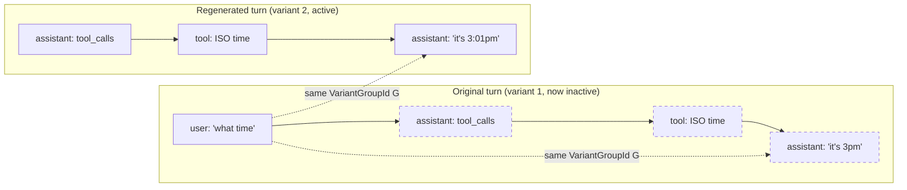
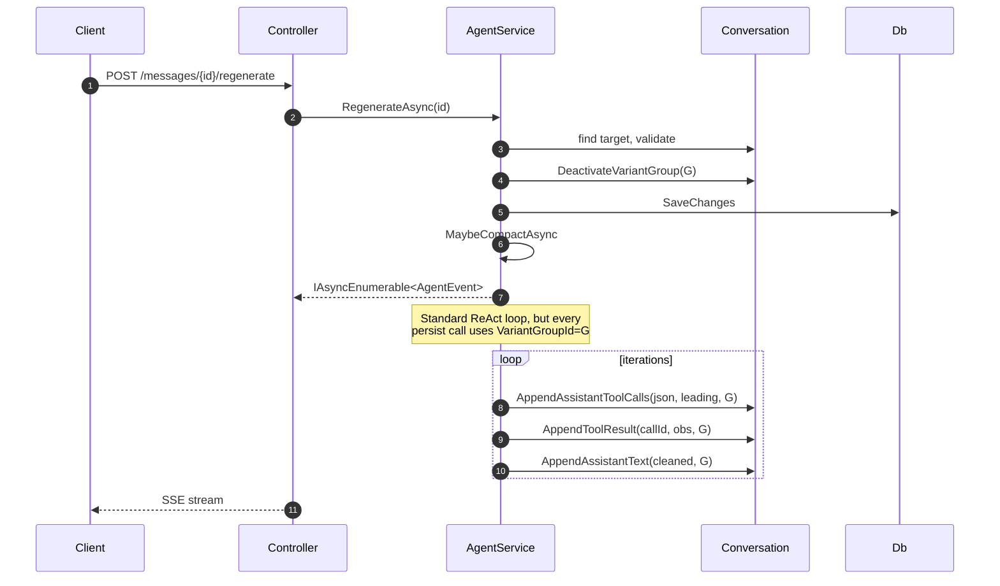

# Variants and history

How regenerate, delete, and the variant picker work — at the data model, agent loop, and API levels.

## The variant group concept

A "variant group" is a set of `Message`s that represent **alternative versions of one logical turn**. Two columns on `Message` express it:

```csharp
public Guid VariantGroupId { get; private set; }  // shared across regen siblings
public bool IsActiveVariant { get; private set; } = true;
```

Defaults:

- For a newly-created `Message`, `VariantGroupId = Message.Id` — every message is its own singleton group.
- `IsActiveVariant = true`.

When the agent **regenerates** an assistant reply, the new turn's messages share the **original assistant's** `VariantGroupId`. The old turn flips to `IsActiveVariant = false`; the new turn stays `true`. Exactly one set of variants is active per group at any time.



Dashed = inactive variant; still in the database, hidden from history assembly.

## Regenerate flow

`IAgentService.RegenerateAsync(convId, assistantMessageId)`:

1. Load conversation user-scoped.
2. Locate target. Validate it's an assistant message AND `IsActiveVariant`.
3. `conversation.DeactivateVariantGroup(target.VariantGroupId)` — flips every member of the group to inactive.
4. Save. From this point `ToProviderHistory` sees the old turn as "gone".
5. `MaybeCompactAsync` (standard between-turn step).
6. Hand to the shared `RunStreamAsync(conversation, variantGroupIdOverride: target.VariantGroupId, ct)`.

The iterator runs the regular ReAct loop. Every message it creates passes the `variantGroupIdOverride` through to `Message.Create`, so the new turn's assistant + tool messages all carry the SAME group id as the old turn.

When the stream finishes, the variant group has $\geq 2$ active+inactive turn-sequences sharing one id.



## Truncate-from-here

`IChatService.DeleteMessageAsync(convId, messageId)`:

1. Load conversation user-scoped.
2. Validate the target exists.
3. `conversation.TruncateFrom(messageId)` returns the removed messages.
4. `_conversations.RemoveMessages(removed)` — explicit EF removal (orphan-removal alone is fragile across EF Core versions / configs).
5. Save.

The interesting bit is `TruncateFrom` — it doesn't just delete from `messageId` onward. It first **anchors on the variant group's earliest sibling**, then deletes from that anchor's `CreatedAt` onward.

**Why anchor on the earliest sibling**: if the user deletes a regenerated variant that's currently active, naive "delete from this message onward" would leave the *inactive* siblings orphaned with no active member. The conversation would then show a blank turn at that position. Anchoring on the earliest sibling means the whole turn (all variants + their tool aftermath + everything after) goes cleanly.

```csharp
public IReadOnlyList<Message> TruncateFrom(Guid messageId)
{
    var target = _messages.FirstOrDefault(m => m.Id == messageId)
        ?? throw new ArgumentException(...);

    var anchor = _messages
        .Where(m => m.VariantGroupId == target.VariantGroupId)
        .OrderBy(m => m.CreatedAt)
        .First();

    var toRemove = _messages.Where(m => m.CreatedAt >= anchor.CreatedAt).ToList();
    foreach (var m in toRemove) _messages.Remove(m);
    return toRemove;
}
```

For non-assistant messages (user, system, tool), the variant group equals the message's own id, so anchor = self. The truncation is `≥ CreatedAt` — straight chronological cut.

## History filtering

`AgentService.ToProviderHistory` enforces variant-awareness when building the wire format:

```csharp
// Collect tool_call.ids referenced by active assistant messages.
var activeToolCallIds = new HashSet<string>(StringComparer.Ordinal);
foreach (var m in messages)
{
    if (m.Role != MessageRole.Assistant || !m.IsActiveVariant) continue;
    if (string.IsNullOrEmpty(m.ToolCallsJson)) continue;
    foreach (var el in JsonDocument.Parse(m.ToolCallsJson).RootElement.EnumerateArray())
        activeToolCallIds.Add(el.GetProperty("id").GetString()!);
}

for (var i = startIdx; i < messages.Count; i++)
{
    var m = messages[i];
    if (m.Role == MessageRole.Tool)
    {
        // Tool message: keep iff its ToolCallId is referenced by an active assistant.
        if (m.ToolCallId is null || !activeToolCallIds.Contains(m.ToolCallId)) continue;
    }
    else if (!m.IsActiveVariant)
    {
        continue;
    }
    // ... build ChatProviderMessage ...
}
```

Two filters, both necessary:

1. **`IsActiveVariant`** — excludes inactive assistant messages directly. Catches the obvious case where a regen-deactivated assistant lurks in `Conversation.Messages`.
2. **Tool-call-id linkage** — excludes tool messages whose parent assistant is gone (either deactivated, or it's a legacy message from before variant grouping existed at all). Without this, a tool message could appear in history with no corresponding `tool_calls` declaration → the provider's wire-format invariant breaks.

The `Conversation` entity stores ALL messages including inactive ones — nothing is destroyed unless explicitly deleted. The model just never sees them, and the API response filters them (see below).

## Variant picker (data contract for the UI)

Every active message returned by `GET /api/conversations/{id}` carries variant metadata:

```ts
interface MessageResponse {
  id: string;
  role: 'user' | 'assistant' | 'system' | 'tool';
  content: string | null;
  createdAt: string;
  variantGroupId: string;         // shared across regen siblings
  variantIndex: number;           // 0-based position in the group (by CreatedAt)
  variantCount: number;           // total siblings in this group
  variantSiblingIds: string[];    // all sibling Ids in this group, CreatedAt-sorted (includes self)
  toolCallId: string | null;
  toolCalls: MessageToolCall[] | null;
}
```

For singletons (the common case): `variantCount = 1`, `variantIndex = 0`, `variantSiblingIds = [self.id]`. The UI hides the picker when `variantCount === 1`.

For regenerated turns: `variantCount >= 2`. The UI shows `< {variantIndex + 1}/{variantCount} >` chrome with prev/next arrows. Switching navigates by `variantSiblingIds`.

`ContractMappings.ToResponse` builds this metadata at API response time:

```csharp
var groupSiblings = allMessages
    .GroupBy(m => m.VariantGroupId)
    .ToDictionary(
        g => g.Key,
        g => g.OrderBy(m => m.CreatedAt).Select(m => m.Id).ToList());

// ... per message:
var siblings = groupSiblings[m.VariantGroupId];
new MessageResponse(
    ...,
    VariantGroupId: m.VariantGroupId,
    VariantIndex: siblings.IndexOf(m.Id),
    VariantCount: siblings.Count,
    VariantSiblingIds: siblings,
    ...);
```

The response **only includes active variants** (and tool aftermath of active assistants) — same filter as `ToProviderHistory`. Inactive siblings are NOT exposed in the messages array; the client navigates to them via the `variantSiblingIds` list + the `PATCH /active` endpoint.

## API surface

Three endpoints:

| Method | Route | Purpose |
| --- | --- | --- |
| `DELETE` | `/api/conversations/{convId}/messages/{messageId}` | Truncate from here. Returns the conversation without `messages`. |
| `PATCH` | `/api/conversations/{convId}/messages/{messageId}/active` | Switch active variant inside the group. Empty body. Returns conversation with new-active `messages`. |
| `POST` | `/api/conversations/{convId}/messages/{messageId}/regenerate` | SSE; same wire format as `/messages/stream`. New reply re-uses original's `VariantGroupId`. |

### Switch active variant

```csharp
public void SetActiveVariant(Guid messageId)
{
    var target = _messages.FirstOrDefault(m => m.Id == messageId)
        ?? throw new ArgumentException(...);

    foreach (var m in _messages.Where(m => m.VariantGroupId == target.VariantGroupId))
    {
        if (m.Id == target.Id) m.MarkActiveVariant();
        else m.MarkInactiveVariant();
    }
}
```

Within the group, flip the target on, everyone else off. The PATCH response is the full conversation with the new active set — UI just replaces the message list with `response.messages`.

For multi-message variants (assistant + tool calls + tool results), the `SetActiveVariant(messageId)` call activates the entire turn at once because every message in the turn shares the same `VariantGroupId`. Calling with any one of them is equivalent.

## Compact interaction

The rolling compact (see [agent-loop.md](agent-loop.md)) cuts on **user-message boundaries**. That naturally avoids cutting through a variant group, because:

- All members of a regen variant group are assistant + tool messages (never user)
- The cut-point selector walks back to a `User` role message
- So the cut lands BEFORE the variant group, and the entire group is either pre-cut (folded into summary) or post-cut (kept verbatim)

A variant group never gets half-summarized.

When a variant group falls entirely pre-cut, the summary captures whatever the active variant said. Inactive siblings of summarized turns are still in the DB but they're now invisible — the message history no longer includes them, and the summary represents the active variant's content.

## What this design does NOT do (yet)

- **Branching from a user message** — only assistant messages can be regenerated. Editing a user message would mean either replacing it (lose original) or branching the conversation tree itself (much bigger model change). Current UX: delete + retype.
- **Cross-conversation variant pools** — variants are scoped to a single conversation. You can't "merge" two conversations' replies into a shared variant pool.
- **Variant scoring / preference learning** — the UI doesn't capture "user prefers variant N for turns of this kind". If we wanted to learn from picker activity, we'd need to persist switch events.
- **Streaming the variant switch** — `PATCH /active` returns the full conversation in one response. A small conversation could be megabytes once it grows; we'd want a partial-update response or a diff format if conversations got very long.
- **Diff between variants** — the UI gets `variantSiblingIds` but no preview of what differs. A "show diff" affordance would require either fetching each sibling separately or a new endpoint that bundles them.
