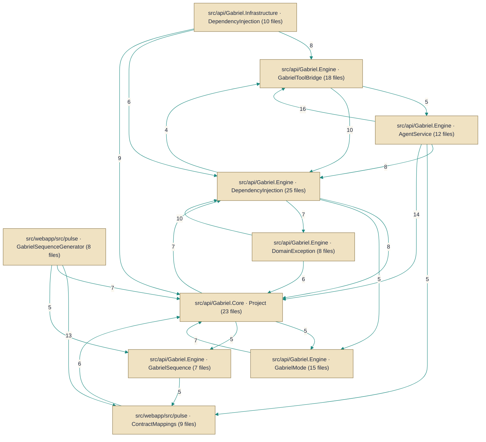

# Architecture — HueByte/Gabriel

> *Auto-synthesized from 532 documented symbols across 250 files on `main`.*

## Topic Guides

Deep-dives into cross-cutting concerns synthesized from the per-symbol corpus.

- [API configuration and logging](api-configuration-and-logging.md) — Configurations and logging enhancements that shape how the API is bootstrapped and observed, including route prefixes and log enrichment.
- [Authentication and token management](authentication-and-token-management.md) — Authentication endpoints and payloads for login, token issuance, and token refresh.
- [Documentation sources with multi-source lookups](documentation-lookups.md) — A multi-source docs lookup system supporting local, GitHub, and composite strategies.
- [Web search integration and HTTP utilities](web-search-and-http-tools.md) — Web search integrations and underlying HTTP fetch utilities used by tools.
- [Persistence layer and data access](persistence-layer.md) — EF Core DbContext and repositories handling persistence across domain entities.

## Architecture Diagram

## System Overview
This repository implements an HTTP API front end (src/api/Gabriel.API) that coordinates an agent execution engine (src/api/Gabriel.Engine) which runs small, focused tooling components (the ITool implementations) to fulfill user requests. Agents are composed and driven by a system-prompt builder (GabrielSystemPromptBuilder / ISystemPromptBuilder) and configured by option classes in src/api/Gabriel.Core; runtime state is kept in persistence (conversation configuration) and in-memory memories exposed by the engine’s memory tools. The overall collaboration pattern is API requests -> Engine orchestration -> tool invocations, with configuration and conversation persistence backing the system.

## Key Components
**Agent Tools** — Runtime worker/task implementations that perform discrete actions for agents. Implemented by [`Base64Tool`](../Code/src/api/Gabriel.Engine/Tools/Codecs/Base64Tool.cs.md), [`BaseConvertTool`](../Code/src/api/Gabriel.Engine/Tools/Numbers/BaseConvertTool.cs.md), [`CalculateTool`](../Code/src/api/Gabriel.Engine/Tools/Calc/CalculateTool.cs.md), [`ColorConvertTool`](../Code/src/api/Gabriel.Engine/Tools/Colors/ColorConvertTool.cs.md), [`DocsListTool`](../Code/src/api/Gabriel.Engine/Tools/Docs/DocsListTool.cs.md), [`DocsReadTool`](../Code/src/api/Gabriel.Engine/Tools/Docs/DocsReadTool.cs.md), [`FileInfoTool`](../Code/src/api/Gabriel.Engine/Tools/Files/FileInfoTool.cs.md), [`FindTool`](../Code/src/api/Gabriel.Engine/Tools/Files/FindTool.cs.md), [`GetCurrentTimeTool`](../Code/src/api/Gabriel.Engine/Tools/GetCurrentTimeTool.cs.md), [`GrepTool`](../Code/src/api/Gabriel.Engine/Tools/Files/GrepTool.cs.md), [`HashTool`](../Code/src/api/Gabriel.Engine/Tools/Codecs/HashTool.cs.md), [`JsonFormatTool`](../Code/src/api/Gabriel.Engine/Tools/Data/JsonFormatTool.cs.md), [`ListDirTool`](../Code/src/api/Gabriel.Engine/Tools/Files/ListDirTool.cs.md), [`ListProjectFilesTool`](../Code/src/api/Gabriel.Engine/Tools/Projects/ListProjectFilesTool.cs.md), [`MemoryListTool`](../Code/src/api/Gabriel.Engine/Tools/Memory/MemoryListTool.cs.md), [`MemoryRemoveTool`](../Code/src/api/Gabriel.Engine/Tools/Memory/MemoryRemoveTool.cs.md), [`MemorySaveTool`](../Code/src/api/Gabriel.Engine/Tools/Memory/MemorySaveTool.cs.md), [`ReadProjectFileTool`](../Code/src/api/Gabriel.Engine/Tools/Projects/ReadProjectFileTool.cs.md), [`TextStatsTool`](../Code/src/api/Gabriel.Engine/Tools/Strings/TextStatsTool.cs.md), [`TextTransformTool`](../Code/src/api/Gabriel.Engine/Tools/Strings/TextTransformTool.cs.md), [`WebFetchTool`](../Code/src/api/Gabriel.Engine/Tools/Web/WebFetchTool.cs.md), [`WebSearchTool`](../Code/src/api/Gabriel.Engine/Tools/Web/WebSearchTool.cs.md), and others.  

**Tooling Interface** — Defines the contract every tool implements so the engine can invoke them uniformly. Implemented by [`ITool`](../Code/src/api/Gabriel.Engine/Tools/ITool.cs.md).

**Personality / System Prompt Builder** — Builds the agent/system prompt and personality used by the engine when composing agent behavior. Implemented by [`GabrielSystemPromptBuilder`](../Code/src/api/Gabriel.Engine/Personality/GabrielSystemPromptBuilder.cs.md), [`ISystemPromptBuilder`](../Code/src/api/Gabriel.Engine/Personality/ISystemPromptBuilder.cs.md).

**Configuration** — Strongly-typed configuration sections that control agent behavior, available tools, authentication, and external search settings. Implemented by [`AgentOptions`](../Code/src/api/Gabriel.Core/Configuration/AgentOptions.cs.md), [`AgentToolsOptions`](../Code/src/api/Gabriel.Core/Configuration/AgentToolsOptions.cs.md), [`AuthOptions`](../Code/src/api/Gabriel.Core/Configuration/AuthOptions.cs.md), [`BraveSearchOptions`](../Code/src/api/Gabriel.Core/Configuration/BraveSearchOptions.cs.md).

**Persistence / Repositories** — Database mapping and entity configuration used to persist conversation state. Implemented by [`ConversationConfiguration`](../Code/src/api/Gabriel.Infrastructure/Persistence/Configurations/ConversationConfiguration.cs.md).

**External integrations** — Tools and configuration that interact with external web/search resources on behalf of agents. Implemented by [`WebSearchTool`](../Code/src/api/Gabriel.Engine/Tools/Web/WebSearchTool.cs.md), [`WebFetchTool`](../Code/src/api/Gabriel.Engine/Tools/Web/WebFetchTool.cs.md).

## Component Map

*Subsystems below are structural clusters detected from the dependency graph — groups of symbols more densely wired to each other than to the rest of the codebase.*

- **src/api/Gabriel.Engine · DependencyInjection** — 25 documented files
- **src/api/Gabriel.Core · Project** — 23 documented files
- **src/api/Gabriel.Engine · GabrielToolBridge** — 18 documented files
- **src/api/Gabriel.Engine · GabrielMode** — 15 documented files
- **src/api/Gabriel.Engine · AgentService** — 12 documented files
- **src/api/Gabriel.Infrastructure · DependencyInjection** — 10 documented files
- **src/webapp/src/pulse · ContractMappings** — 9 documented files
- **src/api/Gabriel.Engine · DomainException** — 8 documented files
- **src/webapp/src/pulse · GabrielSequenceGenerator** — 8 documented files
- **src/api/Gabriel.API · AuthController** — 7 documented files
- **src/api/Gabriel.Core · MemoryEntry** — 7 documented files
- **src/api/Gabriel.Engine · GabrielSequence** — 7 documented files
- *…and 42 more subsystem folders*

### Components by Role

**Agent Tools**
- `Base64Tool` — `src/api/Gabriel.Engine/Tools/Codecs/Base64Tool.cs`
- `BaseConvertTool` — `src/api/Gabriel.Engine/Tools/Numbers/BaseConvertTool.cs`
- `CalculateTool` — `src/api/Gabriel.Engine/Tools/Calc/CalculateTool.cs`
- `ColorConvertTool` — `src/api/Gabriel.Engine/Tools/Colors/ColorConvertTool.cs`
- `DocsListTool` — `src/api/Gabriel.Engine/Tools/Docs/DocsListTool.cs`
- `DocsReadTool` — `src/api/Gabriel.Engine/Tools/Docs/DocsReadTool.cs`
- `FileInfoTool` — `src/api/Gabriel.Engine/Tools/Files/FileInfoTool.cs`
- `FindTool` — `src/api/Gabriel.Engine/Tools/Files/FindTool.cs`
- `GetCurrentTimeTool` — `src/api/Gabriel.Engine/Tools/GetCurrentTimeTool.cs`
- `GrepTool` — `src/api/Gabriel.Engine/Tools/Files/GrepTool.cs`
- `HashTool` — `src/api/Gabriel.Engine/Tools/Codecs/HashTool.cs`
- `ITool` — `src/api/Gabriel.Engine/Tools/ITool.cs`
- `JsonFormatTool` — `src/api/Gabriel.Engine/Tools/Data/JsonFormatTool.cs`
- `ListDirTool` — `src/api/Gabriel.Engine/Tools/Files/ListDirTool.cs`
- `ListProjectFilesTool` — `src/api/Gabriel.Engine/Tools/Projects/ListProjectFilesTool.cs`
- `MemoryListTool` — `src/api/Gabriel.Engine/Tools/Memory/MemoryListTool.cs`
- `MemoryRemoveTool` — `src/api/Gabriel.Engine/Tools/Memory/MemoryRemoveTool.cs`
- `MemorySaveTool` — `src/api/Gabriel.Engine/Tools/Memory/MemorySaveTool.cs`
- `ReadProjectFileTool` — `src/api/Gabriel.Engine/Tools/Projects/ReadProjectFileTool.cs`
- `TextStatsTool` — `src/api/Gabriel.Engine/Tools/Strings/TextStatsTool.cs`
- `TextTransformTool` — `src/api/Gabriel.Engine/Tools/Strings/TextTransformTool.cs`
- `WebFetchTool` — `src/api/Gabriel.Engine/Tools/Web/WebFetchTool.cs`
- `WebSearchTool` — `src/api/Gabriel.Engine/Tools/Web/WebSearchTool.cs`

**Builders**
- `GabrielSystemPromptBuilder` — `src/api/Gabriel.Engine/Personality/GabrielSystemPromptBuilder.cs`
- `ISystemPromptBuilder` — `src/api/Gabriel.Engine/Personality/ISystemPromptBuilder.cs`

**Configuration**
- `AgentOptions` — `src/api/Gabriel.Core/Configuration/AgentOptions.cs`
- `AgentToolsOptions` — `src/api/Gabriel.Core/Configuration/AgentToolsOptions.cs`
- `AuthOptions` — `src/api/Gabriel.Core/Configuration/AuthOptions.cs`
- `BraveSearchOptions` — `src/api/Gabriel.Core/Configuration/BraveSearchOptions.cs`
- `ConversationConfiguration` — `src/api/Gabriel.Infrastructure/Persistence/Configurations/ConversationConfiguration.cs`

---
*Generated by Aurion on 2026-07-07 18:15:17 UTC*
