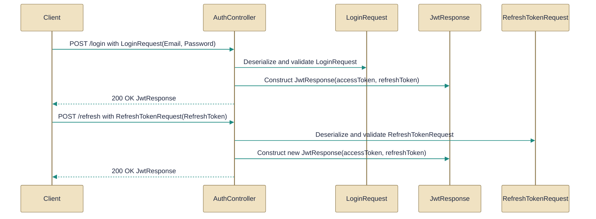

# Authentication and token management

> Authentication endpoints and payloads for login, token issuance, and token refresh.

*Figure: How Authentication and token management works.*

Authentication and token management

This topic covers the HTTP surface and small data contracts used to authenticate users and manage JWT / refresh-token lifecycles. You will see the controller that exposes login, refresh, revoke and related endpoints, and the immutable request/response records used as the request and response payloads; together they support both browser-based (HttpOnly cookie) and external-client (token-in-body) flows.

## AuthController.cs
Exposes authentication endpoints (login, token refresh, etc.).

The [AuthController](../Code/src/api/Gabriel.API/Controllers/AuthController.cs.md) class is the API surface for registration, login, refresh, logout, revoke (single token), revoke-all and the "me" endpoint. It centralizes JWT issuance and refresh-token lifecycle operations by calling into an IJwtTokenService to mint, rotate and revoke refresh tokens while delegating user persistence and credential verification to ASP.NET Identity (UserManager and SignInManager). The controller intentionally both returns a [JwtResponse](../Code/src/api/Gabriel.API/Contracts/Auth/JwtResponse.cs.md) in the response body and sets/clears HttpOnly cookies so the same endpoints serve browser SPAs (which use cookies) and external clients (which read tokens from the body). Registration can be toggled at runtime via AuthOptions read through IOptionsMonitor; when disabled the controller returns a 403.

## LoginRequest.cs
Represents login request payload (email and password).

[LoginRequest](../Code/src/api/Gabriel.API/Contracts/Auth/LoginRequest.cs.md) is a positional, immutable record that carries the Email and Password fields for the login endpoint. The controller consumes this DTO on login requests (POST /api/auth/login) to obtain credentials that Identity will validate; because it contains a password it should be treated as sensitive (redact in logs and send only over TLS).

## JwtResponse.cs
Represents issued JWT token response.

[JwtResponse](../Code/src/api/Gabriel.API/Contracts/Auth/JwtResponse.cs.md) is the immutable response contract returned by endpoints that issue tokens (for example POST /api/auth/jwt and POST /api/auth/jwt/refresh). It contains the short-lived signed access token (AccessToken) and its expiry (AccessExpiresAt), plus an opaque RefreshToken and its expiry (RefreshExpiresAt). The controller produces this record for external clients to consume while also writing the refresh token into an HttpOnly cookie for browser clients; the contract notes that refresh tokens are rotated on use and both tokens must be treated as sensitive.

## RefreshTokenRequest.cs
Represents a refresh token submission for renewal.

[RefreshTokenRequest](../Code/src/api/Gabriel.API/Contracts/Auth/RefreshTokenRequest.cs.md) is a single-field positional record that carries a RefreshToken string when an external client submits a refresh request in the request body. The controller accepts this DTO on refresh calls (POST /api/auth/refresh for external clients) and forwards the token to the IJwtTokenService/validation logic; clients must transmit this record over HTTPS and replace stored tokens when the server returns a rotated refresh token.

How the pieces fit

The [AuthController](../Code/src/api/Gabriel.API/Controllers/AuthController.cs.md) depends on the three small contracts: it accepts [LoginRequest](../Code/src/api/Gabriel.API/Contracts/Auth/LoginRequest.cs.md) to authenticate credentials, accepts [RefreshTokenRequest](../Code/src/api/Gabriel.API/Contracts/Auth/RefreshTokenRequest.cs.md) when external clients present a refresh token, and issues [JwtResponse](../Code/src/api/Gabriel.API/Contracts/Auth/JwtResponse.cs.md) containing the access and refresh tokens. Responsibility is split so the controller orchestrates HTTP behavior (cookies vs. body, registration toggle via AuthOptions) and delegates credential checks to Identity and token operations to the IJwtTokenService; this enables a single set of endpoints to serve both browser-first and external-client authentication flows while keeping token contracts and security guidance explicit.

---
*Synthesised by Aurion on 2026-07-07 18:10:39 UTC*
