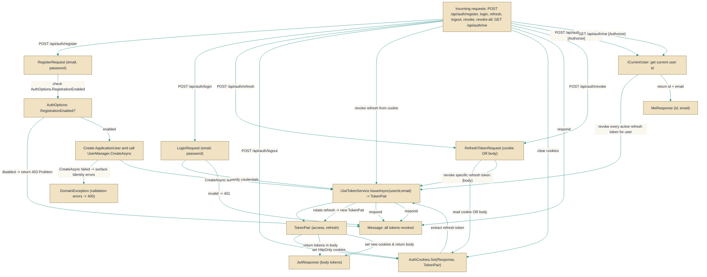

# AuthController

> **File:** `src/api/Gabriel.API/Controllers/AuthController.cs`  
> **Kind:** class

*Figure: How AuthController works.*



```csharp
[ApiController]
[Route("auth")]
public class AuthController : ControllerBase
```


Exposes the application's authentication surface: register, login, refresh, logout, revoke (single token), revoke-all, and me. Use this controller when you need a single HTTP API that serves both browser-based clients (which rely on HttpOnly cookies) and external clients (which consume JWTs in the response body). Endpoints mint, rotate and revoke refresh tokens via the IJwtTokenService and set/clear HttpOnly cookies so the same endpoints work for both audiences.

## Remarks
This controller centralizes JWT issuance and refresh-token lifecycle management while delegating user persistence and credential checks to ASP.NET Identity (UserManager and SignInManager). It intentionally returns tokens in the response body and also writes HttpOnly cookies: the browser-based SPA relies on the cookies (ignoring the body), whereas external clients ignore cookies and use the tokens from the body. Registration is guarded by an AuthOptions toggle (read via IOptionsMonitor so it can be flipped at runtime without restarting the app). Identity validation failures are surfaced as a clean client error (password rules, duplicate email, etc.), and invalid credentials follow a unified unauthorized path to avoid account enumeration.

## Example
```csharp
// Browser flow (frontend): POST /api/auth/login; browser receives HttpOnly cookies automatically and the SPA ignores the JSON body.
// External client flow (CLI): POST /api/auth/login and read the JSON body for access/refresh tokens.

using var client = new HttpClient();
var login = new { Email = "alice@example.com", Password = "P@ssw0rd" };
var resp = await client.PostAsJsonAsync("/api/auth/login", login);
resp.EnsureSuccessStatusCode();
// External client: read tokens from the body
var jwt = await resp.Content.ReadFromJsonAsync<JwtResponse>();

// To refresh using cookie (browser): POST /api/auth/refresh with no body; browser attaches cookie automatically.
// To refresh for external client: POST /api/auth/refresh with { refreshToken: "..." } in the body and read new tokens from the body.
```

## Notes
- Registration can be disabled at runtime via AuthOptions. When disabled the controller returns a 403 Problem response.
- The controller sets HttpOnly cookies (not readable by JavaScript). External clients must use the tokens returned in the response body.
- Identity validation errors from CreateAsync are aggregated and surfaced as a domain/client error so callers receive a clean 400-style response rather than raw Identity details.
