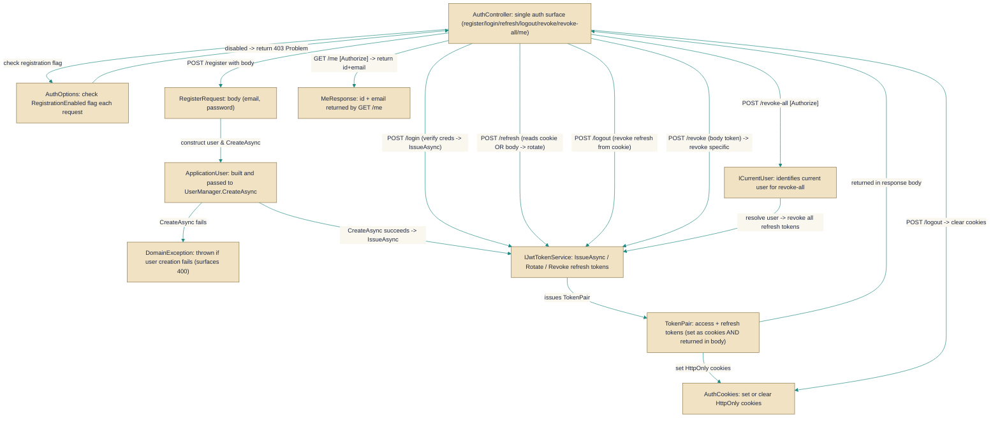

# AuthController

> **File:** `src/api/Gabriel.API/Controllers/AuthController.cs`  
> **Kind:** class

*Figure: How AuthController works.*



```csharp
[ApiController]
[Route("auth")]
public class AuthController : ControllerBase
```


Exposes the application's authentication surface: endpoints for register, login, refresh, logout, revoke (single token), revoke-all (all tokens for the current user) and me (current user info). It is the single place clients—both browser-based and external—interact with account creation, credential verification, JWT issuance/rotation, and refresh-token revocation.

## Remarks
AuthController centralizes two concerns that often diverge: Identity-backed user management (creation, password verification and lockout) and JWT lifecycle (issue, rotate, revoke). To support both browser clients and external consumers, its register/login/refresh paths both set HttpOnly cookies and return token pairs in the response body so the web app can rely on cookies while API clients can use the body tokens. The controller delegates user operations to UserManager/SignInManager, token operations to IJwtTokenService, and cookie handling to AuthCookies; AuthOptions (via IOptionsMonitor) is used to toggle registration at runtime.

## Notes
- Registration can be disabled at runtime via AuthOptions. The controller checks IOptionsMonitor.AuthOptions.RegistrationEnabled on each request so flipping that flag takes effect without restarting the app.
- Register/Login/Refresh both set HttpOnly cookies and return tokens in the response body intentionally: browser flows rely on cookies, external clients ignore cookies and use the returned tokens. Clients must pick the mechanism appropriate for them.
- The controller intentionally avoids account-enumeration: missing user and wrong-password paths are handled the same (unauthorized). Identity creation errors (password rules, duplicate email, etc.) are surfaced as a DomainException to produce a clean 400-style error surface for callers.