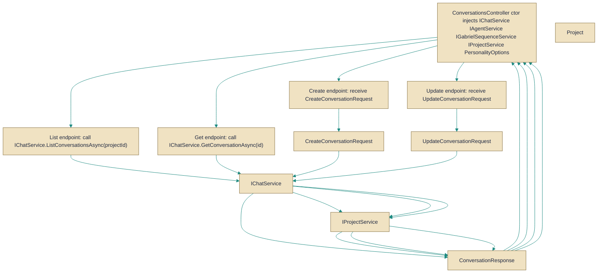

# ConversationsController

> **File:** `src/api/Gabriel.API/Controllers/ConversationsController.cs`  
> **Kind:** class

*Figure: How ConversationsController works.*



```csharp
[ApiController]
[Authorize]
[Route("conversations")]
public class ConversationsController : ControllerBase
```


HTTP API surface for managing user conversations. Use this controller when you need REST endpoints to list, read, create and modify conversations (including avatar and skin operations); it sits behind authorization and exposes conversation payloads as ConversationResponse objects.

## Remarks
ConversationsController is the web API layer that translates HTTP requests into calls against the chat/project/agent/sequence services. It centralizes conversation-related endpoints (listing, retrieval, creation, renaming, avatar operations and related flows), enriches conversation responses with project data when appropriate, and uses the configured PersonalityOptions to influence behavior where needed. The controller intentionally avoids per-row project loading on the list endpoint to prevent N+1 queries (single-conversation endpoints do load the parent project so responses can include projectIsDefault and avatar seed information).

## Notes
- The List endpoint accepts an optional projectId query parameter; omitting it returns "all my conversations" while providing it scopes results to a single project.
- The controller is decorated with [Authorize], so all routes require an authenticated user, and most actions accept a CancellationToken to allow request cancellation.
- PUT /{id}/skin uses PUT semantics and validates skin against the project catalog; note that a pinned conversation skin is ignored at render time for conversations that belong to a real project (the value is still persisted).