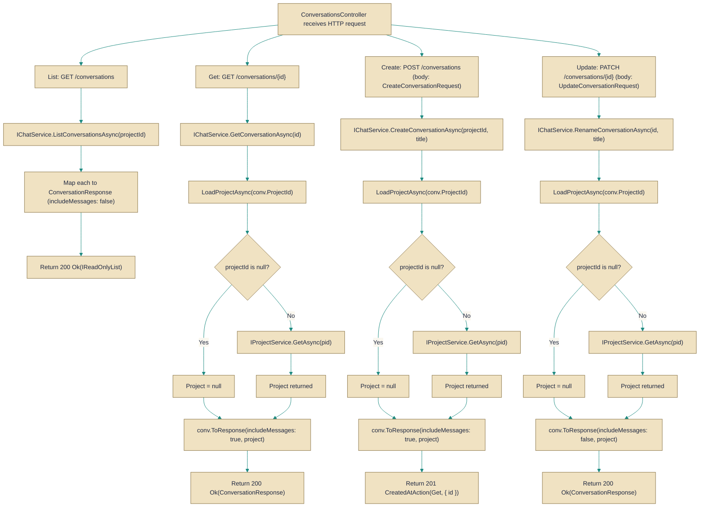

# ConversationsController

> **File:** `src/api/Gabriel.API/Controllers/ConversationsController.cs`  
> **Kind:** class

*Figure: How ConversationsController works.*



```csharp
[ApiController]
[Authorize]
[Route("conversations")]
public class ConversationsController : ControllerBase
```


Exposes the HTTP endpoints for managing conversation resources under the "conversations" route. This ApiController is protected with [Authorize] and delegates conversation operations (list, get, create, rename, avatar reroll, skin pinning) to backend services such as IChatService, IAgentService and IProjectService; use it when you need a REST surface for CRUD and conversation-specific actions rather than calling service-layer APIs directly.

## Remarks
The controller intentionally keeps thin HTTP actions and forwards work to injected services. A private helper, LoadProjectAsync, is used by single-conversation endpoints to load the conversation's parent project so the response can include project-specific metadata (for example, whether the project is the default and the effective avatar seed). The List endpoint intentionally skips loading project data to avoid an N+1 query pattern and because sidebar list rows do not render avatars.

## Notes
- The List endpoint returns ConversationResponse objects with messages omitted (the controller calls ToResponse(includeMessages: false)). Single-conversation endpoints (Get, Create) return responses that include messages.
- The optional projectId query parameter on List scopes the result to a project; omitting it returns all conversations for the caller.
- PUT /{id}/skin is intended to pin/clear a conversation avatar skin; this is meaningful for standalone (default-project) conversations. For real project-backed conversations the project's skin is rendered instead (a pinned conversation skin is persisted but ignored at render time).