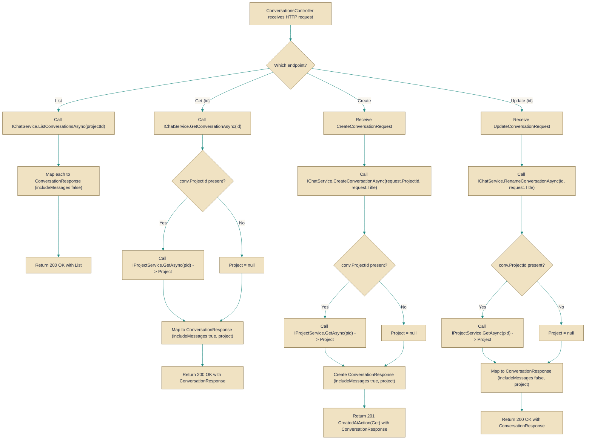

# ConversationsController

> **File:** `src/api/Gabriel.API/Controllers/ConversationsController.cs`  
> **Kind:** class

*Figure: How ConversationsController works.*



```csharp
[ApiController]
[Authorize]
[Route("conversations")]
public class ConversationsController : ControllerBase
```


API controller that exposes REST endpoints for managing user conversations and performing conversation-related operations (list, get, create, rename, avatar/skin operations and related sequence/agent interactions) under the /conversations route. Use this controller when a client needs to enumerate a user's conversations, read a single conversation (including messages), create or rename conversations, or invoke conversation-specific behaviors like avatar rerolls and skin management. All endpoints require an authenticated user.

## Remarks
This controller is a thin HTTP layer that delegates business logic to application services (IChatService, IAgentService, IGabrielSequenceService, IProjectService) and shapes the results into ConversationResponse DTOs. Single-conversation endpoints load the conversation's parent project to surface project-specific metadata (for example projectIsDefault and effectiveAvatarSeed); the List endpoint deliberately avoids that extra load and omits messages for performance and to prevent an N+1 query pattern. The controller also configures JSON options used for server-sent-event/sequence responses.

## Notes
- All routes are protected by [Authorize]; callers must be authenticated.
- The List endpoint returns conversation summaries with includeMessages: false to avoid loading full message histories and to prevent N+1 project lookups; single-item endpoints include project data and (where appropriate) message lists.
- Pinning a conversation skin (SetSkin) is meaningful only for standalone/default-project conversations; project-backed conversations render the project's skin and will ignore a pinned conversation skin at render time (the pinned value is still persisted).