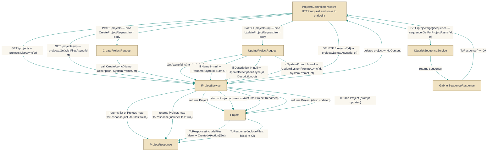

# ProjectsController

> **File:** `src/api/Gabriel.API/Controllers/ProjectsController.cs`  
> **Kind:** class

*Figure: How ProjectsController works.*



```csharp
[ApiController]
[Authorize]
[Route("projects")]
public class ProjectsController : ControllerBase
```


An ASP.NET Core API controller that exposes CRUD operations and project-specific utilities for Project entities (list, get, create, update, delete), plus project-level Gabriel sequence and avatar management endpoints. Use this controller when implementing or calling the HTTP API for managing projects and their shared avatar/sequence state (routes are rooted at /projects and the controller requires authorization).

## Remarks
This controller is a thin HTTP layer that delegates business logic to IProjectService and IGabrielSequenceService. It converts domain Project results into ProjectResponse DTOs for transport and maps HTTP verbs to higher-level operations (Create -> CreateAsync, PATCH -> a series of targeted update calls, etc.). The GetSequence endpoint uses the IGabrielSequenceService aggregation for project-level sequences; callers should use the sequence endpoint for non-default projects while default-project behavior falls back to per-conversation sequences (the aggregation rule lives in IGabrielSequenceService.GetForProjectAsync).

## Notes
- PATCH semantics: the update endpoint treats the request DTO as an all-nullable patch where supplied (non-null) fields are applied, and null is intended to clear values. JSON deserialization cannot distinguish between a missing property and a JSON null, so the current implementation treats both as null — see the project's PATCH design note for explicit-clear behavior.
- Avatar reroll preserves any pinned pattern/palette overrides; reroll only changes seed-derived avatar dimensions.
- Skin pinning/clearing uses PUT semantics (commented in source): each skin field is taken as the full intended state and null clears that dimension; unknown pattern/palette identifiers are rejected with 400 to avoid client-side confusion.
- All controller actions accept a CancellationToken and return standard IActionResult-derived responses (Ok, CreatedAtAction, NoContent), enabling HTTP-friendly status codes and cancellation propagation.