# ChatService

> **File:** `src/api/Gabriel.Core/Services/ChatService.cs`  
> **Kind:** class

*Figure: How ChatService works.*

```mermaid
%%{init: {'theme':'base','themeVariables':{'background':'#faf7ef','primaryColor':'#f0e2c2','primaryTextColor':'#1f2840','primaryBorderColor':'#8a7548','secondaryColor':'#d9efec','secondaryBorderColor':'#1d8a80','secondaryTextColor':'#1f2840','tertiaryColor':'#f2ebd8','tertiaryBorderColor':'#8a7548','tertiaryTextColor':'#1f2840','lineColor':'#1d8a80','titleColor':'#1f2840','fontSize':'14px','edgeLabelBackground':'#faf7ef','clusterBkg':'#f2ebd8','clusterBorder':'#8a7548','actorBkg':'#f0e2c2','actorBorder':'#8a7548','actorTextColor':'#1f2840','actorLineColor':'#8a7548','signalColor':'#1d8a80','signalTextColor':'#1f2840','activationBkgColor':'#d9efec','activationBorderColor':'#1d8a80','noteBkgColor':'#f2ebd8','noteBorderColor':'#8a7548','noteTextColor':'#1f2840','labelBoxBkgColor':'#f0e2c2','labelBoxBorderColor':'#8a7548','labelTextColor':'#1f2840','transitionColor':'#1d8a80','transitionLabelColor':'#1f2840','stateLabelColor':'#1f2840','altBackground':'#f2ebd8'}}}%%
flowchart TB
ChatService -->|"RequireUserId()"| ICurrentUser

ChatService -->|"if projectId supplied: GetByIdAsync(pid, userId)"| IProjectRepository
IProjectRepository -->|"found -> return Project"| Project
IProjectRepository -->|"null -> throw NotFoundException(nameof(Entities.Project), pid)"| NotFoundException
Project -->|"resolvedProjectId = Project.Id"| ChatService

ChatService -->|"else: EnsureDefaultProjectIdAsync()"| IProjectService
IProjectService -->|"returns resolvedProjectId"| ChatService

ChatService -->|"Conversation.Create(userId, resolvedProjectId, title)"| Conversation
Conversation -->|"AddAsync(conversation)"| IConversationRepository
IConversationRepository -->|"persist; then SaveChangesAsync()"| IUnitOfWork
IUnitOfWork -->|"return created Conversation"| Conversation

ChatService -->|"GetConversationAsync: GetByIdWithMessagesAsync(id, userId)"| IConversationRepository
IConversationRepository -->|"found -> return Conversation"| Conversation
IConversationRepository -->|"null -> throw NotFoundException(nameof(Conversation), id)"| NotFoundException

ChatService -->|"Rename/Reroll: GetByIdAsync(id, userId)"| IConversationRepository
IConversationRepository -->|"null -> throw NotFoundException"| NotFoundException
IConversationRepository -->|"found -> Conversation instance"| Conversation
Conversation -->|"Rename(title) or RerollAvatar()"| Conversation
Conversation -->|"Update(conversation)"| IConversationRepository
IConversationRepository -->|"SaveChangesAsync()"| IUnitOfWork
IUnitOfWork -->|"return updated Conversation"| Conversation
```



```csharp
public class ChatService : IChatService
```


A service-layer implementation of IChatService that coordinates conversation-related operations for the currently authenticated user. ChatService delegates persistence to IConversationRepository and IProjectRepository, uses IProjectService to resolve or create a user's default project, and commits changes through IUnitOfWork. Call this when you need application-level orchestration (create, list, retrieve, rename, and update conversation appearance or mode) rather than directly calling repositories or domain objects.

## Remarks
ChatService is a thin application service: it enforces user-scoped access, resolves or validates project ownership, invokes domain methods on Conversation (for operations like Rename, RerollAvatar, SetSkin, SetMode), and persists changes via the unit of work. Validation of conversation state (for example, empty titles) is performed by the domain model and surfaced by ChatService; the service itself focuses on ownership checks, repository coordination, and transaction boundaries.

## Example
```csharp
// Create a new conversation in the caller's default project
var conversation = await chatService.CreateConversationAsync(null, "Ideas for Q3", cancellationToken);

// Rename an existing conversation
var renamed = await chatService.RenameConversationAsync(conversation.Id, "Q3 Roadmap", cancellationToken);
```

## Notes
- CreateConversationAsync: if projectId is null the service uses IProjectService.EnsureDefaultProjectIdAsync to place the conversation in the user's default project; if a projectId is supplied it must belong to the current user or a NotFoundException is thrown.
- Methods call RequireUserId() and are scoped to the authenticated user; unauthenticated callers will receive an UnauthorizedAccessException.
- Domain-level validation (e.g. empty or whitespace titles) is performed by Conversation methods and will typically surface as ArgumentException that the global exception handler maps to 400 Bad Request.
- All mutating operations call IUnitOfWork.SaveChangesAsync; callers should await the returned Task to ensure changes are persisted. CancellationToken is forwarded to repository and unit-of-work calls.