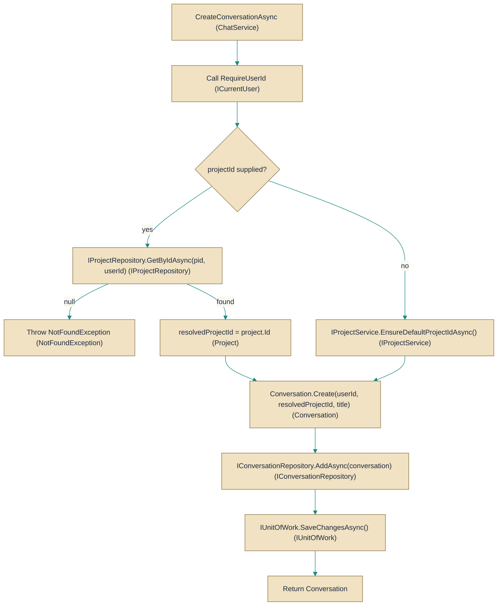

# ChatService

> **File:** `src/api/Gabriel.Core/Services/ChatService.cs`  
> **Kind:** class

*Figure: How ChatService works.*



```csharp
public class ChatService : IChatService
```


Coordinates conversation-related operations and enforces per-user scope.

Use ChatService when you need the higher-level business behavior around conversations (create, list, rename, set skin/mode, delete messages, etc.) rather than manipulating repositories directly: it resolves the caller's user context, ensures project ownership or default project creation, invokes Conversation entity methods for invariants, and persists changes through the unit-of-work.

## Remarks
ChatService is an application-layer facade that composes IConversationRepository, IProjectService, IProjectRepository, IUnitOfWork and ICurrentUser to implement IChatService. It centralizes authorization (operations are executed for the current user obtained via RequireUserId), project resolution (validates a supplied project belongs to the user or falls back to the user's default project via EnsureDefaultProjectIdAsync) and persistence (calls SaveChangesAsync on the unit-of-work after repository updates). Domain invariants and validation are enforced by the Conversation entity (for example Rename, SetSkin, RerollAvatar), and missing resources are surfaced as NotFoundException so the API layer can translate them to the appropriate HTTP responses.

## Notes
- If the caller supplies a projectId to CreateConversationAsync the service verifies the project belongs to the current user; if it does not exist or is not accessible a NotFoundException is thrown for that project id.
- Conversation.Rename throws on invalid (empty/whitespace) titles; the service does not catch that and relies on the global exception handling to map it to a 400 Bad Request.
- Mutating operations call IUnitOfWork.SaveChangesAsync; changes are not persisted until that call completes.