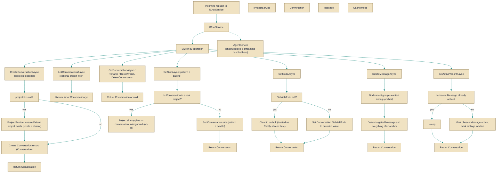

# IChatService

> **File:** `src/api/Gabriel.Core/Services/IChatService.cs`  
> **Kind:** interface

*Figure: How IChatService works.*



```csharp
public interface IChatService
```


A high-level conversation lifecycle API: create, list, retrieve, rename and delete conversations, manage per-conversation presentation (avatar/skin) and behaviour (mode), and perform message-level edits such as deleting a message tail or selecting an active variant. Use this when you need to manage conversation metadata and structural changes outside of the agent/chat-turn execution (the live streaming/tooling loop lives in IAgentService).

## Remarks
IChatService is an orchestration surface for conversation CRUD and structural edits — it does not implement the chat turn loop or runtime agent behavior. It coordinates per-conversation settings (title, avatar/skin overrides, mode) and structural operations on messages (rewinds and variant selection). Skin operations mirror IProjectService.SetSkinAsync: for conversations belonging to a real project the project's skin is authoritative; pattern/palette overrides on a conversation are only meaningful for standalone/default-project conversations. Project creation/lookup (the "default" project auto-created on first use) is managed at a higher layer (IProjectService).

## Example
```csharp
// Create a conversation in the user's Default project (projectId=null uses/creates the default)
var conversation = await chatService.CreateConversationAsync(projectId: null, title: "Ideas", ct: cancellationToken);

// Set a conversation-level skin (only used when the conversation is not inside a real project)
conversation = await chatService.SetSkinAsync(conversation.Id, pattern: "stripes", palette: "ocean", ct: cancellationToken);

// Delete a message and everything that followed it in that thread (a rewind)
conversation = await chatService.DeleteMessageAsync(conversation.Id, messageIdToRewindTo, ct: cancellationToken);
```

## Notes
- DeleteMessageAsync is destructive: it removes the targeted message and everything that came after it (the tail), anchored to the variant group's earliest sibling so regenerated tails are removed cleanly.
- SetActiveVariantAsync flips which sibling variant is active within its variant group; it is a no-op if the requested variant is already active.
- Passing null to SetModeAsync clears any per-conversation override and returns the conversation to the default behaviour (treated as "Chatty" at read time).
- Catalog identifiers for SetSkinAsync must be validated before calling this service; the interface assumes validated identifiers and does not re-check catalog validity.