# IProjectService

> **File:** `src/api/Gabriel.Core/Services/IProjectService.cs`  
> **Kind:** interface

*Figure: How IProjectService works.*

```mermaid
%%{init: {'theme':'base','themeVariables':{'background':'#faf7ef','primaryColor':'#f0e2c2','primaryTextColor':'#1f2840','primaryBorderColor':'#8a7548','secondaryColor':'#d9efec','secondaryBorderColor':'#1d8a80','secondaryTextColor':'#1f2840','tertiaryColor':'#f2ebd8','tertiaryBorderColor':'#8a7548','tertiaryTextColor':'#1f2840','lineColor':'#1d8a80','titleColor':'#1f2840','fontSize':'14px','edgeLabelBackground':'#faf7ef','clusterBkg':'#f2ebd8','clusterBorder':'#8a7548','actorBkg':'#f0e2c2','actorBorder':'#8a7548','actorTextColor':'#1f2840','actorLineColor':'#8a7548','signalColor':'#1d8a80','signalTextColor':'#1f2840','activationBkgColor':'#d9efec','activationBorderColor':'#1d8a80','noteBkgColor':'#f2ebd8','noteBorderColor':'#8a7548','noteTextColor':'#1f2840','labelBoxBkgColor':'#f0e2c2','labelBoxBorderColor':'#8a7548','labelTextColor':'#1f2840','transitionColor':'#1d8a80','transitionLabelColor':'#1f2840','stateLabelColor':'#1f2840','altBackground':'#f2ebd8'}}}%%
flowchart TB
Start["Start"]
Choose["Choose IProjectService operation"]
Start --> Choose

Choose --> List["IProjectService.ListAsync()\n- Lazily Ensure Default Project\n- Absorb legacy conversations\n- Return user's projects (repo-scoped)"]
Choose --> Get["IProjectService.GetAsync(Guid id)\n- Return Project"]
Choose --> GetWithFiles["IProjectService.GetWithFilesAsync(Guid id)\n- Load files\n- Sort files newest-first\n- Return Project"]
Choose --> Create["IProjectService.CreateAsync(name, description, systemPrompt)\n- Create Project"]
Choose --> Rename["IProjectService.RenameAsync(Guid id, name)"]
Choose --> UpdateDesc["IProjectService.UpdateDescriptionAsync(Guid id, description)"]
Choose --> UpdatePrompt["IProjectService.UpdateSystemPromptAsync(Guid id, systemPrompt)"]
Choose --> Reroll["IProjectService.RerollAvatarAsync(Guid id)\n- Reroll AvatarSeed -> affects seed-derived pattern/palette if not pinned"]
Choose --> SetSkin["IProjectService.SetSkinAsync(Guid id, pattern, palette)\n- Pin or clear pattern/palette (null/empty clears)"]
Choose --> Delete["IProjectService.DeleteAsync(Guid id)"]
Choose --> EnsureDefaultMethod["IProjectService.EnsureDefaultProjectIdAsync()\n- Lazily create Default if missing\n- Assign legacy project-less conversations\n- Return Default Project id"]

List --> DefaultExists["Does Default project exist?"]
DefaultExists -->|Yes| ReturnList["Return user's projects"]
DefaultExists -->|No| CreateDefault["Create Default Project (returns id)"]
CreateDefault --> AssignLegacy["Assign legacy conversations to Default Project"]
AssignLegacy --> ReturnList

EnsureDefaultMethod --> DefaultExists
```



```csharp
public interface IProjectService
```


Provides asynchronous, user-scoped operations for managing Project entities: listing a user's projects, retrieving projects (optionally with files), creating and updating project metadata, customizing avatar appearance, deleting projects, and ensuring/creating the per-user "Default" project. Reach for IProjectService whenever you need repository-scoped, multi-tenant-aware project lifecycle operations or the service's built-in behavior for creating/assigning a default project and absorbing legacy (project-less) conversations.

## Remarks
IProjectService centralizes project-related behavior so callers don't need to implement tenancy, default-project bootstrap, or legacy-data migration logic themselves. The service always operates in the caller's user scope (returns only that user's projects) and lazily ensures a "Default" project exists; the first call that requires it may also assign the user's legacy, project-less conversations into that default. Avatar customization is exposed at two levels: RerollAvatarAsync changes the long-running seed (affecting seed-derived pattern/palette), while SetSkinAsync pins per-project pattern and/or palette overrides — passing null or an empty string clears an individual override. The service expects catalog identifiers for skins to have been validated at the API layer before calling SetSkinAsync.

## Example
```csharp
// Typical usage inside an async handler or service
public async Task UseProjectsAsync(IProjectService projectsService, CancellationToken ct)
{
    // Ensure the user has a Default project (creates it and migrates legacy conversations if needed)
    Guid defaultId = await projectsService.EnsureDefaultProjectIdAsync(ct);

    // Create a new project
    Project newProject = await projectsService.CreateAsync("Ideas", "Drafts and experiments", null, ct);

    // Pin a specific skin (pattern and palette identifiers are expected to be validated upstream)
    await projectsService.SetSkinAsync(newProject.Id, "stripe-pattern", "warm-palette", ct);

    // List the current user's projects
    IReadOnlyList<Project> mine = await projectsService.ListAsync(ct);

    // Fetch a project with its files (files are returned newest-first)
    Project withFiles = await projectsService.GetWithFilesAsync(newProject.Id, ct);
}
```

## Notes
- EnsureDefaultProjectIdAsync may have side effects (creating a Default project and assigning legacy conversations); call it only when those actions are acceptable.
- SetSkinAsync: pass null or an empty string to clear a single override and revert that dimension to seed-derived behavior.
- GetWithFilesAsync returns the project's Files collection sorted newest-first; callers should not rely on other ordering.