# IProjectService

> **File:** `src/api/Gabriel.Core/Services/IProjectService.cs`  
> **Kind:** interface

*Figure: How IProjectService works.*

```mermaid
%%{init: {'theme':'base','themeVariables':{'background':'#faf7ef','primaryColor':'#f0e2c2','primaryTextColor':'#1f2840','primaryBorderColor':'#8a7548','secondaryColor':'#d9efec','secondaryBorderColor':'#1d8a80','secondaryTextColor':'#1f2840','tertiaryColor':'#f2ebd8','tertiaryBorderColor':'#8a7548','tertiaryTextColor':'#1f2840','lineColor':'#1d8a80','titleColor':'#1f2840','fontSize':'14px','edgeLabelBackground':'#faf7ef','clusterBkg':'#f2ebd8','clusterBorder':'#8a7548','actorBkg':'#f0e2c2','actorBorder':'#8a7548','actorTextColor':'#1f2840','actorLineColor':'#8a7548','signalColor':'#1d8a80','signalTextColor':'#1f2840','activationBkgColor':'#d9efec','activationBorderColor':'#1d8a80','noteBkgColor':'#f2ebd8','noteBorderColor':'#8a7548','noteTextColor':'#1f2840','labelBoxBkgColor':'#f0e2c2','labelBoxBorderColor':'#8a7548','labelTextColor':'#1f2840','transitionColor':'#1d8a80','transitionLabelColor':'#1f2840','stateLabelColor':'#1f2840','altBackground':'#f2ebd8'}}}%%
flowchart TB
IService[IProjectService]
ProjectNode[Project]

L["ListAsync: lazily ensure Default project exists; absorb pre-Phase-8 conversations; return user's projects (IReadOnlyList<Project>)"]
E["EnsureDefaultProjectIdAsync: create Default project if missing; assign project-less (legacy) conversations; return Guid"]
G["GetAsync: return Project by id"]
GF["GetWithFilesAsync: return Project with files loaded, sorted newest-first"]
C["CreateAsync: create Project (name, description, systemPrompt); return Project"]
U["RenameAsync / UpdateDescriptionAsync / UpdateSystemPromptAsync: update Project metadata; return Project"]
R["RerollAvatarAsync: re-roll AvatarSeed (changes seed-derived pattern+palette); return Project"]
S["SetSkinAsync: pin or clear pattern & palette overrides; catalog ids validated at API layer; return Project"]
D["DeleteAsync: delete Project"]

IService --> L
L -->|"calls EnsureDefaultProjectIdAsync lazily"| E
L -->|"returns IReadOnlyList<Project>"| ProjectNode
E -->|"returns Guid (Default project id)"| IService

IService --> G
G -->|"returns Project"| ProjectNode

IService --> GF
GF -->|"loads files; sorts newest-first; returns Project"| ProjectNode

IService --> C
C -->|"creates Project and returns it"| ProjectNode

IService --> U
U -->|"updates fields and returns Project"| ProjectNode

IService --> R
R -->|"re-rolls AvatarSeed and returns Project"| ProjectNode

IService --> S
S -->|"sets/clears overrides and returns Project"| ProjectNode

IService --> D
D -->|"deletes Project"| ProjectNode
```



```csharp
public interface IProjectService
```


Provides the high-level operations for creating, reading, updating and deleting per-user Project entities and for managing project presentation (avatar/skin). Use this interface from application or API layers when you need to list a user's projects, ensure or retrieve the user's default project, migrate legacy project-less conversations into the default, or modify project metadata and visual appearance.

## Remarks
IProjectService is the central boundary for project lifecycle and simple presentation concerns. Implementations are expected to be multi-tenant aware (the service surface returns only the current user's projects) and to perform lazy bootstrapping: the default project for a user is created on demand and legacy, project-less conversations are assigned to it during that process. The interface intentionally blends CRUD operations (CreateAsync, GetAsync, ListAsync, DeleteAsync, RenameAsync, UpdateDescriptionAsync, UpdateSystemPromptAsync) with a small set of presentation helpers (RerollAvatarAsync, SetSkinAsync) because avatar/palette state is stored on the Project entity.

## Example
```csharp
// Typical usage from an application service or controller
public async Task Demo(IProjectService projects, CancellationToken ct)
{
    // Ensure the current user has a default project and get its id
    Guid defaultId = await projects.EnsureDefaultProjectIdAsync(ct);

    // List all projects for the current user (this call will also lazily create
    // the default project on first invocation if it wasn't present)
    var all = await projects.ListAsync(ct);

    // Create a new project
    var newProj = await projects.CreateAsync("Research", "Notes for research", null, ct);

    // Load a project and its files (files are returned newest-first)
    var withFiles = await projects.GetWithFilesAsync(newProj.Id, ct);

    // Update presentation: pin a palette and pattern, or pass null/empty to clear
    await projects.SetSkinAsync(newProj.Id, pattern: "grid", palette: "muted", ct: ct);

    // Reroll the avatar seed so seed-derived pattern/palette change (unless pinned)
    await projects.RerollAvatarAsync(newProj.Id, ct);

    // Rename and update metadata
    await projects.RenameAsync(newProj.Id, "Research 2026", ct);
    await projects.UpdateDescriptionAsync(newProj.Id, "Updated notes", ct);

    // Delete when no longer needed
    await projects.DeleteAsync(newProj.Id, ct);
}
```

## Notes
- ListAsync and EnsureDefaultProjectIdAsync have side effects: they lazily create the user's "Default" project and migrate legacy project-less conversations into it on first use. Calling them can modify persistent state.
- GetWithFilesAsync returns the project's Files ordered newest-first; callers relying on a different ordering should reorder explicitly.
- SetSkinAsync treats null or empty strings as a request to clear an override and revert that dimension to seed-derived behavior; higher-level API layers validate catalog identifiers before calling into the service.
- All methods accept a CancellationToken; implementations should respect cancellation to avoid long-running or blocking calls under request cancellation.