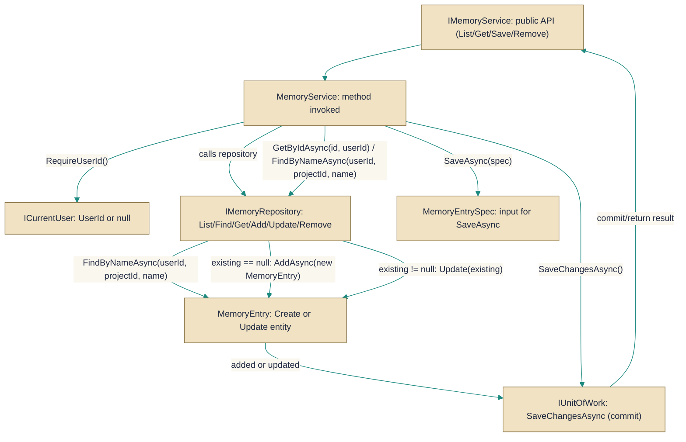

# MemoryService

> **File:** `src/api/Gabriel.Core/Services/MemoryService.cs`  
> **Kind:** class

*Figure: How MemoryService works.*



```csharp
public class MemoryService : IMemoryService
```


A service that implements IMemoryService by delegating memory operations to a repository and committing changes through a unit-of-work. Use MemoryService when you need an application-layer façade that enforces the current authenticated user, performs simple upsert logic for memories (by name + project), and coordinates persistence (add/update/remove) with transaction semantics.

## Remarks
MemoryService centralizes user-scoped memory operations: it requires an authenticated user (via ICurrentUser) and then forwards list, retrieve, save, and delete operations to an underlying IMemoryRepository. SaveAsync implements an upsert by searching for an existing memory with the same name and project for the current user — creating a new MemoryEntry when none exists or calling Update on the existing entry otherwise — and always calls IUnitOfWork.SaveChangesAsync to persist modifications.

## Notes
- All operations require an authenticated user; if ICurrentUser.UserId is null the service throws UnauthorizedAccessException.
- SaveAsync matches existing entries by (userId, projectId, name) and will update the first match rather than creating a duplicate.
- RemoveAsync and RemoveByNameAsync return false when the targeted memory cannot be found; they return true only after the repository removal and unit-of-work save complete.
- ListForConversationAsync delegates to the repository's agent-specific listing method (ListForAgentAsync) — use ListAsync for the standard listing behavior and ListForConversationAsync when data tailored for agent/conversation use is needed.