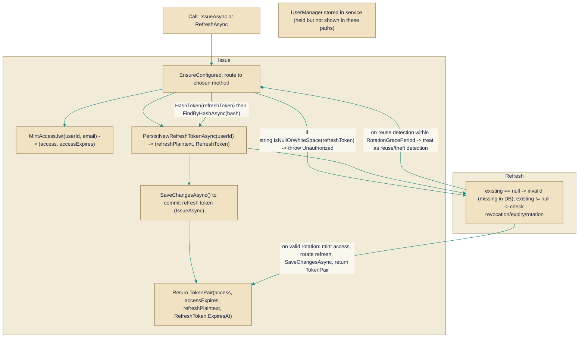

# JwtTokenService

> **File:** `src/api/Gabriel.Infrastructure/Identity/JwtTokenService.cs`  
> **Kind:** class

*Figure: How JwtTokenService works.*



```csharp
public class JwtTokenService : IJwtTokenService
```


Creates and rotates JWT-based authentication tokens (access + refresh) and enforces refresh-token hygiene.

Use this service when you need a single place to mint short-lived access JWTs and issue/rotate long-lived refresh tokens, with built-in replay/theft detection and persistence. It is the infrastructure implementation of IJwtTokenService used by higher-level authentication workflows (issue on login, refresh on cookie/API refresh requests, revoke on logout or compromise).

## Remarks
JwtTokenService centralizes JWT creation and refresh-token lifecycle management. It mints access tokens, stores refresh-token hashes in a persistent IRefreshTokenStore, and performs rotation on refresh requests so that each refresh produces a new refresh token while marking the previous one as replaced or revoked. A short RotationGracePeriod (5 minutes) is applied to tolerate benign races (multi-tab requests, delayed SSE responses) while still allowing reliably-detected reuse of stale tokens to be treated as a theft signal. The service depends on JwtOptions for configuration, a UnitOfWork to persist database changes, and ASP.NET Identity's UserManager when user data is required.

## Notes
- IssueAsync explicitly calls the unit-of-work SaveChangesAsync to commit the newly-created refresh-token row; without this save the refresh token may remain only in the EF change tracker and never persist, causing subsequent refresh attempts to fail as "not found."
- A missing refresh-token hash in the store results in an UnauthorizedAccessException and a logged warning that includes a short token-hash prefix — look for these logs when diagnosing lost Set-Cookie events, DB resets, or tampered tokens.
- RotationGracePeriod intentionally allows a small window (5 minutes) where a recently-rotated-but-still-sent token will not immediately trigger theft detection; reuse after that window is treated as a strong signal of token theft and leads to stricter revocation handling.