# JwtTokenService

> **File:** `src/api/Gabriel.Infrastructure/Identity/JwtTokenService.cs`  
> **Kind:** class

*Figure: How JwtTokenService works.*

```mermaid
%%{init: {'theme':'base','themeVariables':{'background':'#faf7ef','primaryColor':'#f0e2c2','primaryTextColor':'#1f2840','primaryBorderColor':'#8a7548','secondaryColor':'#d9efec','secondaryBorderColor':'#1d8a80','secondaryTextColor':'#1f2840','tertiaryColor':'#f2ebd8','tertiaryBorderColor':'#8a7548','tertiaryTextColor':'#1f2840','lineColor':'#1d8a80','titleColor':'#1f2840','fontSize':'14px','edgeLabelBackground':'#faf7ef','clusterBkg':'#f2ebd8','clusterBorder':'#8a7548','actorBkg':'#f0e2c2','actorBorder':'#8a7548','actorTextColor':'#1f2840','actorLineColor':'#8a7548','signalColor':'#1d8a80','signalTextColor':'#1f2840','activationBkgColor':'#d9efec','activationBorderColor':'#1d8a80','noteBkgColor':'#f2ebd8','noteBorderColor':'#8a7548','noteTextColor':'#1f2840','labelBoxBkgColor':'#f0e2c2','labelBoxBorderColor':'#8a7548','labelTextColor':'#1f2840','transitionColor':'#1d8a80','transitionLabelColor':'#1f2840','stateLabelColor':'#1f2840','altBackground':'#f2ebd8'}}}%%
flowchart TB

IJwtTokenService["IJwtTokenService: caller of token operations"] -->|"Call IssueAsync(userId,email) or RefreshAsync(refreshToken)"| JwtTokenService["JwtTokenService: IssueAsync / RefreshAsync"]

%% IssueAsync path
JwtTokenService -->|"EnsureConfigured & MintAccessJwt(userId, email)"| JwtOptions["JwtOptions: configuration used to mint access JWT"]
JwtTokenService -->|"PersistNewRefreshTokenAsync(userId) -> create plaintext & hash"| IRefreshTokenStore["IRefreshTokenStore: store/find refresh token hashes"]
IRefreshTokenStore -->|"Returns RefreshToken entity (hash stored)"| RefreshToken["RefreshToken: persisted refresh token entity (ExpiresAt, hash)"]
JwtTokenService -->|"Commit refresh row"| IUnitOfWork["IUnitOfWork: SaveChangesAsync to persist refresh token"]
IUnitOfWork -->|"SaveChanges completed"| JwtTokenService
JwtTokenService -->|"Return TokenPair(accessJwt, expires, refreshPlaintext, refreshExpires)"| TokenPair["TokenPair: returned access + refresh info"]

%% RefreshAsync path
JwtTokenService -->|"HashToken(refreshToken) & FindByHashAsync(hash)"| IRefreshTokenStore
IRefreshTokenStore -->|"Returns existing RefreshToken or null"| RefreshToken
RefreshToken -->|"If null -> throw UnauthorizedAccessException (invalid)"| JwtTokenService
RefreshToken -->|"If found -> detect reuse/rotate (respect RotationGracePeriod)"| JwtTokenService
JwtTokenService -->|"Persist rotation / revoke old row"| IRefreshTokenStore
JwtTokenService -->|"Commit rotation"| IUnitOfWork
IUnitOfWork -->|"Rotation saved"| JwtTokenService
JwtTokenService -->|"Mint new access JWT and return TokenPair"| TokenPair

%% Reference to user identity involved in minting
JwtTokenService -->|"Uses user identity (userId, email) when minting"| ApplicationUser["ApplicationUser: user identity used to mint JWTs"]
```



```csharp
public class JwtTokenService : IJwtTokenService
```


Issues and rotates JSON Web Tokens (access + refresh) for an authenticated user and enforces safe refresh-token lifecycle policies. Use this service from authentication endpoints to mint a fresh access token and a persistent refresh token (IssueAsync), to rotate and validate refresh tokens on client refresh (RefreshAsync), and to revoke refresh tokens when needed. It centralizes signing, hashing/persisting refresh tokens, and detection/handling of suspicious token reuse.

## Remarks
Centralizes the JWT and refresh-token workflow so callers don't need to mix signing, storage, and rotation logic. The service delegates storage to IRefreshTokenStore, user lookups to `UserManager<ApplicationUser>`, and transactional commits to IUnitOfWork; this keeps token lifecycle rules (hashing, rotation, grace window for reuse detection, and revocation) in one place while letting the backing store and identity implementations vary.

## Example
```csharp
// Typical usage in an auth controller or service
// (dependencies are usually injected via DI)
TokenPair pair = await jwtService.IssueAsync(userId, email, cancellationToken);
// send pair.AccessToken to client and persist pair.RefreshToken in an HttpOnly cookie

// Later, when the client sends the refresh token back:
TokenPair rotated = await jwtService.RefreshAsync(refreshTokenFromCookie, cancellationToken);
// return rotated.AccessToken and replace the refresh cookie with rotated.RefreshToken
```

## Notes
- IssueAsync saves a newly-created refresh-token row via the unit-of-work; without that SaveChanges call the refresh token can remain only in EF's change tracker and never persist (the source comments call this out as a real pitfall).
- A rotation-grace period is applied when detecting reuse of recently-rotated tokens to tolerate benign races (multi-tab, in-flight requests, long SSE streams). This reduces false theft detections at the cost of a short grace window (configured in the implementation as a few minutes).
- RefreshAsync throws UnauthorizedAccessException for missing/invalid/blank refresh tokens; callers should map that to an appropriate HTTP 401/403 response and avoid exposing sensitive internals.