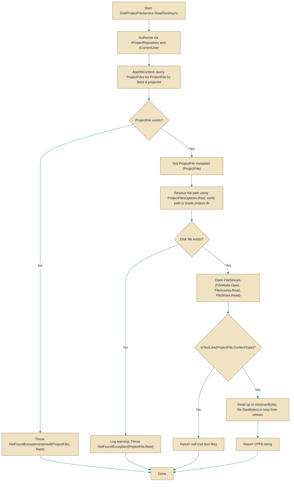

# DiskProjectFileService

> **File:** `src/api/Gabriel.Infrastructure/Projects/DiskProjectFileService.cs`  
> **Kind:** class

*Figure: How DiskProjectFileService works.*



```csharp
public sealed class DiskProjectFileService : IProjectFileService
```


Stores and serves project file content on the local filesystem while keeping file metadata in the application's database. Use this implementation when you want a simple, predictable on-disk layout for project files (root/{ProjectId:N}/{filename}) and prefer local disk storage instead of a remote blob service. All operations perform authorization checks and validate filesystem paths to prevent path-traversal.

## Remarks
This class separates file content (on-disk) from metadata (ProjectFiles table in the DbContext). It enforces a number of safety and consistency rules that are easy to miss when implementing custom file services: filenames are sanitized and restricted by allowed extensions, every resolved path is checked to ensure it lives inside the project's directory (mitigating path-traversal), and the upload path selection uses a suffix-collision policy so concurrent uploads result in distinct final filenames.

## Example
```csharp
// List files
var files = await diskService.ListAsync(projectId, ct);

// Open a file stream for reading (caller must dispose)
var (meta, stream) = await diskService.OpenAsync(projectId, fileId, ct);
using (stream)
{
    // read from stream
}

// Read small text content, null if not a text-like content type
string? text = await diskService.ReadTextAsync(projectId, fileId, maxBytes: 16_384, ct);

// Upload a file stream
using var uploadStream = File.OpenRead("localfile.bin");
var newFile = await diskService.UploadAsync(projectId, "report.txt", "text/plain", uploadStream, ct);
```

## Notes
- OpenAsync returns an open FileStream; the caller is responsible for disposing it to avoid file handles leaking.
- ReadTextAsync returns null if the file's content type is not considered "text-like"; it also caps the read to the provided maxBytes and decodes bytes as UTF-8.
- If metadata exists but the underlying disk file is missing, OpenAsync logs a warning and throws NotFoundException.
- UploadAsync sanitizes filenames and enforces allowed extensions; its collision policy appends a short suffix so concurrent uploads to the same sanitized name do not clobber each other.
- All public operations perform an authorization check (via AuthorizeAsync) before accessing metadata or disk; callers must ensure the current principal has the required project permissions.