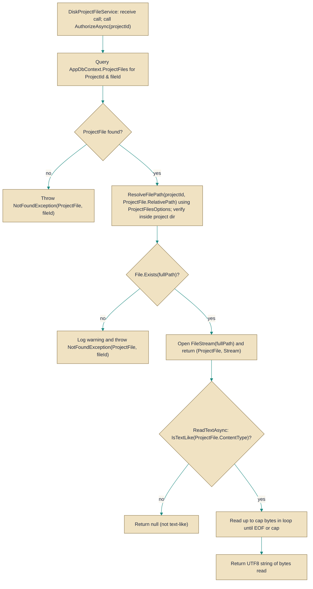

# DiskProjectFileService

> **File:** `src/api/Gabriel.Infrastructure/Projects/DiskProjectFileService.cs`  
> **Kind:** class

*Figure: How DiskProjectFileService works.*



```csharp
public sealed class DiskProjectFileService : IProjectFileService
```


Stores and retrieves project files by keeping file contents on local disk and file metadata in the database. Use this service when you want durable, file-system-backed storage for project attachments where files are placed under {Root}/{ProjectId:N}/{filename} and every operation enforces authorization and path-traversal protections before touching disk.

## Remarks
This implementation ties project file metadata (ProjectFile) to physical files on disk and is intended for environments where a shared, mountable filesystem is acceptable. It centralizes concerns that callers would otherwise need to implement themselves: filename sanitization, extension validation, a collision-resilient naming strategy, strict path resolution to prevent traversal attacks, and consistent authorization checks before any read or write. The service logs mismatches between database metadata and on-disk state and surfaces NotFoundException when files are absent.

## Notes
- OpenAsync returns a FileStream that the caller is responsible for disposing; the method comment explicitly delegates disposal to the caller.
- ReadTextAsync only returns text for content types recognized as "text-like"; for non-text content it returns null. It also caps the returned data to the smaller of the provided maxBytes and the file's recorded size and decodes bytes using UTF-8.
- Uploaded filenames are sanitized and validated against AllowedExtensions; when a sanitized name collides the service chooses a short, fresh suffix so concurrent uploads do not clobber each other.
- Before any disk access the service resolves the final path and verifies it is inside the project's directory to mitigate path-traversal attacks; if metadata exists but the on-disk file is missing a warning is logged and NotFoundException is thrown.