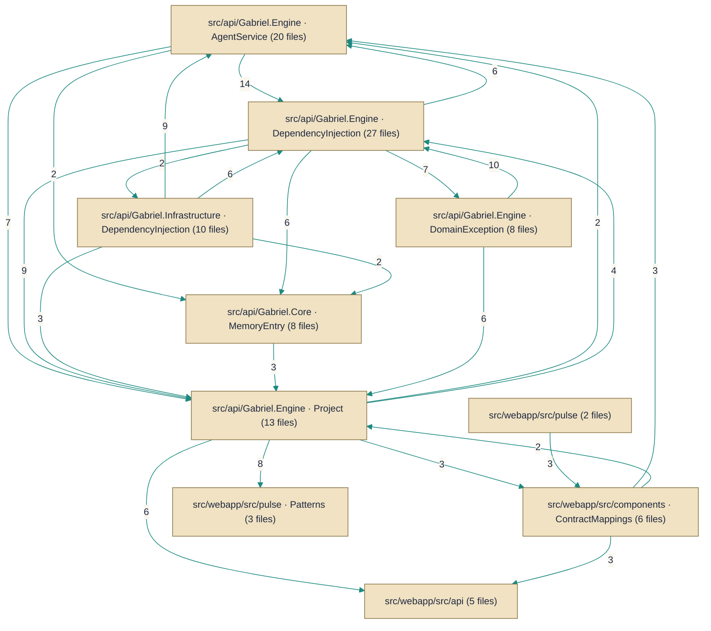

# Architecture — HueByte/Gabriel

> *Auto-synthesized from 532 documented symbols across 250 files on `main`.*

## Topic Guides

Deep-dives into cross-cutting concerns synthesized from the per-symbol corpus.

- [Authentication and Authorization](authentication.md) — How the API authenticates users, issues tokens, and manages identity across the API and infrastructure.
- [Dependency injection and service bootstrap](dependency-injection.md) — Centralized DI wiring across core, engine, and infrastructure layers to compose the app.
- [HTTP API surface and contracts](http-api-surface.md) — Controllers expose REST endpoints and the associated request/response contracts across modules.
- [Data persistence and repositories](data-persistence.md) — Repositories, entities, and UoW coordinating persistence for conversations and memory.
- [Web search and fetch tooling](web-search-and-fetch.md) — Web search providers and fetch utilities used by the engine tooling.

## Architecture Diagram

## System Overview
Gabriel provides an agent runtime and HTTP-facing API that together expose programmable "tools" to drive conversations and project/file operations end-to-end. The engine (src/api/Gabriel.Engine) hosts a catalog of ITool implementations (e.g. file, web, text, memory and codec tools) that the API and agent logic call into, while conversational and agent state is persisted via the infrastructure persistence configuration (e.g. ConversationConfiguration) and lightweight memory entries managed by memory tools. Interaction is primarily request/response over the API surface with the engine invoking tools and builders to construct system prompts and perform work.

## Key Components
**Agent Tools** — Provide discrete capabilities the agent runtime can call (file ops, web/search, text transforms, codecs, memory, project I/O, etc.). Implemented by [`Base64Tool`](../Code/src/api/Gabriel.Engine/Tools/Codecs/Base64Tool.cs.md), [`BaseConvertTool`](../Code/src/api/Gabriel.Engine/Tools/Numbers/BaseConvertTool.cs.md), [`CalculateTool`](../Code/src/api/Gabriel.Engine/Tools/Calc/CalculateTool.cs.md), [`ColorConvertTool`](../Code/src/api/Gabriel.Engine/Tools/Colors/ColorConvertTool.cs.md), [`DocsListTool`](../Code/src/api/Gabriel.Engine/Tools/Docs/DocsListTool.cs.md), [`DocsReadTool`](../Code/src/api/Gabriel.Engine/Tools/Docs/DocsReadTool.cs.md), [`FileInfoTool`](../Code/src/api/Gabriel.Engine/Tools/Files/FileInfoTool.cs.md), [`FindTool`](../Code/src/api/Gabriel.Engine/Tools/Files/FindTool.cs.md), [`GetCurrentTimeTool`](../Code/src/api/Gabriel.Engine/Tools/GetCurrentTimeTool.cs.md), [`GrepTool`](../Code/src/api/Gabriel.Engine/Tools/Files/GrepTool.cs.md), [`HashTool`](../Code/src/api/Gabriel.Engine/Tools/Codecs/HashTool.cs.md), [`JsonFormatTool`](../Code/src/api/Gabriel.Engine/Tools/Data/JsonFormatTool.cs.md), [`ListDirTool`](../Code/src/api/Gabriel.Engine/Tools/Files/ListDirTool.cs.md), [`ListProjectFilesTool`](../Code/src/api/Gabriel.Engine/Tools/Projects/ListProjectFilesTool.cs.md), [`MemoryListTool`](../Code/src/api/Gabriel.Engine/Tools/Memory/MemoryListTool.cs.md), [`MemoryRemoveTool`](../Code/src/api/Gabriel.Engine/Tools/Memory/MemoryRemoveTool.cs.md), [`MemorySaveTool`](../Code/src/api/Gabriel.Engine/Tools/Memory/MemorySaveTool.cs.md), [`ReadProjectFileTool`](../Code/src/api/Gabriel.Engine/Tools/Projects/ReadProjectFileTool.cs.md), [`TextStatsTool`](../Code/src/api/Gabriel.Engine/Tools/Strings/TextStatsTool.cs.md), [`TextTransformTool`](../Code/src/api/Gabriel.Engine/Tools/Strings/TextTransformTool.cs.md), [`WebFetchTool`](../Code/src/api/Gabriel.Engine/Tools/Web/WebFetchTool.cs.md), [`WebSearchTool`](../Code/src/api/Gabriel.Engine/Tools/Web/WebSearchTool.cs.md), and the core interface [`ITool`](../Code/src/api/Gabriel.Engine/Tools/ITool.cs.md).

**Prompt Builders** — Construct the system prompt and personality for agents used during conversation handling. Implemented by [`GabrielSystemPromptBuilder`](../Code/src/api/Gabriel.Engine/Personality/GabrielSystemPromptBuilder.cs.md) and the interface [`ISystemPromptBuilder`](../Code/src/api/Gabriel.Engine/Personality/ISystemPromptBuilder.cs.md).

**Configuration** — Holds typed configuration sections that drive agent behavior, tools, authentication and search integration. Implemented by [`AgentOptions`](../Code/src/api/Gabriel.Core/Configuration/AgentOptions.cs.md), [`AgentToolsOptions`](../Code/src/api/Gabriel.Core/Configuration/AgentToolsOptions.cs.md), [`AuthOptions`](../Code/src/api/Gabriel.Core/Configuration/AuthOptions.cs.md), and [`BraveSearchOptions`](../Code/src/api/Gabriel.Core/Configuration/BraveSearchOptions.cs.md).

**Persistence / Repositories** — Defines how conversation state is mapped and stored in the persistence layer (entity configuration). Implemented by [`ConversationConfiguration`](../Code/src/api/Gabriel.Infrastructure/Persistence/Configurations/ConversationConfiguration.cs.md).

## Component Map

*Subsystems below are structural clusters detected from the dependency graph — groups of symbols more densely wired to each other than to the rest of the codebase.*

- **src/api/Gabriel.Engine · DependencyInjection** — 27 documented files
- **src/api/Gabriel.Engine · AgentService** — 20 documented files
- **src/api/Gabriel.Engine · Project** — 13 documented files
- **src/webapp/src/components** — 13 documented files
- **src/api/Gabriel.Infrastructure · DependencyInjection** — 10 documented files
- **src/api/Gabriel.Core · ICurrentUser** — 9 documented files
- **src/api/Gabriel.Core · MemoryEntry** — 8 documented files
- **src/api/Gabriel.Engine · DomainException** — 8 documented files
- **src/api/Gabriel.Engine · ConversationState** — 7 documented files
- **src/api/Gabriel.Engine · GabrielSystemPromptBuilder** — 7 documented files
- **src/api/Gabriel.API · AuthController** — 6 documented files
- **src/api/Gabriel.API · Program** — 6 documented files
- *…and 46 more subsystem folders*

### Components by Role

**Agent Tools**
- `Base64Tool` — `src/api/Gabriel.Engine/Tools/Codecs/Base64Tool.cs`
- `BaseConvertTool` — `src/api/Gabriel.Engine/Tools/Numbers/BaseConvertTool.cs`
- `CalculateTool` — `src/api/Gabriel.Engine/Tools/Calc/CalculateTool.cs`
- `ColorConvertTool` — `src/api/Gabriel.Engine/Tools/Colors/ColorConvertTool.cs`
- `DocsListTool` — `src/api/Gabriel.Engine/Tools/Docs/DocsListTool.cs`
- `DocsReadTool` — `src/api/Gabriel.Engine/Tools/Docs/DocsReadTool.cs`
- `FileInfoTool` — `src/api/Gabriel.Engine/Tools/Files/FileInfoTool.cs`
- `FindTool` — `src/api/Gabriel.Engine/Tools/Files/FindTool.cs`
- `GetCurrentTimeTool` — `src/api/Gabriel.Engine/Tools/GetCurrentTimeTool.cs`
- `GrepTool` — `src/api/Gabriel.Engine/Tools/Files/GrepTool.cs`
- `HashTool` — `src/api/Gabriel.Engine/Tools/Codecs/HashTool.cs`
- `ITool` — `src/api/Gabriel.Engine/Tools/ITool.cs`
- `JsonFormatTool` — `src/api/Gabriel.Engine/Tools/Data/JsonFormatTool.cs`
- `ListDirTool` — `src/api/Gabriel.Engine/Tools/Files/ListDirTool.cs`
- `ListProjectFilesTool` — `src/api/Gabriel.Engine/Tools/Projects/ListProjectFilesTool.cs`
- `MemoryListTool` — `src/api/Gabriel.Engine/Tools/Memory/MemoryListTool.cs`
- `MemoryRemoveTool` — `src/api/Gabriel.Engine/Tools/Memory/MemoryRemoveTool.cs`
- `MemorySaveTool` — `src/api/Gabriel.Engine/Tools/Memory/MemorySaveTool.cs`
- `ReadProjectFileTool` — `src/api/Gabriel.Engine/Tools/Projects/ReadProjectFileTool.cs`
- `TextStatsTool` — `src/api/Gabriel.Engine/Tools/Strings/TextStatsTool.cs`
- `TextTransformTool` — `src/api/Gabriel.Engine/Tools/Strings/TextTransformTool.cs`
- `WebFetchTool` — `src/api/Gabriel.Engine/Tools/Web/WebFetchTool.cs`
- `WebSearchTool` — `src/api/Gabriel.Engine/Tools/Web/WebSearchTool.cs`

**Builders**
- `GabrielSystemPromptBuilder` — `src/api/Gabriel.Engine/Personality/GabrielSystemPromptBuilder.cs`
- `ISystemPromptBuilder` — `src/api/Gabriel.Engine/Personality/ISystemPromptBuilder.cs`

**Configuration**
- `AgentOptions` — `src/api/Gabriel.Core/Configuration/AgentOptions.cs`
- `AgentToolsOptions` — `src/api/Gabriel.Core/Configuration/AgentToolsOptions.cs`
- `AuthOptions` — `src/api/Gabriel.Core/Configuration/AuthOptions.cs`
- `BraveSearchOptions` — `src/api/Gabriel.Core/Configuration/BraveSearchOptions.cs`
- `ConversationConfiguration` — `src/api/Gabriel.Infrastructure/Persistence/Configurations/ConversationConfiguration.cs`

---
*Generated by Aurion on 2026-07-08 05:48:37 UTC*
