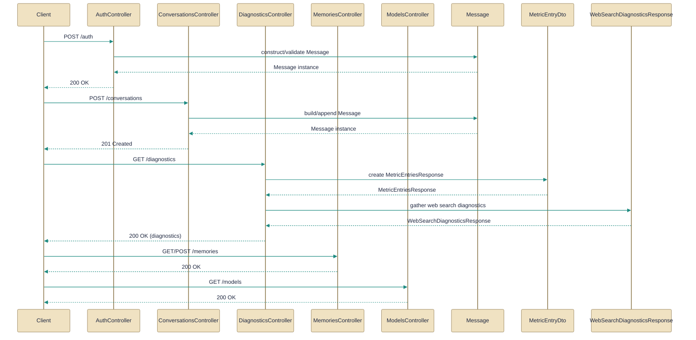

# HTTP API surface and controllers

> The exposed HTTP API controllers and their responsibilities.

*Figure: How HTTP API surface and controllers works.*

This guide describes the HTTP API controllers that form the application's external surface: what endpoints they expose, the domain DTOs they rely on for transport, and how they hand off work to domain services and repositories. Read this to understand which controller to call for account flows, conversation management, diagnostics, memories, and model selection, and to see which immutable contracts the diagnostics endpoints return.

## AuthController.cs
Provides authentication-related endpoints exposed by the API.
AuthController exposes register, login, refresh, logout, revoke (single token), revoke-all (all tokens for the current user) and me endpoints and centralizes both identity-backed user management and JWT lifecycle operations. Concretely, it delegates user operations to Identity primitives (UserManager/SignInManager), token issuance/rotation to the [IJwtTokenService](../Code/src/api/Gabriel.Core/Identity/IJwtTokenService.cs.md) boundary referenced in its remarks, cookie handling to AuthCookies, and runtime toggling of registration to an [IOptionsMonitor] configuration. To support browser and API clients it both sets HttpOnly cookies and returns token pairs in the response body; per the relationships for this topic it also depends on the [Message](../Code/src/api/Gabriel.Core/Entities/Message.cs.md) entity.

## ConversationsController.cs
Manages conversations via REST endpoints.
ConversationsController is the authorized web API layer for listing, retrieving, creating, renaming and otherwise mutating conversations (including avatar and skin operations) and returns conversation payloads as ConversationResponse shapes. The controller translates HTTP into calls against the chat/project/agent/sequence services, enriches responses with project data when appropriate, and uses configured PersonalityOptions to influence behavior; its list endpoint avoids per-row project loads to prevent N+1 queries while single-conversation endpoints do load the parent project so responses can include projectIsDefault and avatar seed info. Per the topic relationships it depends on the [Message](../Code/src/api/Gabriel.Core/Entities/Message.cs.md) entity for conversation history handling.

## DiagnosticsController.cs
Exposes diagnostics-related API operations.
DiagnosticsController offers read-only operational views over the generic metric event log for any authenticated user and implements aggregation endpoints such as GET /diagnostics/web-search that group recent metric entries by provider to return totals, successes, errors and latency statistics. Data access is delegated to an IMetricRepository so the controller focuses on aggregation, and it uses lazy JSON parsing to deserialize only the fields needed for the reports; the controller returns immutable transport contracts defined in this topic — namely [MetricEntriesResponse](../Code/src/api/Gabriel.API/Contracts/Diagnostics/MetricEntryDto.cs.md) / [MetricEntryDto](../Code/src/api/Gabriel.API/Contracts/Diagnostics/MetricEntryDto.cs.md) for raw metric rows and [WebSearchDiagnosticsResponse](../Code/src/api/Gabriel.API/Contracts/Diagnostics/WebSearchDiagnosticsResponse.cs.md) for the per-provider web-search health summary. The controller clamps windowSize to a safe range and relies on the source ordering (newest first) when computing last-success/last-failure indicators.

## MemoriesController.cs
Handles memory-related API actions.
MemoriesController exposes a CRUD-style HTTP surface over an IMemoryService for the settings UI: listing memories (project-scoped or merged), fetching by id, a single POST upsert that is idempotent, and deletion. It maps domain MemoryEntry objects to transport MemoryDto, enforces SaveMemoryRequest validation (type parsing limited to user/feedback/project/reference, and Name/Description/Body must be non-empty), and ensures repeated upserts update metadata rather than create duplicates so the controller aligns with the agent's memory_save workflow. The List endpoint supports a scope parameter to return per-project or merged views that mirror the agent's perspective, and Delete returns 204 or 404 per existence.

## ModelsController.cs
Exposes model-related endpoints and data.
ModelsController bridges the UI to the model catalog and per-user preference store: it enumerates available model configurations via IModelCatalog and resolves/persists a user's active selection via IUserPreferences. GET /models returns all known models with a Selected entry computed by resolving the user's preferences against the catalog (falling back to the catalog default if no user choice exists), and PUT /models/active validates that both Provider and Name are supplied together, ensures the pair exists in the catalog, writes the preference, and returns the updated list so the client can refresh immediately. The controller enforces explicit validation (rejecting partial or invalid selections and accepting an explicit clear request) so the UI sees a consistently populated dropdown and clear error messages on invalid input.

## MetricEntryDto.cs
`MetricEntryDto` collaborates directly with `DiagnosticsController` and other members of this topic (2 dependency links).
This file defines two immutable transport records used by the diagnostics surface: the per-row [MetricEntryDto](../Code/src/api/Gabriel.API/Contracts/Diagnostics/MetricEntryDto.cs.md) and the wrapper [MetricEntriesResponse](../Code/src/api/Gabriel.API/Contracts/Diagnostics/MetricEntryDto.cs.md). MetricEntryDto carries Id (Guid), System (string), Metric (an opaque JsonElement holding the raw JSON payload) and CreatedAt (DateTimeOffset); callers are expected to re-deserialize Metric as needed. MetricEntriesResponse packages an IReadOnlyList<MetricEntryDto> along with a Count integer (typically equal to Entries.Count) so the diagnostics endpoints can return a snapshot page of recent entries in newest-first order, and the types are sealed records to guarantee immutability and stable serialization for clients.

## WebSearchDiagnosticsResponse.cs
`WebSearchDiagnosticsResponse` collaborates directly with `DiagnosticsController` and other members of this topic (2 dependency links).
This record models the GET /diagnostics/web-search payload: a Providers list of per-provider stats ([WebSearchProviderStatsDto](../Code/src/api/Gabriel.API/Contracts/Diagnostics/WebSearchDiagnosticsResponse.cs.md)), a HasUnhealthyProvider boolean that signals global health concerns (recent failures or no successes in the window), and the WindowSize used to compute the metrics. The shape is immutable and intended for network serialization so the DiagnosticsController can return a concise health summary the UI can use to display warnings and per-provider totals, and the HasUnhealthyProvider flag encodes both most-recent outcome failures and absence of success within the lookback window.

## Message.cs
`Message` collaborates directly with `AuthController` and other members of this topic (2 dependency links).
Message is the domain entity representing a single turn in a conversation (roles: user, assistant, system, tool) and centralizes role-specific payloads and metadata used for persistence, regeneration, and UI presentation. The class enforces role-based rules at construction via a Create method (user/system messages require non-empty content; assistant messages require content or a tool-calls JSON array; tool messages require a toolCallId and an observation), assigns Id and CreatedAt automatically, and exposes VariantGroupId/IsActiveVariant for regenerated alternatives plus a separate ReasoningContent slot and a ToolCallsJson raw field so tool-call replay and streaming reasoning can be persisted and displayed independently. Per the topic relationships, this entity is consumed by controllers such as [AuthController](../Code/src/api/Gabriel.API/Controllers/AuthController.cs.md) and [ConversationsController](../Code/src/api/Gabriel.API/Controllers/ConversationsController.cs.md) for conversation-related flows.

These controllers follow a consistent collaboration pattern: controllers translate HTTP requests into calls to domain services/repositories, validate and map DTOs, and return immutable transport records to clients. Diagnostics uses small, focused DTO records for efficient aggregation and serialization, while conversation- and memory-related controllers rely on domain entities such as [Message](../Code/src/api/Gabriel.Core/Entities/Message.cs.md) and delegate persistence/business rules to service layers (IMemoryService, model catalog, identity services). Across the board the pattern is “thin controller, fat service”: HTTP surface logic, validation and DTO mapping live in controllers, and business/persistence live behind injected interfaces so the surface remains testable and stable.

---
*Covers 8 of 8 source files identified for this topic.*

*Synthesised by Aurion on 2026-07-07 21:07:46 UTC*
