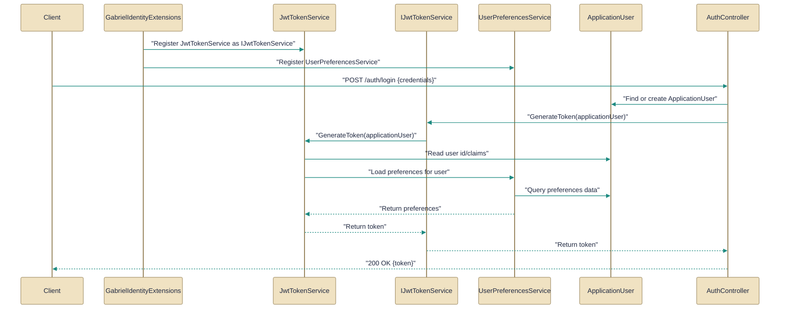

# Authentication and identity management

> How the API authenticates users, issues tokens, and stores identity data.

*Figure: How Authentication and identity management works.*

This guide describes how the API performs authentication and manages user identity: who issues JWT access and refresh tokens, where per-user preferences live, and how the ASP.NET Core startup wiring ties those pieces together. It highlights the concrete types and flows you will touch when handling login, token rotation, preference updates, or when debugging refresh-token failures. Read the per-file sections to see responsibilities and handoffs, then use the final paragraph to understand the overall collaboration pattern.

## AuthController.cs
Exposes authentication endpoints for login and token refresh.
AuthController is the HTTP surface for account creation and session management: it defines endpoints for register, login, refresh, logout, revoke (single token), revoke-all (all tokens for the current user), and me (current user info). The controller centralizes Identity-backed user operations (via UserManager/SignInManager) and JWT lifecycle operations by delegating issuance, rotation, and revocation to the configured [IJwtTokenService](../Code/src/api/Gabriel.Core/Identity/IJwtTokenService.cs.md). To support browser-based and external API clients, its register/login/refresh paths both set HttpOnly cookies and return a token pair in the response body; it also consults runtime [AuthOptions] to allow toggling registration and intentionally suppresses account-enumeration by returning the same unauthorized response for missing-user and wrong-password cases. IdentityServiceCollectionExtensions registers the same cookie names and the services AuthController depends on so the startup wiring and controller remain in sync.

## JwtTokenService.cs
Generates and validates JWT tokens used for auth.
[JwtTokenService](../Code/src/api/Gabriel.Infrastructure/Identity/JwtTokenService.cs.md) is the infrastructure implementation of the [IJwtTokenService](../Code/src/api/Gabriel.Core/Identity/IJwtTokenService.cs.md) contract: it mints short-lived access JWTs and long-lived rotatable refresh tokens, persists refresh-token hashes to an IRefreshTokenStore and performs rotation on refresh requests. The service enforces refresh-token hygiene (rotation, marking replaced/revoked tokens) and applies a RotationGracePeriod (5 minutes) to avoid false theft detections on benign races; it explicitly calls the UnitOfWork SaveChangesAsync when issuing a refresh token so the new token row is persisted. Missing refresh-token hashes surface as an UnauthorizedAccessException and are logged with a short hash prefix; the [IdentityServiceCollectionExtensions](../Code/src/api/Gabriel.Infrastructure/Identity/IdentityServiceCollectionExtensions.cs.md) registers this implementation so the controller and middleware use a consistent token service.

## ApplicationUser.cs
Represents the user with Identity in the database.
[ApplicationUser](../Code/src/api/Gabriel.Infrastructure/Identity/ApplicationUser.cs.md) extends IdentityUser<Guid> and carries a small set of per-user chat preferences: PreferredProvider and PreferredModel, stored as plain strings. Those preference fields are intentionally optional (null means “use the system default”), allowing domain code to fall back to global configuration when no preference is set. This concrete user shape is referenced by the controller, the token service, and the preferences service so user-scoped settings are available wherever authentication and per-user behavior are needed.

## UserPreferencesService.cs
Manages user preferences for authentication/identity flows.
UserPreferencesService (an internal sealed implementation of IUserPreferences) reads and writes the tiny preference set directly on the [ApplicationUser](../Code/src/api/Gabriel.Infrastructure/Identity/ApplicationUser.cs.md). Its GetAsync returns the current user’s preferred provider and model (or defaults/nulls when there is no authenticated user), while SetPreferredModelAsync updates the ApplicationUser for an authenticated user and normalizes empty or whitespace inputs to null so the catalog consistently treats the preference as unset. The service enforces authentication for updates (throwing UnauthorizedAccessException when unauthenticated) and surfaces UserManager.UpdateAsync failures with joined error descriptions to ease diagnostics; IdentityServiceCollectionExtensions registers this scoped service so controllers and other consumers can obtain preferences via DI.

## IJwtTokenService.cs
`IJwtTokenService` is the interface/implementation counterpart of `JwtTokenService`, which this topic covers.
[IJwtTokenService](../Code/src/api/Gabriel.Core/Identity/IJwtTokenService.cs.md) defines the contract for issuing a TokenPair (access token + refresh token with expiration metadata), refreshing tokens with rotation, and revoking either a single token or all tokens for a user. The file also declares the [TokenPair](../Code/src/api/Gabriel.Core/Identity/IJwtTokenService.cs.md) record, which bundles AccessToken, AccessExpiresAt, RefreshToken, and RefreshExpiresAt so callers receive a single immutable value object representing both tokens and their lifetimes. This abstraction keeps stateless access tokens separate from stateful refresh tokens, enabling scalable validation of access tokens while retaining revocation capability through the refresh token lifecycle implemented by JwtTokenService.

## IdentityServiceCollectionExtensions.cs
`GabrielIdentityExtensions` collaborates directly with `AuthController` and other members of this topic (4 dependency links).
[GabrielIdentityExtensions](../Code/src/api/Gabriel.Infrastructure/Identity/IdentityServiceCollectionExtensions.cs.md) exposes AddIdentityAndAuth, a single startup extension that wires IdentityCore (EF store), the JwtBearer authentication scheme, the token service implementation, and the per-user preferences service into the DI container. It centralizes configuration concerns such as signing-key validation (which fails startup unless a proper key is present or SKIP_DB_INIT is set), and it defines AccessCookieName and RefreshCookieName to keep the JwtBearer token reader and the [AuthController](../Code/src/api/Gabriel.API/Controllers/AuthController.cs.md) cookie writer aligned. The extension registers [JwtTokenService](../Code/src/api/Gabriel.Infrastructure/Identity/JwtTokenService.cs.md), the preferences service, and the Identity stores so controllers and middleware have a consistent, validated authentication stack.

How the pieces fit
AuthController is the HTTP entry point that handles register/login/refresh/logout and delegates token work to the [IJwtTokenService] contract implemented by [JwtTokenService], while user data (including PreferredProvider and PreferredModel) is persisted on [ApplicationUser] and read/updated through the [UserPreferencesService]. Token lifecycle rules (issue, rotation, revoke, rotation grace window) live in JwtTokenService and are surfaced as TokenPair objects per the [IJwtTokenService] contract; the extension method [GabrielIdentityExtensions] wires the Identity stores, token service, and cookie names together at startup so controller behavior and middleware token-reading remain consistent. Together they implement a token-centric authentication pattern: stateless access tokens for scale plus stateful, rotatable refresh tokens for revocation and theft detection, with per-user preferences stored alongside identity in the same user record.

---
*Covers 6 of 6 source files identified for this topic.*

*Synthesised by Aurion on 2026-07-07 21:05:51 UTC*
