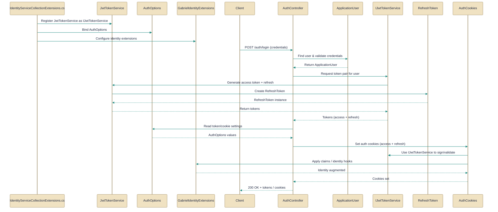

# Authentication and Authorization

> How the API authenticates users, issues tokens, and manages identity across the API and infrastructure.

*Figure: How Authentication and Authorization works.*

> This guide explains the authentication and authorization surface: how the app wires Identity at startup, issues and rotates JWT access/refresh pairs, and exposes a single controller surface that serves both browser clients (via HttpOnly cookies) and external clients (via JSON token bodies). Read this to understand which types own cookie policy, refresh-token state, and token issuance rules so you can safely modify or extend auth behavior without breaking the rotation/revocation invariants.

## AuthController.cs
Exposes authentication endpoints for login and token refresh.

The [AuthController](../Code/src/api/Gabriel.API/Controllers/AuthController.cs.md) is the canonical HTTP surface for registration, login, refresh, logout, token revocation, and retrieving the current user. It delegates credential checks and user persistence to ASP.NET Identity (UserManager/SignInManager) and uses the [IJwtTokenService](../Code/src/api/Gabriel.Core/Identity/IJwtTokenService.cs.md) implementation to mint and rotate token pairs (access + refresh). To support browser flows it calls the [AuthCookies](../Code/src/api/Gabriel.API/Identity/AuthCookies.cs.md) helpers to set, clear, and read HttpOnly cookies while also returning the [TokenPair](../Code/src/api/Gabriel.Core/Identity/IJwtTokenService.cs.md) in the response body for external clients. The controller consults [AuthOptions](../Code/src/api/Gabriel.Core/Configuration/AuthOptions.cs.md) (via IOptionsMonitor) to gate registration at runtime and is registered into the pipeline by [GabrielIdentityExtensions](../Code/src/api/Gabriel.Infrastructure/Identity/IdentityServiceCollectionExtensions.cs.md).

## AuthCookies.cs
Manages authentication cookies for web sessions.

The internal [AuthCookies](../Code/src/api/Gabriel.API/Identity/AuthCookies.cs.md) helper centralizes cookie lifecycle: it exposes Set to write both access and refresh cookies, Clear to remove them, and ReadRefresh to read the refresh token from inbound requests. It enforces the cookie policy (HttpOnly, Secure, SameSite, explicit paths) and scopes the refresh cookie to /api/auth so browser-presented cookies map correctly to the identity pipeline. In practice the [AuthController](../Code/src/api/Gabriel.API/Controllers/AuthController.cs.md) calls these helpers after receiving a token pair from the [IJwtTokenService](../Code/src/api/Gabriel.Core/Identity/IJwtTokenService.cs.md) implementation; the cookie names and paths align with wiring in [GabrielIdentityExtensions](../Code/src/api/Gabriel.Infrastructure/Identity/IdentityServiceCollectionExtensions.cs.md).

## JwtTokenService.cs
Implements issuing and validating JWT tokens.

The [JwtTokenService](../Code/src/api/Gabriel.Infrastructure/Identity/JwtTokenService.cs.md) is the concrete implementation of [IJwtTokenService](../Code/src/api/Gabriel.Core/Identity/IJwtTokenService.cs.md) that issues initial token pairs (IssueAsync), rotates/validates refresh tokens (RefreshAsync), and revokes refresh tokens or entire families when compromise is detected. It centralizes signing, hashing/persisting refresh tokens, and detection of suspicious reuse: the service delegates durable storage to an IRefreshTokenStore, looks up user details with `UserManager<ApplicationUser>`, and uses an IUnitOfWork to commit changes so rotation and revocation are atomic. Callers (for example the [AuthController](../Code/src/api/Gabriel.API/Controllers/AuthController.cs.md) or refresh endpoints) should handle UnauthorizedAccessException from RefreshAsync and persist the issued refresh plaintext into the cookie via [AuthCookies](../Code/src/api/Gabriel.API/Identity/AuthCookies.cs.md).

## ApplicationUser.cs
Represents the user entity persisted by the identity system.

[ApplicationUser](../Code/src/api/Gabriel.Infrastructure/Identity/ApplicationUser.cs.md) derives from `IdentityUser<Guid>` and stores per-user preferences used by higher-level services: `PreferredProvider` and `PreferredModel` (nullable strings) which record the user's chosen chat provider and model identifier. The type lives in Infrastructure so persistence details stay out of Core; callers such as [JwtTokenService](../Code/src/api/Gabriel.Infrastructure/Identity/JwtTokenService.cs.md) and [AuthController](../Code/src/api/Gabriel.API/Controllers/AuthController.cs.md) work with users through this shape and must handle nulls by falling back to configuration defaults.

## IJwtTokenService.cs
Defines contract for token service operations (signing/refresh).

[IJwtTokenService](../Code/src/api/Gabriel.Core/Identity/IJwtTokenService.cs.md) is the abstraction for issuing and managing JWT-based token pairs. Its semantic responsibilities include producing an initial [TokenPair](../Code/src/api/Gabriel.Core/Identity/IJwtTokenService.cs.md) for authenticated users, rotating refresh tokens with theft detection on refresh, and revoking single or all refresh tokens for a user (signing out a device or everywhere). The interface separates stateless access tokens from stateful refresh tokens so callers like [AuthController](../Code/src/api/Gabriel.API/Controllers/AuthController.cs.md) and [AuthCookies](../Code/src/api/Gabriel.API/Identity/AuthCookies.cs.md) can remain agnostic of storage and rotation mechanics implemented in [JwtTokenService](../Code/src/api/Gabriel.Infrastructure/Identity/JwtTokenService.cs.md).

## RefreshToken.cs
`RefreshToken` collaborates directly with `AuthController` and other members of this topic (5 dependency links).

The [RefreshToken](../Code/src/api/Gabriel.Core/Identity/RefreshToken.cs.md) class models the server-side refresh-token record and intentionally stores only a SHA‑256 hash of the token; the plaintext is emitted to the client only at issuance. Use the Create(...) factory to build a token with an expiry; the instance exposes behaviors to evaluate IsActive/IsExpired, to Revoke (idempotent), and to MarkReplacedBy (linking a replaced token and setting RevokedAt). Higher-level services such as [JwtTokenService](../Code/src/api/Gabriel.Infrastructure/Identity/JwtTokenService.cs.md) perform rotation by creating a new [RefreshToken](../Code/src/api/Gabriel.Core/Identity/RefreshToken.cs.md), marking the previous one as replaced, and persisting those changes via the configured store.

## IdentityServiceCollectionExtensions.cs
`GabrielIdentityExtensions` collaborates directly with `AuthController` and other members of this topic (5 dependency links).

[GabrielIdentityExtensions](../Code/src/api/Gabriel.Infrastructure/Identity/IdentityServiceCollectionExtensions.cs.md) provides AddIdentityAndAuth, the single startup entry point that wires IdentityCore with the EF user store, binds JWT options, registers the JwtBearer authentication scheme, and registers token-related services (including the concrete [JwtTokenService](../Code/src/api/Gabriel.Infrastructure/Identity/JwtTokenService.cs.md) and an IRefreshTokenStore). It validates critical config (for example the signing key length unless SKIP_DB_INIT=true) and sets the JwtBearer parameters used later to validate access tokens that [IJwtTokenService](../Code/src/api/Gabriel.Core/Identity/IJwtTokenService.cs.md) issues. This bootstrapper also exposes the cookie names and paths used by [AuthCookies](../Code/src/api/Gabriel.API/Identity/AuthCookies.cs.md) so cookie handling and authentication wiring stay consistent.

## AuthOptions.cs
`AuthOptions` collaborates directly with `AuthController` and other members of this topic (2 dependency links).

[AuthOptions](../Code/src/api/Gabriel.Core/Configuration/AuthOptions.cs.md) is the configuration surface under the Auth section. It exposes `RegistrationEnabled` to toggle the public registration endpoint at runtime and `Seed` (a [SeedUserOptions](../Code/src/api/Gabriel.Core/Configuration/AuthOptions.cs.md)) to opt into creating a bootstrapped identity user at startup. The [AuthController](../Code/src/api/Gabriel.API/Controllers/AuthController.cs.md) checks `RegistrationEnabled` via IOptionsMonitor so flipping the flag takes effect immediately; the seeding behavior is intended to be used during application initialization and is idempotent (skipped if the user already exists).

How the pieces fit

At startup, [GabrielIdentityExtensions](../Code/src/api/Gabriel.Infrastructure/Identity/IdentityServiceCollectionExtensions.cs.md) wires Identity, binds JWT options, and registers the [IJwtTokenService](../Code/src/api/Gabriel.Core/Identity/IJwtTokenService.cs.md) implementation ([JwtTokenService](../Code/src/api/Gabriel.Infrastructure/Identity/JwtTokenService.cs.md)). Runtime auth flows go through the [AuthController](../Code/src/api/Gabriel.API/Controllers/AuthController.cs.md), which uses Identity to validate credentials, asks the token service for a [TokenPair](../Code/src/api/Gabriel.Core/Identity/IJwtTokenService.cs.md), and then writes cookies via [AuthCookies](../Code/src/api/Gabriel.API/Identity/AuthCookies.cs.md) while also returning the token pair in the response body. Persistent refresh state lives as hashed [RefreshToken](../Code/src/api/Gabriel.Core/Identity/RefreshToken.cs.md) records and user preferences are stored on [ApplicationUser](../Code/src/api/Gabriel.Infrastructure/Identity/ApplicationUser.cs.md); [AuthOptions](../Code/src/api/Gabriel.Core/Configuration/AuthOptions.cs.md) controls registration and startup seeding so operator decisions flow into the runtime endpoints without code changes.

---
*Covers 8 of 8 source files identified for this topic.*

*Synthesised by Aurion on 2026-07-08 05:44:03 UTC*
