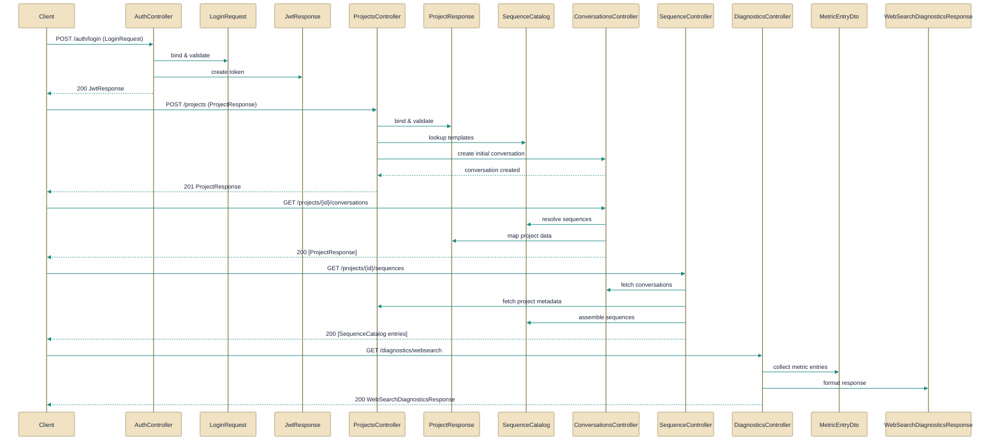

# HTTP API surface and contracts

> Controllers expose REST endpoints and the associated request/response contracts across modules.

*Figure: How HTTP API surface and contracts works.*

This guide describes the HTTP API surface: the controllers that expose REST endpoints and the DTO contracts they send and receive. Each controller is a thin, authenticated HTTP façade that delegates business work to service-layer components and returns stable DTOs for clients. The contracts (login payload, JWT response, project and diagnostics DTOs, and a centralized sequence catalog) standardize communication so clients — browser or API consumers — get consistent behavior across endpoints.

## AuthController.cs
Exposes authentication endpoints for login and token refresh.
AuthController implements the canonical authentication surface and centralizes JWT issuance, refresh rotation, cookie management, and integration with ASP.NET Identity. Concretely, the controller exposes endpoints such as register, login, refresh, logout, revoke, and current-user; it delegates persistence and credential checks to Identity's UserManager/SignInManager, issues token pairs via an IJwtTokenService, and manipulates HttpOnly cookies with AuthCookies helpers. Relationships: it accepts the [LoginRequest](../Code/src/api/Gabriel.API/Contracts/Auth/LoginRequest.cs.md) payload and returns the [JwtResponse](../Code/src/api/Gabriel.API/Contracts/Auth/JwtResponse.cs.md) token pair (and also sets cookies), and it reacts to runtime flags like AuthOptions.RegistrationEnabled to enable/disable registration without restart.

## ConversationsController.cs
Exposes endpoints to create and manage conversations.
ConversationsController is an [Authorize]-guarded, route-rooted controller that forwards conversation actions — list, get, create, rename, reroll avatar, and skin pinning — to backend services such as IChatService, IAgentService and IProjectService rather than implementing domain logic itself. It keeps HTTP actions thin, uses a private LoadProjectAsync helper to include project metadata on single-conversation responses (for example whether the project is default or what avatar seed applies), and purposely omits messages from the List responses by calling ToResponse(includeMessages: false) to avoid N+1 loads. Relationships: it converts project data into the [ProjectResponse](../Code/src/api/Gabriel.API/Contracts/Projects/ProjectResponse.cs.md) DTO and consults the [SequenceCatalog](../Code/src/api/Gabriel.Engine/Sequence/SequenceCatalog.cs.md) when working with skin identifiers; the controller is also referenced/used by other controllers in this topic (ProjectsController.cs and SequenceController.cs) for related surface-level operations.

## DiagnosticsController.cs
Exposes diagnostics endpoints for metrics and health.
DiagnosticsController provides a read-only, authenticated endpoint (GET /diagnostics/web-search) that summarizes recent web_search metric events rather than exposing raw rows. It filters the generic metric event log by the WebSearchSystemPrefix, aggregates per-provider counts (total, success, error), latencies, and records most-recent success/failure details while parsing each metric JSON lazily to minimize overhead. Relationships: the controller surfaces row-level data using [MetricEntryDto]/[MetricEntriesResponse](../Code/src/api/Gabriel.API/Contracts/Diagnostics/MetricEntryDto.cs.md) and returns aggregated summaries in a [WebSearchDiagnosticsResponse](../Code/src/api/Gabriel.API/Contracts/Diagnostics/WebSearchDiagnosticsResponse.cs.md) for UI consumption.

## ProjectsController.cs
Exposes endpoints to manage projects.
ProjectsController is an authenticated REST surface rooted at "projects" that delegates project CRUD and avatar operations to IProjectService and aggregates the project-level Gabriel sequence via IGabrielSequenceService. It converts domain Project objects into [ProjectResponse](../Code/src/api/Gabriel.API/Contracts/Projects/ProjectResponse.cs.md) DTOs (via ToResponse calls), supports standard REST semantics (GET list/detail, POST create with CreatedAtAction, PATCH partial updates, DELETE), and exposes endpoints to fetch project sequences and reroll avatars. Relationships: the controller depends on the [ProjectResponse](../Code/src/api/Gabriel.API/Contracts/Projects/ProjectResponse.cs.md) DTO and consults the [SequenceCatalog](../Code/src/api/Gabriel.Engine/Sequence/SequenceCatalog.cs.md) for skin/sequence concerns; it is also surfaced to or used by [SequenceController](../Code/src/api/Gabriel.API/Controllers/SequenceController.cs.md) in scenarios where project-level sequence data is relevant.

## SequenceController.cs
Exposes endpoints to work with sequences.
SequenceController provides a single, global, authorized endpoint that returns the static catalog of valid skin identifiers (patterns and palettes) exposed by the static [SequenceCatalog](../Code/src/api/Gabriel.Engine/Sequence/SequenceCatalog.cs.md). The controller wraps the static lists in a lightweight SequenceCatalogResponse and intentionally keeps the endpoint global and read-only so UI clients can fetch skin options once per session. Relationships: it sources its response from [SequenceCatalog](../Code/src/api/Gabriel.Engine/Sequence/SequenceCatalog.cs.md) and exists to avoid duplicating skin option lists across per-project or per-conversation controllers (ProjectsController and ConversationsController).

## LoginRequest.cs
Represents login payload.
[LoginRequest](../Code/src/api/Gabriel.API/Contracts/Auth/LoginRequest.cs.md) is an immutable record that carries the Email and Password pair for authentication. It is the canonical transport shape for login operations; callers should treat Password as sensitive (do not log or persist it) and consider validation at the boundary before constructing this record. Relationships: this DTO is consumed by [AuthController](../Code/src/api/Gabriel.API/Controllers/AuthController.cs.md) for the login endpoint.

## JwtResponse.cs
Represents token response after login.
[JwtResponse](../Code/src/api/Gabriel.API/Contracts/Auth/JwtResponse.cs.md) is the contract returned by authentication endpoints: it bundles the short-lived AccessToken and its expiry together with the opaque RefreshToken and its expiry. The controller policy is to rotate refresh tokens on every refresh; AuthController both sets HttpOnly cookies and returns this record in the response body so browser clients can rely on cookies while external clients can read the tokens from the body. Relationships: this record is produced by [AuthController](../Code/src/api/Gabriel.API/Controllers/AuthController.cs.md) and consumed by clients implementing the refresh flow.

## ProjectResponse.cs
`ProjectResponse` collaborates directly with `ConversationsController` and other members of this topic (5 dependency links).
The ProjectResponse compilation unit defines several DTOs for project-related traffic (CreateProjectRequest, ProjectFileResponse, ProjectResponse, SetSkinRequest, UpdateProjectRequest) used when creating, updating, listing, or representing project resources over HTTP. These immutable records shape create/update payloads and the project result that controllers return; for example CreateProjectRequest captures Name, optional Description and SystemPrompt, while ProjectFileResponse models uploaded file metadata. Relationships: these DTOs are emitted by controllers such as [ProjectsController](../Code/src/api/Gabriel.API/Controllers/ProjectsController.cs.md) and [ConversationsController](../Code/src/api/Gabriel.API/Controllers/ConversationsController.cs.md), and the project response types reference the [SequenceCatalog](../Code/src/api/Gabriel.Engine/Sequence/SequenceCatalog.cs.md) vocabulary when exposing or interpreting skin overrides.

## SequenceCatalog.cs
`SequenceCatalog` collaborates directly with `ConversationsController` and other members of this topic (3 dependency links).
[SequenceCatalog](../Code/src/api/Gabriel.Engine/Sequence/SequenceCatalog.cs.md) is a static utility that centralizes the canonical, case-insensitive vocabulary of pattern and palette identifiers used by projects and standalone conversations. It exposes lists (Patterns, Palettes) and helpers such as NormalizePattern/NormalizePalette and TryParsePattern to validate, normalize, and map string inputs to internal enums; unknown identifiers are ignored and cause callers to fall back to seed-derived selections. Relationships: the catalog is referenced by [ProjectResponse](../Code/src/api/Gabriel.API/Contracts/Projects/ProjectResponse.cs.md), [ConversationsController](../Code/src/api/Gabriel.API/Controllers/ConversationsController.cs.md), [ProjectsController](../Code/src/api/Gabriel.API/Controllers/ProjectsController.cs.md), and [SequenceController](../Code/src/api/Gabriel.API/Controllers/SequenceController.cs.md) so that skin identifiers remain consistent across the API surface.

## MetricEntryDto.cs
`MetricEntryDto` collaborates directly with `DiagnosticsController` and other members of this topic (2 dependency links).
This file defines the diagnostics transport records: [MetricEntryDto](../Code/src/api/Gabriel.API/Contracts/Diagnostics/MetricEntryDto.cs.md) for individual metric rows (Id, System, Metric as a JsonElement, CreatedAt) and [MetricEntriesResponse] for paged responses. MetricEntryDto preserves the original JSON payload in a JsonElement so callers can lazily parse only the fields they need when aggregating or inspecting metrics, which reduces per-call overhead. Relationships: DiagnosticsController consumes these DTOs to present recent metric rows and to drive aggregation into higher-level summaries.

## WebSearchDiagnosticsResponse.cs
`WebSearchDiagnosticsResponse` collaborates directly with `DiagnosticsController` and other members of this topic (2 dependency links).
[WebSearchDiagnosticsResponse](../Code/src/api/Gabriel.API/Contracts/Diagnostics/WebSearchDiagnosticsResponse.cs.md) is the aggregated diagnostics DTO returned by the web-search diagnostics endpoint: it contains a list of per-provider [WebSearchProviderStatsDto] entries, a HasUnhealthyProvider flag, and the WindowSize used for the lookback. Each provider DTO carries counts (total, success, error, empty), last success/failure timestamps and messages, and average latency so UIs can render both detailed trends and a top-level health indicator. Relationships: DiagnosticsController builds and returns this response by summarizing metric rows represented as [MetricEntryDto](../Code/src/api/Gabriel.API/Contracts/Diagnostics/MetricEntryDto.cs.md).

How the pieces fit
The controllers are thin, authenticated HTTP facades: they accept well-defined DTOs (LoginRequest, CreateProjectRequest, UpdateProjectRequest, etc.), delegate domain work to injected services, and return stable response records (JwtResponse, ProjectResponse, WebSearchDiagnosticsResponse). SequenceCatalog centralizes skin/palette vocabulary so both project- and conversation-level controllers present consistent options, while diagnostics uses MetricEntryDto rows as raw inputs to produce aggregated WebSearchDiagnosticsResponse objects for UI consumption. AuthController is the single canonical source of token behavior (setting cookies and returning [JwtResponse] payloads) so clients get consistent login and refresh semantics regardless of whether they rely on cookies or token JSON.

---
*Covers 11 of 11 source files identified for this topic.*

*Synthesised by Aurion on 2026-07-08 05:45:21 UTC*
