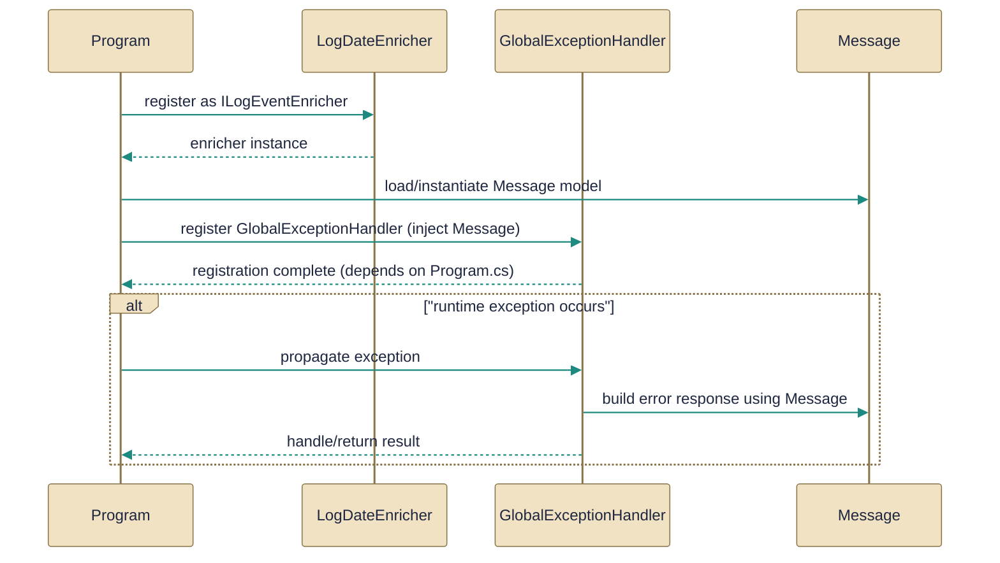

# Observability and startup configuration

> Logging, error handling, and startup wiring for the Gabriel API.

*Figure: How Observability and startup configuration works.*

This guide explains the small surface of startup wiring and observability inside the Gabriel API: how a Serilog enrichment is implemented, how exceptions are translated into HTTP ProblemDetails, the Program bootstrap that wires logging and middleware, and the Message entity that participates in error handling and startup flows. Read each file section to see the concrete types and actions they define and how they are connected at startup so you know where to look when changing logging, error mapping, or conversation persistence.

## LogDateEnricher.cs
Enriches log events with a date value.

The file declares the [LogDateEnricher](../Code/src/api/Gabriel.API/Configuration/LogDateEnricher.cs.md) class (an implementation of Serilog enrichment) and a small companion [LogDateEnricherExtensions](../Code/src/api/Gabriel.API/Configuration/LogDateEnricher.cs.md) façade. The enricher adds a LogDate property to every Serilog event by formatting the event timestamp as MM-dd-yyyy so downstream sinks or Serilog.Sinks.Map routing can target day-named files rather than relying on the built-in rolling pattern. The provided extension method WithLogDate wires the enricher into LoggerEnrichmentConfiguration and is intended to let configuration or fluent startup code enable the behavior consistently across the logging pipeline.

## GlobalExceptionHandler.cs
Centralized exception handling for API responses.

[GlobalExceptionHandler](../Code/src/api/Gabriel.API/Middleware/GlobalExceptionHandler.cs.md) centralizes translation from exceptions to HTTP responses: it maps NotFoundException → 404, DomainException/ArgumentException → 400, UnauthorizedAccessException → 401, and all other exceptions → 500, and returns a ProblemDetails payload (status, title, detail) that uses the request path as the instance. The class is designed to be registered with DI and invoked via ASP.NET Core's UseExceptionHandler so controllers don't need per-action try/catch logic; it also centralizes logging levels (information for domain/client errors, error for unexpected exceptions) and ensures the 500 path returns a generic client message while logging the full exception server-side. Per the relationships, this component is wired via [Program](../Code/src/api/Gabriel.API/Program.cs.md) at startup and consumes the application's [Message](../Code/src/api/Gabriel.Core/Entities/Message.cs.md) type where appropriate (the project maps Message usages to exception handling and startup flows).

## Program.cs
Application entry point configuring Serilog and hosting.

[Program](../Code/src/api/Gabriel.API/Program.cs.md) is the bootstrap file that orchestrates startup: it configures a bootstrap Serilog logger, loads configuration and secrets early (including Infisical), binds options such as InfisicalOptions and AuthOptions, and then builds the host with the application logging pipeline. The file wires middleware and conventions (global API prefix, Swagger, and optional file logging settings) and registers the global exception behavior so that [GlobalExceptionHandler](../Code/src/api/Gabriel.API/Middleware/GlobalExceptionHandler.cs.md) is invoked through UseExceptionHandler; the relationships also show Program and the [Message](../Code/src/api/Gabriel.Core/Entities/Message.cs.md) entity participate together in startup concerns. Notes in the file emphasize that the bootstrap logger captures early startup errors independently of the host logger and that FileLog configuration is optional with sensible defaults.

## Message.cs
`Message` collaborates directly with `GlobalExceptionHandler` and other members of this topic (2 dependency links).

[Message](../Code/src/api/Gabriel.Core/Entities/Message.cs.md) is the domain entity representing a single conversation turn (roles: user, assistant, system, tool). The class enforces role-specific construction rules (e.g., user/system require content, assistant requires content or tool-calls JSON, tool messages require a toolCallId and content), assigns Id and CreatedAt automatically, and exposes variant-grouping fields (VariantGroupId, IsActiveVariant) plus a separate ReasoningContent and verbatim ToolCallsJson for replay. The documentation notes that callers must respect Create's validations (ArgumentException is thrown on invalid inputs); the entity is referenced by startup and middleware code as shown in the relationships with [Program](../Code/src/api/Gabriel.API/Program.cs.md) and [GlobalExceptionHandler](../Code/src/api/Gabriel.API/Middleware/GlobalExceptionHandler.cs.md).

How the pieces fit

Program.cs is the orchestration point: it boots a short-lived bootstrap Serilog, loads secrets/config, and then assembles the host, registering middleware including the [GlobalExceptionHandler](../Code/src/api/Gabriel.API/Middleware/GlobalExceptionHandler.cs.md). The global exception handler provides a single translation surface for domain and framework errors and interacts with the domain [Message](../Code/src/api/Gabriel.Core/Entities/Message.cs.md) where the application needs to correlate or present conversational state. Observability is augmented by the [LogDateEnricher](../Code/src/api/Gabriel.API/Configuration/LogDateEnricher.cs.md), which is a lightweight, stateless enrichment you can add into Program's Serilog pipeline (via its WithLogDate extension) so sinks and routing rules can place events into day-named files without changing other logging behavior.

---
*Covers 4 of 4 source files identified for this topic.*

*Synthesised by Aurion on 2026-07-07 21:07:08 UTC*
