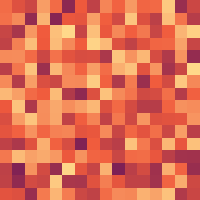
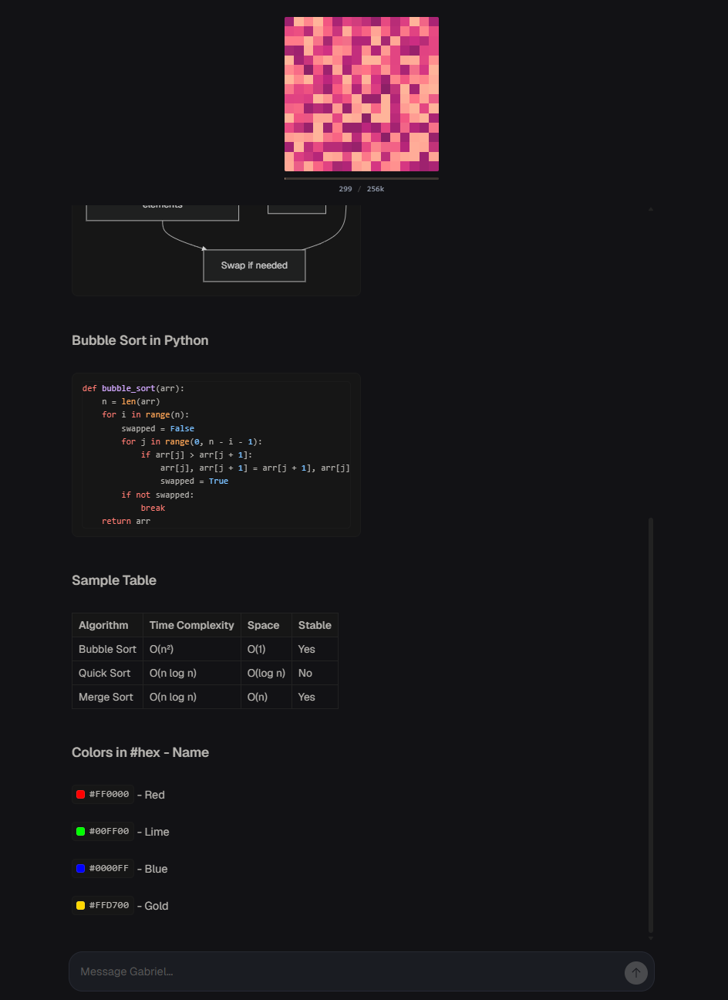
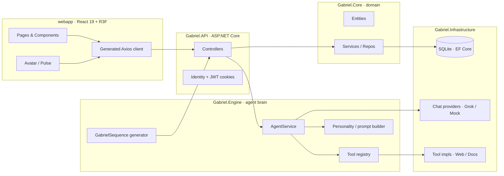

<div align="center">



# Gabriel

_A chat app with a little pixel-grid soul._

[](https://dotnet.microsoft.com/)
[](https://learn.microsoft.com/aspnet/core)
[](https://learn.microsoft.com/ef/core/)
[](https://react.dev/)
[](https://vitejs.dev/)
[](https://www.typescriptlang.org/)
[](https://threejs.org/)
[](LICENSE)

</div>

---

Gabriel is a chat application that talks to LLMs **and** has a face - a 16×16 pixel-grid avatar that breathes, pulses, and shimmers while it thinks. Under the hood it's a .NET 10 onion-layered backend (API · Core · Engine · Infrastructure), a React 19 + Three.js webapp, and a tiny Node.js sandbox where the animation patterns were originally born.

It's built as a **playground for chat-agent ideas** - tool-using agents, rolling personality state, prompt assembly - wrapped in something that's nice to look at.

## Table of contents

- [Highlights](#highlights)
- [Architecture](#architecture)
- [Stack](#stack)
- [Requirements](#requirements)
- [Installation](#installation)
- [Running it](#running-it)
- [Project layout](#project-layout)
- [The prototype](#the-prototype)
- [License](#license)

## Highlights



### The avatar

A 16×16 pixel-grid avatar lives in the corner of every conversation, rendered in [Three.js](https://threejs.org/) via `@react-three/fiber` and `@react-three/drei`. Five animation primitives drive it - **Plasma**, **Waves**, **Spiral**, **Pulse**, and **Shimmer** - each with its own grammar, and palette templates let the same pattern wear different moods. The seed is per-project and per-conversation, so either override it deliberately or let the roll surprise you. While the agent is mid-thought a `ThinkingPulse` animates beside the text, and a `SkinPicker` is one click away when you want to dress it differently.

### The chat

Responses stream in token-by-token through `StreamingText`, with a `GalacticTypewriter` adding a bit of flavor on top. Markdown renders with [GFM](https://github.github.com/gfm/), and the heavy formatting gear is all baked in: syntax highlighting via [highlight.js](https://highlightjs.org/), math via [KaTeX](https://katex.org/), and [Mermaid](https://mermaid.js.org/) diagrams that render inline. A live `ContextStats` panel shows token usage growing as the conversation does, and the shell spans Chat, Diagnostics, Project Settings, and User Settings pages with [react-toastify](https://fkhadra.github.io/react-toastify/) for transient feedback.

<br clear="all">

### The agent

The chat backend is provider-pluggable: a real **Grok** integration for live work, and a **Mock** provider so you can develop offline. On top of that sits a tool registry the LLM can call into, including `GetCurrentTime`, `WebFetch` and `WebSearch` (backed by Brave or DuckDuckGo), `DocsList` and `DocsRead` against a GitHub docs source, and a sandboxed file group - `FileInfo`, `ListProjectFiles`, `ReadProjectFile` - all gated by an `AgentPathResolver` so the agent only sees what it should. Wrapping the loop is a personality layer made of `Mood`, `ConversationState`, a heuristic state updater, a system-prompt builder, and a response post-processor. A naive token estimator feeds `ContextMetrics` so the UI always knows roughly what the model is looking at.

### The backend, properly layered

The solution is an onion. `Gabriel.API` hosts the controllers, auth middleware, Swagger, and the global `/api` prefix. `Gabriel.Core` holds the entities, services, and abstractions with zero infra leakage. `Gabriel.Engine` is where the agent loop, tools, personality, and pulse-sequence generator live. `Gabriel.Infrastructure` plugs in EF Core (SQLite), Identity, and the provider implementations - the outer ring that the inner ones never reach back into. Auth is ASP.NET Identity plus JWT in HttpOnly cookies via a controller-based flow; [Serilog](https://serilog.net/) handles request logging; and a global exception handler returns [ProblemDetails](https://datatracker.ietf.org/doc/html/rfc7807) on every failure. Secrets are fetched from [Infisical](https://infisical.com/) before `IOptions` binding, and EF Core migrations apply automatically on startup (set `SKIP_DB_INIT=true` to opt out).

### The build pipeline

Every backend build writes `swagger.json` and runs `npm run gen-api`, so the webapp always has a fresh, typed Axios client. No drift, no hand-written DTOs, no `// TODO: keep this in sync`.

## Architecture



Dependencies flow inward - `Core` knows nothing about EF, HTTP, or React; `Infrastructure` and `Engine` plug in via DI.

## Stack

| Layer       | What's in it                                                                                              |
| ----------- | --------------------------------------------------------------------------------------------------------- |
| Backend     | .NET 10 · ASP.NET Core · EF Core 10 (SQLite) · ASP.NET Identity + JWT · Serilog · Swashbuckle · Infisical |
| Engine      | Custom agent loop · tool registry · personality state · pulse-sequence generator                          |
| Providers   | Grok chat provider · Mock chat provider · Brave & DuckDuckGo web search · GitHub docs lookup              |
| Frontend    | React 19 · TypeScript 5 · Vite 7 · React Router 7 · Axios                                                 |
| 3D / pixels | Three.js · `@react-three/fiber` · `@react-three/drei`                                                     |
| Content     | react-markdown · remark-gfm · remark-math · rehype-katex · rehype-highlight · mermaid                     |
| Codegen     | `openapi-typescript-codegen` - typed Axios client from `swagger.json`                                     |
| Prototype   | Vanilla Node.js + a single HTML preview page                                                              |

## Requirements

You'll need the **.NET 10 SDK**, **Node.js 20+** with **npm**, and a modern browser (the avatar uses WebGL via Three.js). An [Infisical](https://infisical.com/) project and token are optional - skip them and the app falls back to `appsettings.Development.json`. A Grok API key is also optional; without one, the `Mock` provider keeps the loop working offline.

## Installation

```sh
git clone <this-repo> gabriel
cd gabriel
```

Restore both halves:

```sh
# backend
cd src/api
dotnet restore
dotnet tool restore

# frontend
cd ../webapp
npm install
```

## Running it

### Backend

```sh
cd src/api
dotnet run --project Gabriel.API
```

API listens on `http://localhost:5080`. On every build, `Gabriel.API.csproj` writes `src/webapp/src/api/swagger.json` and runs `npm run gen-api` so the typed client stays in sync. Swagger UI lives at `/api/swagger`.

### Webapp

```sh
cd src/webapp
npm run dev
```

| Script              | Purpose                                                |
| ------------------- | ------------------------------------------------------ |
| `npm run dev`       | Start the Vite dev server                              |
| `npm run build`     | Type-check (`tsc -b`) and produce a production bundle  |
| `npm run preview`   | Preview the production build                           |
| `npm run typecheck` | Type-check only                                        |
| `npm run gen-api`   | Regenerate the typed API client from `swagger.json`    |

## Project layout

```text
Gabriel/
├── prototype/                       Vanilla JS sandbox for 16×16 pulse animations
├── src/
│   ├── api/                         .NET 10 solution (Gabriel.slnx)
│   │   ├── Gabriel.API/             ASP.NET Core minimal API + Swagger + auth
│   │   ├── Gabriel.Core/            Domain entities, services, abstractions
│   │   ├── Gabriel.Engine/          Agent loop, tools, personality, sequence gen
│   │   └── Gabriel.Infrastructure/  EF Core (SQLite) + providers + tool impls
│   └── webapp/                      React 19 + Vite + R3F frontend
└── readme.md
```

## The prototype

The `prototype/` folder is where the pulse animations were first sketched - a Node.js script that generates palettized 16×16 frames into `frames.json`, plus a single HTML page to play them back.

```sh
cd prototype
node generate.js            # writes frames.json (random pattern)
node generate.js <pattern>  # pick a specific one from patterns.js
```

Then open `prototype/index.html` in a browser. It's still a useful sandbox when tuning a new pattern before wiring it into `Gabriel.Engine.Sequence`.

## License

[MIT](LICENSE) © Gabriel contributors. Be kind to the pixels.
